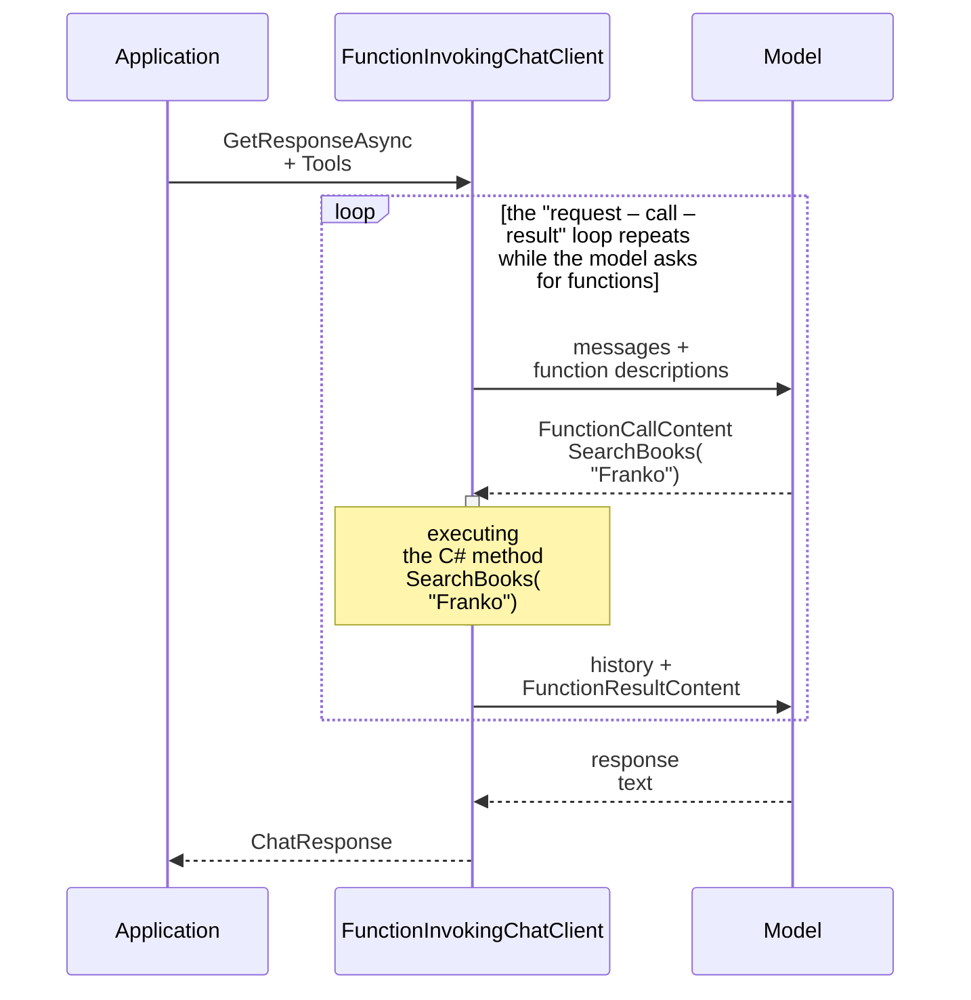
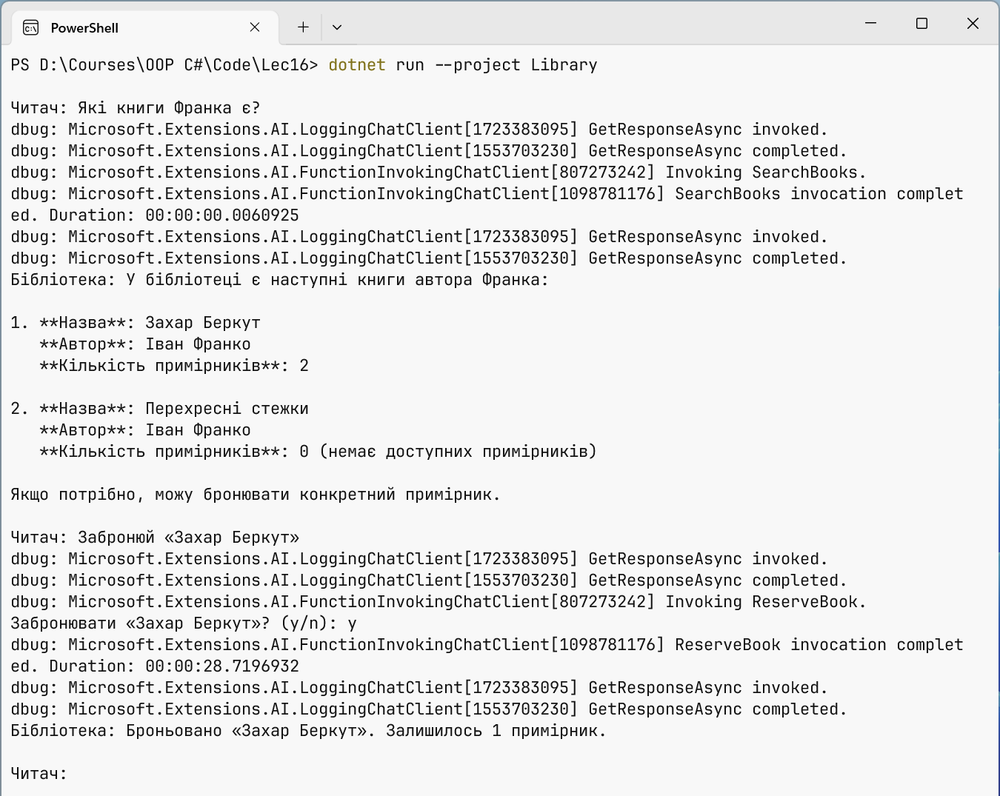

# Function calling and the client pipeline

## Function calling

A model does not know which books are in a library, what the weather is right now, or how much money is in an account. But modern models can **call functions** (*function calling*, *tool calling*): the application describes the available methods, and instead of text the model responds with a request "call `SearchBooks` with the argument `query = "Franko"`". The application executes the method and sends the result to the model, which forms the final response (Fig. 16.6).



Fig. 16.6. The function calling loop {.caption}

In MEAI, a C# method is turned into a tool by `AIFunctionFactory.Create`: the name, the description from the `[Description]` attribute, and the JSON schema of the parameters are taken from the method signature. Tools are passed in `ChatOptions.Tools`, and the "request – call – result – request" loop is run by the `FunctionInvokingChatClient` middleware client, which `UseFunctionInvocation()` adds (<https://learn.microsoft.com/dotnet/ai/quickstarts/use-function-calling>). Not all models support functions: the model's Ollama page must have the *tools* tag.

Tools are code that the model runs, so security requirements apply to them:

- expose only the necessary actions and only the necessary data (the principle of least privilege);
- validate the arguments in the method just like user input;
- actions that change data (reservations, payments, deletions) are confirmed by a human. For this you can ask the user in the method itself or wrap the function in an `ApprovalRequiredAIFunction`, and then the client returns an approval request instead of the call;
- limit the number of loop steps: `MaximumIterationsPerRequest`.

### Example: a library assistant

The assistant searches for books in the catalog (in the lab assignment, in a database, Topics 7–8) and reserves them after the reader confirms. The log at the `Debug` level shows every request to the model and every function call. Besides the packages from the previous example, `Microsoft.Extensions.Logging.Console` is needed. The tools class:

```cs
using System.ComponentModel;

public record Book(int Id, string Author, string Title, int Copies);

public class LibraryTools
{
    private readonly List<Book> books =
    [
        new(1, "Ivan Franko", "Zakhar Berkut", 2),
        new(2, "Ivan Franko", "Crossroads", 0),
        new(3, "Lesya Ukrainka", "The Forest Song", 3),
        new(4, "Lina Kostenko", "Marusia Churai", 1)
    ];

    [Description("Searches for books by part of the author's last name or the title")]
    public List<Book> SearchBooks(
        [Description("The author's last name or a word from the title")]
        string query)
    {
        return books
            .Where(b => b.Author.Contains(query,
                            StringComparison.OrdinalIgnoreCase)
                     || b.Title.Contains(query,
                            StringComparison.OrdinalIgnoreCase))
            .ToList();
    }

    [Description("Reserves a copy of a book by its Id")]
    public string ReserveBook(
        [Description("The book Id from the search results")] int bookId)
    {
        int index = books.FindIndex(b => b.Id == bookId);
        if (index < 0) return "Book not found.";
        Book book = books[index];
        if (book.Copies == 0) return "No copies available.";

        // The action changes data, so a human confirms it, not the model.
        Console.Write($"Reserve \"{book.Title}\"? (y/n): ");
        if (Console.ReadLine()?.Trim().ToLower() != "y")
            return "The user canceled the reservation.";

        books[index] = book with { Copies = book.Copies - 1 };
        return $"Reserved \"{book.Title}\", " +
               $"{book.Copies - 1} left.";
    }
}
```

The program builds a client with two middleware layers and passes both methods as tools. The functions are created from instance methods, so they have access to the instance data:

```cs
using Microsoft.Extensions.AI;
using Microsoft.Extensions.Logging;
using OllamaSharp;

Console.InputEncoding = System.Text.Encoding.UTF8;
Console.OutputEncoding = System.Text.Encoding.UTF8;

using ILoggerFactory loggers = LoggerFactory.Create(b => b
    .AddSimpleConsole(o => o.SingleLine = true)
    .SetMinimumLevel(LogLevel.Debug));

IChatClient client = new ChatClientBuilder(
        new OllamaApiClient(
            new Uri("http://localhost:11434"), "qwen3:4b-instruct"))
    .UseFunctionInvocation(loggers, f =>
        f.MaximumIterationsPerRequest = 5)
    .UseLogging(loggers)
    .Build();

var library = new LibraryTools();
var options = new ChatOptions
{
    Temperature = 0f,
    Tools =
    [
        AIFunctionFactory.Create(library.SearchBooks),
        AIFunctionFactory.Create(library.ReserveBook)
    ]
};
List<ChatMessage> history =
[
    new(ChatRole.System,
        "You are a library assistant. Answer questions about books only " +
        "from the function data, do not make anything up. " +
        "Answer in English.")
];

while (true)
{
    Console.Write("\nReader: ");
    string? text = Console.ReadLine();
    if (string.IsNullOrWhiteSpace(text)) break;
    history.Add(new ChatMessage(ChatRole.User, text));

    ChatResponse response =
        await client.GetResponseAsync(history, options);
    history.AddMessages(response);
    Console.WriteLine($"Library: {response.Text}");
}
```

The log of the first question (the category names are shortened to `…AI.`): the model receives a request twice – before the function call and after it. At the `Trace` level the log also contains the full text of the messages with the arguments, so it is not enabled where personal data is present (Fig. 16.7):

```
Reader: Which books by Franko do you have?
dbug: …AI.LoggingChatClient[1723383095] GetResponseAsync invoked.
dbug: …AI.LoggingChatClient[1553703230] GetResponseAsync completed.
dbug: …AI.FunctionInvokingChatClient[807273242] Invoking SearchBooks.
dbug: …AI.FunctionInvokingChatClient[1098781176] SearchBooks
      invocation completed. Duration: 00:00:00.0097365
dbug: …AI.LoggingChatClient[1723383095] GetResponseAsync invoked.
dbug: …AI.LoggingChatClient[1553703230] GetResponseAsync completed.
Library: The catalog has two books by Ivan Franko: Zakhar Berkut
(2 copies) and Crossroads (currently unavailable).
```



Fig. 16.7. A function calling log {.caption}

## The middleware client pipeline

The `ChatClientBuilder` class wraps the provider's client in a chain of **middleware** clients, each of which implements `IChatClient` itself. The first layer added is the outer one: it receives the request first and the response last. This was checked with two delegate layers `Use(async (messages, options, next, token) => …)` that print messages before and after calling `next`: the output order is "A: before", "B: before", "B: after", "A: after".

Ready-made layers (Table 16.3) are added with the `Use…` methods. The order matters: if `UseDistributedCache` comes before `UseFunctionInvocation`, the final response after the function calls is cached, and a repeated question does not call them again.

Table 16.3. `ChatClientBuilder` middleware clients {.caption}

| **Method** | **What it does** |
| --- | --- |
| `UseFunctionInvocation` | executes the functions the model asks for and repeats the request |
| `UseLogging` | writes every request and response to an `ILogger` (Topic 6) |
| `UseDistributedCache` | returns a stored response to an identical request from `IDistributedCache` |
| `UseOpenTelemetry` | metrics and tracing following the OpenTelemetry conventions for generative AI |
| `ConfigureOptions` | sets default parameters, for example `ModelId` |
| `Use(…)` | a custom layer: a delegate or a class derived from `DelegatingChatClient` |

### A custom middleware client

The `DelegatingChatClient` base class passes all calls to the inner client, so a derived class overrides only what is needed. The `TokenLimitChatClient` client counts the tokens used and blocks requests when the limit is exhausted, so that a program with a bug in a loop does not spend the whole budget of a cloud provider:

```cs
using Microsoft.Extensions.AI;

// A middleware client: counts tokens and stops requests over the limit.
public sealed class TokenLimitChatClient(
    IChatClient inner, long limit) : DelegatingChatClient(inner)
{
    public long UsedTokens { get; private set; }

    public override async Task<ChatResponse> GetResponseAsync(
        IEnumerable<ChatMessage> messages,
        ChatOptions? options = null,
        CancellationToken cancellationToken = default)
    {
        ThrowIfExhausted();
        ChatResponse response = await base.GetResponseAsync(
            messages, options, cancellationToken);
        UsedTokens += response.Usage?.TotalTokenCount ?? 0;
        return response;
    }

    private void ThrowIfExhausted()
    {
        if (UsedTokens >= limit)
            throw new InvalidOperationException(
                $"The limit of {limit} tokens is exhausted.");
    }
}
```

The `GetStreamingResponseAsync` method is overridden the same way; in streaming mode the token count arrives as separate `UsageContent` content, usually in the last update.

### Registration in DI and changing the provider

In an application with the Generic Host (Topic 6), the client is registered with the `AddChatClient` method, and the pipeline is built with methods of the same chain. The provider is chosen by the configuration: the `AI` section specifies `Provider`, `Model`, and, for a cloud provider, `ApiKey`. The rest of the code receives `IChatClient` through the constructor and does not know which model responds:

```cs
using Microsoft.Extensions.AI;
using Microsoft.Extensions.Configuration;
using Microsoft.Extensions.DependencyInjection;
using Microsoft.Extensions.Hosting;
using OllamaSharp;
using OpenAI;

HostApplicationBuilder builder = Host.CreateApplicationBuilder(args);
builder.Configuration.AddUserSecrets<Program>(optional: true);
IConfigurationSection ai = builder.Configuration.GetSection("AI");
string model = ai["Model"] ?? "qwen3:4b-instruct";

// The only place that knows the specific provider.
IChatClient provider = ai["Provider"] switch
{
    "OpenAI" => new OpenAIClient(ai["ApiKey"] ?? throw
            new InvalidOperationException("The AI:ApiKey key is missing"))
        .GetChatClient(model)
        .AsIChatClient(),
    _ => new OllamaApiClient(
        new Uri(ai["Endpoint"] ?? "http://localhost:11434"), model)
};

builder.Services.AddDistributedMemoryCache();
builder.Services.AddChatClient(provider)
    .UseLogging()
    .UseDistributedCache()
    .Use(inner => new TokenLimitChatClient(inner, limit: 20_000));

using IHost host = builder.Build();
IChatClient client = host.Services.GetRequiredService<IChatClient>();
```

The `Microsoft.Extensions.Hosting` and `Microsoft.Extensions.Caching.Memory` packages and, for OpenAI, `Microsoft.Extensions.AI.OpenAI` are needed (<https://learn.microsoft.com/dotnet/ai/quickstarts/prompt-model>). The logging layer is outermost and records all requests, including those answered by the cache, while `TokenLimitChatClient` is closest to the model and counts only real calls to it. A test with a fake client that responds with an 800 ms delay showed that a repeated question "What is DI?" got an answer from the cache in a few milliseconds, without calling the model.

The *GitHub Models* service, which used to be used for free experiments with cloud models, was completely shut down on July 30, 2026 (<https://docs.github.com/github-models>). Cloud models are now provided by OpenAI (<https://platform.openai.com/docs>) and Azure AI Foundry (<https://learn.microsoft.com/azure/ai-foundry/>). Ollama also has an OpenAI-compatible address `http://localhost:11434/v1`, so the OpenAI adapter can also be tested with a local model (<https://docs.ollama.com/api/openai-compatibility>).

### API keys in user secrets

An API key is a password for which the provider bills you. It is **never** written in code or `appsettings.json`: files end up in Git (Topic 1), and automated programs find and use keys from public repositories. During development the key is stored in **user secrets** – a `secrets.json` file in the Windows profile outside the project folder (<https://learn.microsoft.com/aspnet/core/security/app-secrets>):

```powershell
dotnet user-secrets init
dotnet user-secrets set "AI:Provider" "OpenAI"
dotnet user-secrets set "AI:Model" "<model-name>"
dotnet user-secrets set "AI:ApiKey" "<your-key>"
```

In Visual Studio the file is opened with the *Manage User Secrets* command in the project context menu (Fig. 16.8). On a server, the key is set with the `AI__ApiKey` environment variable or a cloud secret store.


Fig. 16.8. An API key in user secrets {.caption}
