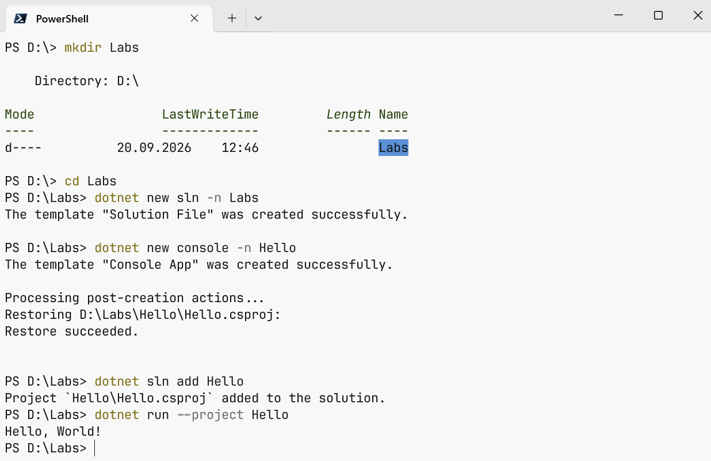
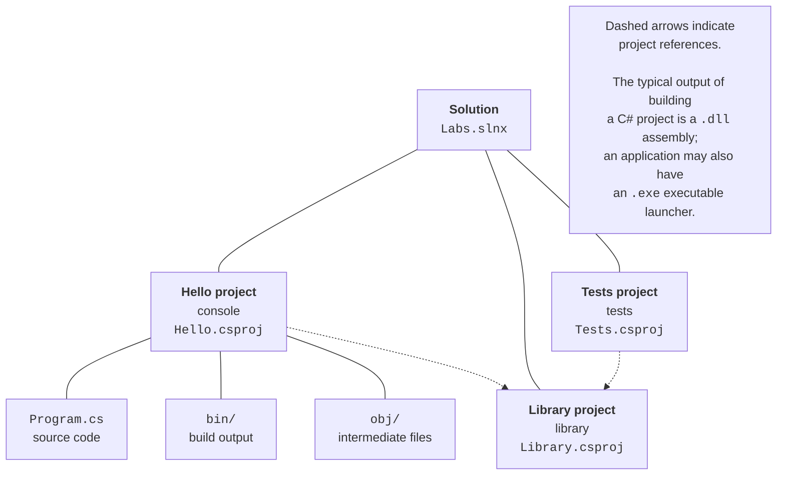
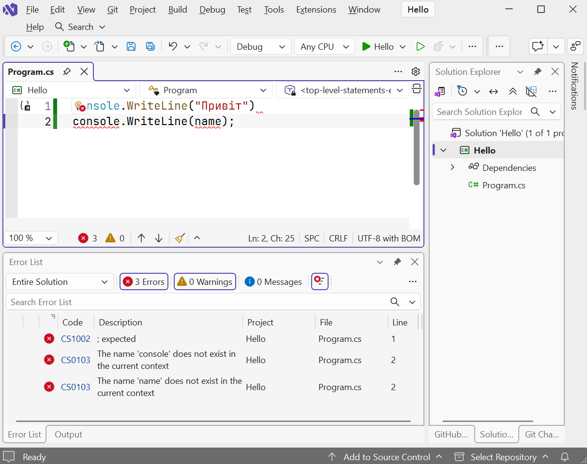

# dotnet CLI and program structure

## The dotnet CLI command-line tool

All development environments invoke the same **dotnet CLI** command-line tool when building and running applications. You can also use it directly: in a terminal on Windows, Linux, or macOS, on a server without a graphical interface, or in automation scripts. Table 1.4 lists the main commands; the full reference is at <https://learn.microsoft.com/dotnet/core/tools/>.

Table 1.4. Main dotnet CLI commands {.caption}

| **Command** | **Purpose** |
| --- | --- |
| `dotnet --info` | information about installed SDKs and runtimes |
| `dotnet new list` | list project templates |
| `dotnet new console -n Hello` | create a Hello console project in a new folder |
| `dotnet new sln -n Labs` | create a `Labs.slnx` solution file |
| `dotnet sln add Hello` | add a project to the solution |
| `dotnet build` | build the project (Debug configuration) |
| `dotnet run` | build and run the project |
| `dotnet run -- a b` | run with command-line arguments `a` and `b` |
| `dotnet clean` | delete build output |
| `dotnet add package Humanizer` | add a NuGet package |
| `dotnet publish -c Release` | prepare the application for distribution |

An example of creating a solution with one project and running the program (Fig. 1.24):

```
mkdir Labs
cd Labs
dotnet new sln -n Labs
dotnet new console -n Hello
dotnet sln add Hello
dotnet run --project Hello
```



Figure 1.24. Creating and running a project in the terminal {.caption}

For small experiments, .NET 10 lets you run a single `.cs` file without creating a project. In any text editor, create a file named `hello.cs` containing `Console.WriteLine("Hello!");` and run `dotnet run hello.cs` in the terminal. These **file-based apps** are convenient for trying individual lecture examples (<https://learn.microsoft.com/dotnet/core/sdk/file-based-apps>).

## Projects and solutions

A **project** is a set of source files and settings that build into one assembly: a console program, library, or web application. A **solution** groups related projects, such as an application, a library, and a test project (Fig. 1.25). After creating and building the solution in the previous example, its folder structure is:

```
Labs/
├── Labs.slnx                 solution file
└── Hello/                    project folder
    ├── Hello.csproj          project file
    ├── Program.cs            source code
    ├── bin/Debug/net10.0/    built program
    │   ├── Hello.dll
    │   └── Hello.exe
    └── obj/                  intermediate build files
```



Figure 1.25. Solution and project structure {.caption}

The solution file has a `.slnx` extension (`.sln` in earlier versions); Visual Studio displays the solution structure in *Solution Explorer*. The `Hello.csproj` project file uses XML:

```xml
<Project Sdk="Microsoft.NET.Sdk">
  <PropertyGroup>
    <OutputType>Exe</OutputType>
    <TargetFramework>net10.0</TargetFramework>
    <ImplicitUsings>enable</ImplicitUsings>
    <Nullable>enable</Nullable>
  </PropertyGroup>
</Project>
```

The `Sdk` attribute specifies the build rules, `OutputType` the assembly type (`Exe` for an executable, `Library` for a library), and `TargetFramework` the target platform version. `ImplicitUsings` enables implicit imports of common namespaces, and `Nullable` enables checking reference types that may hold `null`. All `.cs` files in the project folder are included automatically. The `bin` and `obj` folders are created during the build; do not add them to version control or send them to your instructor—they can be recreated from the source code.

Third-party libraries are added as **NuGet packages**—archives containing assemblies published in the repository at <https://www.nuget.org>. The `dotnet add package Humanizer` command adds a package reference to the project file, and the package downloads automatically during the build. In Visual Studio, add packages through *Project → Manage NuGet Packages…* For details: <https://learn.microsoft.com/nuget/what-is-nuget>.

## C# program structure

The modern console application template contains just one line:

```cs
Console.WriteLine("Hello, World!");
```

These are **top-level statements**. During compilation, they are placed in an automatically generated `Main` method—the program's **entry point**, where execution begins. This form is convenient for small programs; only one file in a project can contain top-level statements. The equivalent program with an explicit structure looks like this:

```cs
namespace Hello;

internal class Program
{
    // Entry point: execution begins with the Main method.
    static void Main(string[] args)
    {
        Console.WriteLine("Hello, World!");
    }
}
```

The main program elements are:

- a **namespace** (`namespace`) groups related types and prevents naming conflicts; the `namespace Hello;` declaration applies to the whole file;
- the **class** `Program` contains the `Main` entry point; the `internal` modifier makes the class accessible only within the assembly;
- `Main` is static, so it is called without creating an object of the class; the `args` array contains command-line arguments, and the method can return an `int`—the program's exit code;
- a `using` directive imports a namespace so you do not need to write fully qualified type names (`System.Console`); thanks to `ImplicitUsings`, `System`, `System.IO`, `System.Linq`, and other namespaces are imported implicitly;
- each statement ends with a semicolon, and code blocks are enclosed in braces;
- comments extend from `//` to the end of a line or appear between `/*` and `*/`; `///` comments are used to document code.

C# is case-sensitive: `Main` and `main` are different names. Naming conventions use PascalCase for types and methods (`ReadLine`) and camelCase for local variables and parameters (`userName`). The complete conventions are documented at <https://learn.microsoft.com/dotnet/csharp/fundamentals/coding-style/identifier-names>.

### Compilation errors

If code breaks the language rules, the compiler reports **compilation errors** instead of producing an assembly. Each error has a code, description, file name, and line number. In Visual Studio, errors are underlined with red wavy lines in the editor and listed in *Error List* (*View → Error List*); double-clicking an error moves the cursor to the relevant line (Fig. 1.26). For example, this code contains errors:

```cs
Console.WriteLine("Hello")
console.WriteLine(name);
```

The compiler reports:

```
error CS1002: ; expected
```

After adding the semicolon, the following errors appear:

```
error CS0103: The name 'console' does not exist in the current context
error CS0103: The name 'name' does not exist in the current context
```

The first line was missing a semicolon; in the second line, `console` starts with a lowercase letter, and `name` has not been declared. You can look up each error by its code in the documentation at <https://learn.microsoft.com/dotnet/csharp/language-reference/compiler-messages/>.



Figure 1.26. Compilation errors in *Error List* {.caption}

::: tip Tip
Fix errors one at a time, starting with the first: a single error often causes several messages on subsequent lines.
:::
