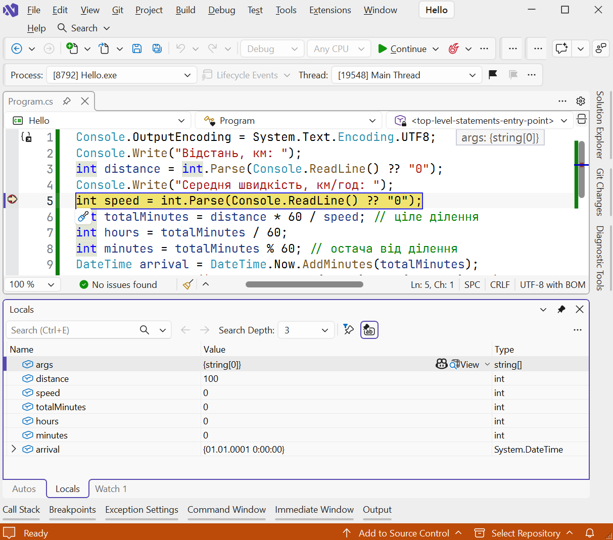
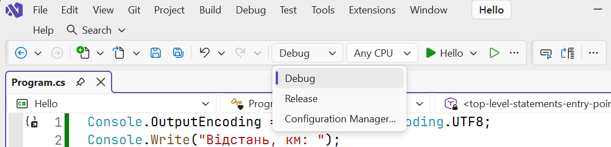

# Debugging and common problems

## Debugging, Debug and Release configurations

**Debugging** means finding and fixing errors that cause a program to behave incorrectly. A debugger lets you execute a program step by step and inspect variable values:

1. Set a **breakpoint**: click in the margin to the left of a line number or press **F9**. A red dot marks the line.
2. Start debugging with **F5**. Execution pauses before the line with the breakpoint.
3. Step through the program: **F10** (*Step Over*) moves to the next line, **F11** (*Step Into*) enters a method, **Shift+F11** (*Step Out*) leaves a method, and **F5** continues to the next breakpoint.
4. Inspect variable values in *Locals* (all local variables) and *Watch* (selected expressions), or hover over a variable in the editor (Fig. 1.27). Press **Shift+F5** to stop debugging.

Figure 1.27. Breakpoint and *Locals* window during debugging {.caption}

Visual Studio creates two build **configurations** for a project, selectable in the toolbar list (Fig. 1.28):

- **Debug** — includes debugging information and does not optimize code; used during development. Output is in `bin/Debug/net10.0`;
- **Release** — optimizes code and is intended for the finished application. Output is in `bin/Release/net10.0`.

Figure 1.28. Selecting a build configuration in the toolbar {.caption}

To give the program to another user, **publish** it with `dotnet publish -c Release` or through *Build → Publish Selection* in Visual Studio. To run the published program on another computer, the same version of the .NET Runtime must be installed (<https://learn.microsoft.com/dotnet/core/deploying/>). Visual Studio debugging tools are documented in detail at <https://learn.microsoft.com/visualstudio/debugger/> and covered in Topic 6 of this course.

## Common beginner problems

Table 1.6 lists problems commonly encountered during the first runs and how to solve them.

Table 1.6. Common problems and solutions {.caption}

| **Problem** | **Cause and solution** |
| --- | --- |
| The `dotnet` command is not found (*is not recognized*) | The SDK is not installed, or the terminal was opened before installation. Open a new terminal and run `dotnet --info`. |
| Error NETSDK1045: *The current .NET SDK does not support targeting .NET 10.0* | An outdated SDK is installed. Install the .NET 10 SDK or update Visual Studio. |
| `?` characters appear instead of Ukrainian letters | The encoding has not been set. Add `Console.OutputEncoding = System.Text.Encoding.UTF8;` at the beginning of the program. |
| `FormatException` during `int.Parse` or `double.Parse` | The input is not a number or uses a different decimal separator. Use `TryParse` and check the result. |
| Error CS8802: *Only one compilation unit can have top-level statements* | Multiple files contain top-level statements. Keep them only in `Program.cs`. |
| The console window closes immediately after launch | The program was started outside the development environment. Run it with **Ctrl+F5** or from a terminal. |
| *Console App* is missing from the template list | The *.NET desktop development* workload is not installed. Add it in Visual Studio Installer. |
