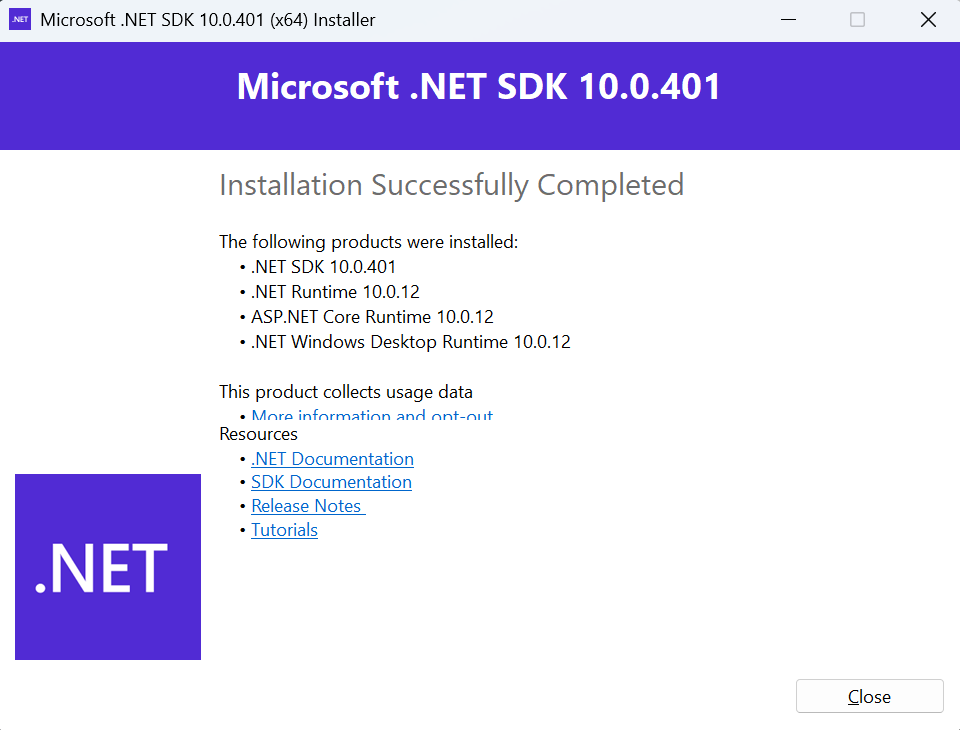
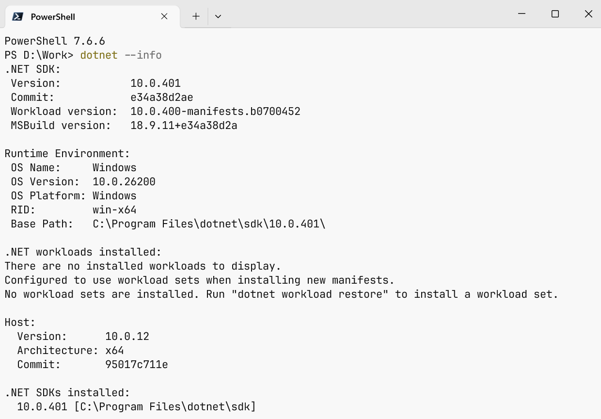
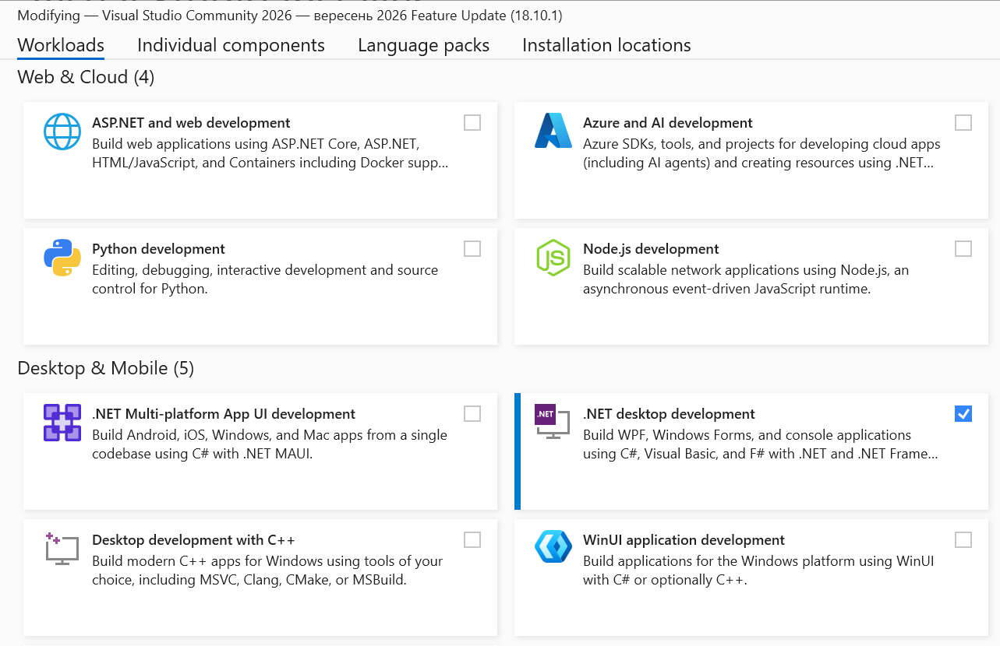
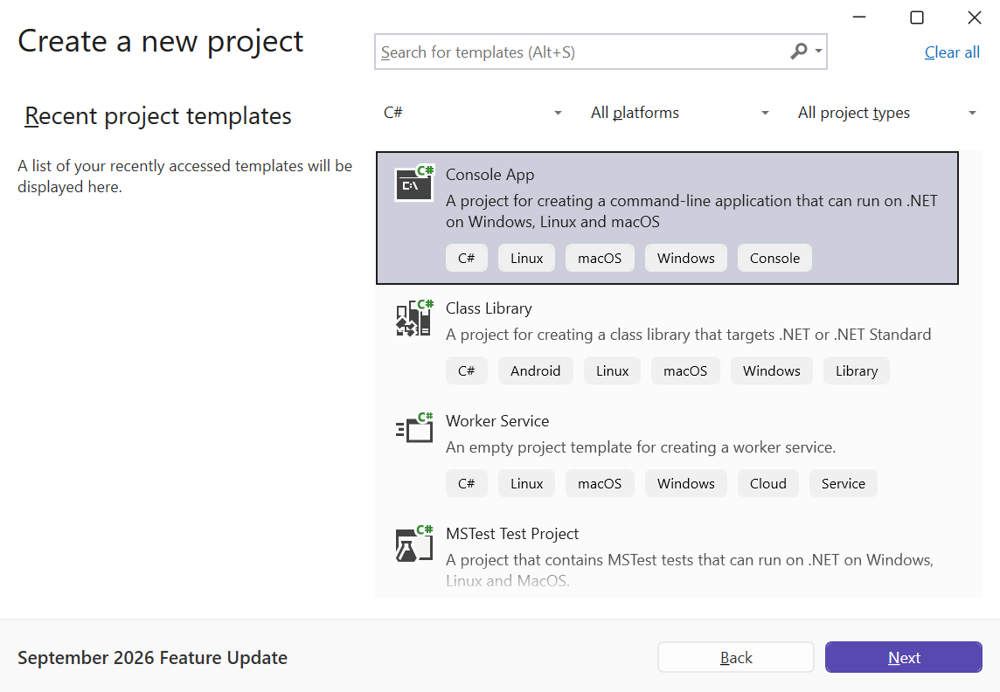
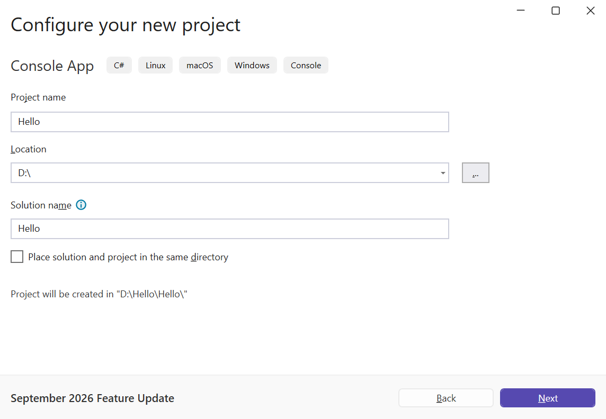
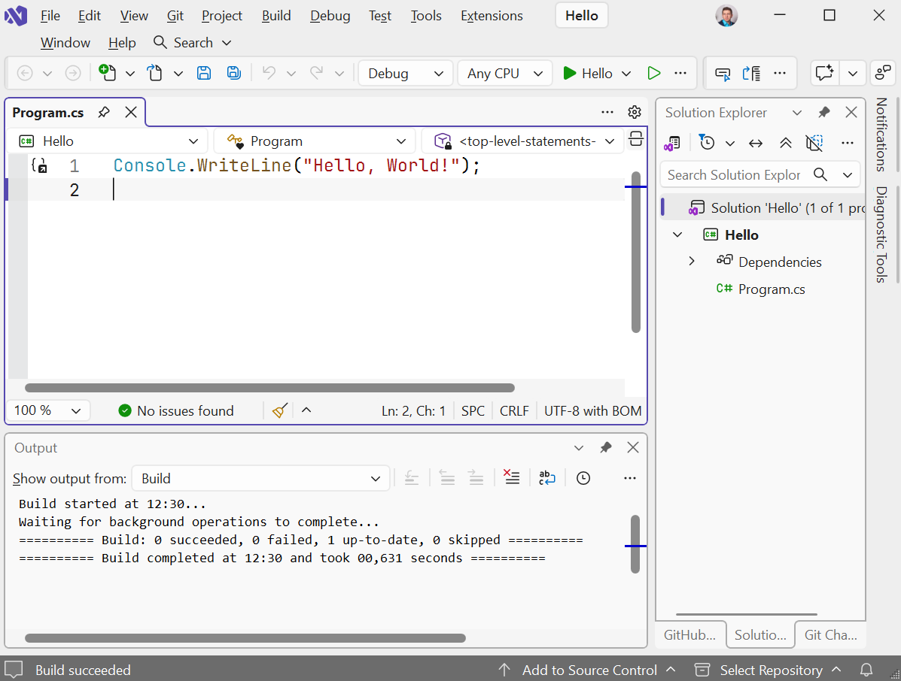
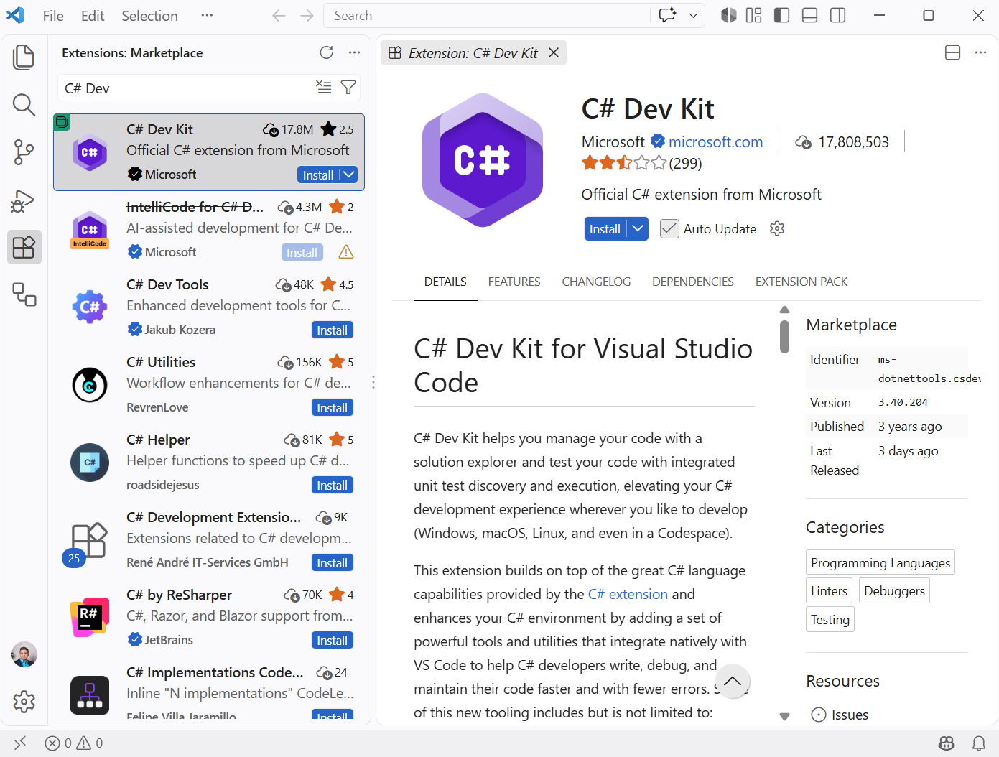
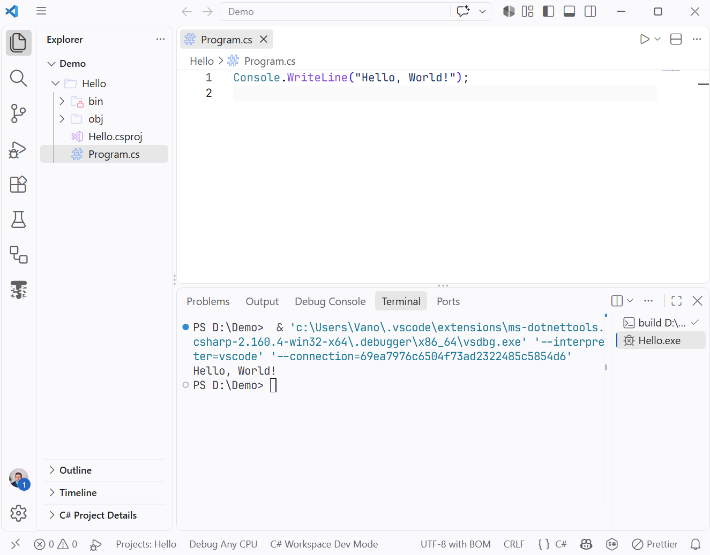
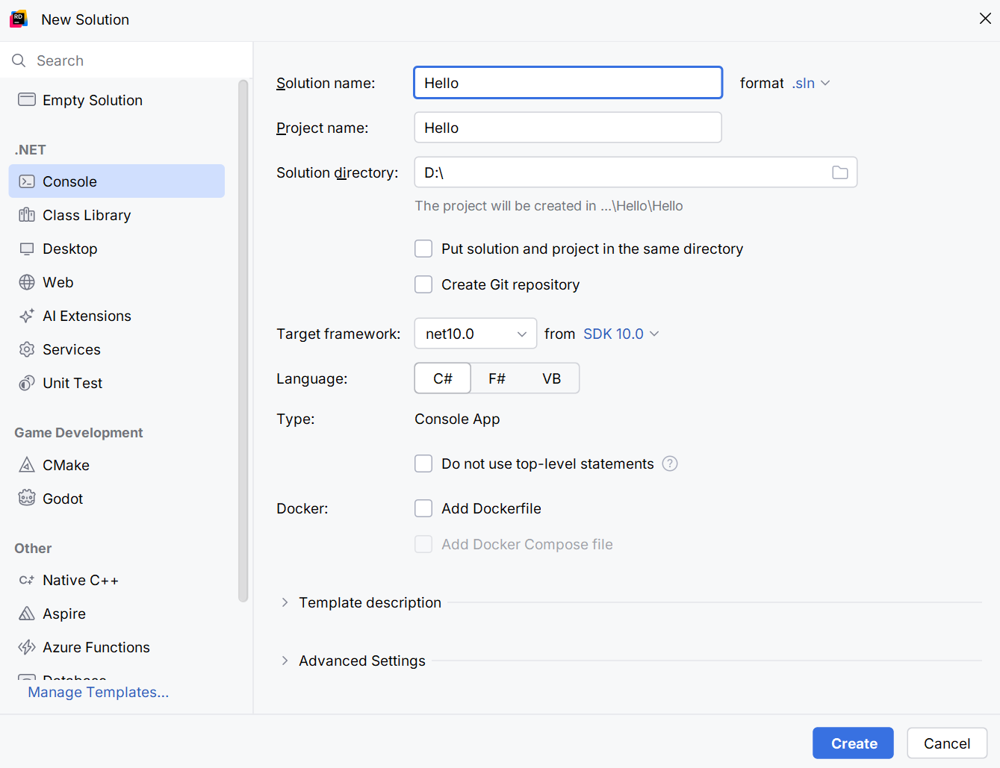
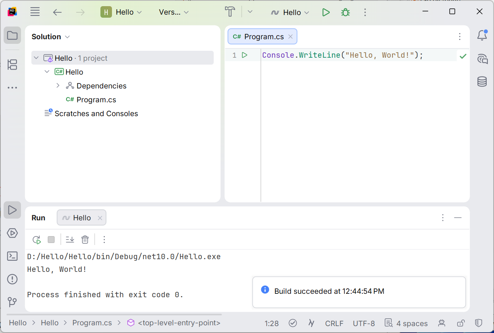

# Installation and development environments

## Installing the .NET SDK

Visual Studio 2026 installs the .NET SDK automatically. You need to install the SDK separately to work in Visual Studio Code, JetBrains Rider, or only at the command line. Instructions for all systems are available in the documentation at <https://learn.microsoft.com/dotnet/core/install/>.

### Windows

Open the download page at <https://dotnet.microsoft.com/download/dotnet/10.0> and, in the *Windows* row of the **SDK 10.0.x** table, choose the installer for your architecture—usually *x64*, or *Arm64* for computers with Snapdragon processors (Fig. 1.5).


Figure 1.5. .NET 10 download page {.caption}

Run the downloaded `dotnet-sdk-10.0.xxx-win-x64.exe` file, click *Install*, and confirm the User Account Control prompt. When finished, the installer displays *Installation was successful* (Fig. 1.6).



Figure 1.6. Completed .NET SDK installation on Windows {.caption}

Another option is **WinGet**, the package manager built into Windows 11. Open a terminal (*Start → Terminal*) and run:

```
winget install Microsoft.DotNet.SDK.10
```

### Linux

On Linux, install .NET from your distribution's package repository. On Ubuntu 24.04 and later, the .NET 10 package is available in the standard repository (Fig. 1.7):

```
sudo apt-get update
sudo apt-get install -y dotnet-sdk-10.0
```

On Fedora, use `sudo dnf install dotnet-sdk-10.0`. Commands for other distributions are listed in the documentation at <https://learn.microsoft.com/dotnet/core/install/linux>. If the package is not in the repository, you can install the SDK with the `dotnet-install` script (<https://learn.microsoft.com/dotnet/core/tools/dotnet-install-script>).


Figure 1.7. Installing the .NET SDK on Ubuntu {.caption}

### macOS

On the download page, choose the *macOS* installer: *Arm64* for Apple Silicon computers or *x64* for Intel computers. Run the `.pkg` file and follow the installation wizard. For details, see <https://learn.microsoft.com/dotnet/core/install/macos>.

### Verifying the installation

After installation, **open a new** terminal and run `dotnet --info`. It displays the SDK version, runtimes, operating system, and processor architecture (Fig. 1.8).



Figure 1.8. Output of `dotnet --info` {.caption}

::: tip Tip
If the terminal reports that `dotnet` was not found, close all terminal windows and open a new one: the `PATH` environment variable is updated only for new windows. If this does not help, restart your computer.
:::

## The Visual Studio 2026 development environment

**Microsoft Visual Studio 2026** is a full-featured IDE (*Integrated Development Environment*) for Windows. It combines a code editor with IntelliSense suggestions, a compiler, a debugger, visual interface designers, and testing and profiling tools.

Visual Studio has three editions: **Community**, **Professional**, and **Enterprise**. Community is free for individual developers, classroom learning, academic research, and open-source projects (<https://visualstudio.microsoft.com/vs/community/>). Its capabilities are sufficient for the entire course.

### System requirements

Visual Studio 2026 officially supports 64-bit Windows 11 (including Arm64 processors) and Windows Server 2019, 2022, and 2025. Requirements:

- an x64 or Arm64 processor, preferably with four or more cores;
- at least 4 GB of RAM; 16 GB recommended;
- 20–50 GB of free disk space for a typical installation, preferably on an SSD;
- a screen resolution of at least 1366 × 768; 1920 × 1080 recommended.

Full requirements are available at <https://learn.microsoft.com/visualstudio/releases/2026/vs-system-requirements>.

### Downloading and installing

1. Open <https://visualstudio.microsoft.com/downloads/> and click *Free download* under *Community* (Fig. 1.9). This downloads a small `VisualStudioSetup.exe` file—the **Visual Studio Installer**.
2. Run the file and accept the license terms. The installer downloads the required components.
3. On the *Workloads* tab, select the *.NET desktop development* workload (Fig. 1.10). It contains everything needed for C# console and desktop applications, including the .NET 10 SDK. You can add web application support later with the *ASP.NET and web development* workload.
4. On the *Language packs* tab, keep *English* as the interface language (Fig. 1.11): menu names in the lectures, documentation, and most learning materials are in English.
5. Click *Install* and wait for completion. Installation takes 10–40 minutes depending on your internet speed.


Figure 1.9. Visual Studio 2026 download page {.caption}



Figure 1.10. Selecting a workload in Visual Studio Installer {.caption}


Figure 1.11. Selecting an interface language in Visual Studio Installer {.caption}

You can change the installed components at any time: use *Tools → Get Tools and Features…* in Visual Studio or the *Modify* button in Visual Studio Installer.

On first launch, Visual Studio asks you to sign in with a Microsoft account (you can skip this with *Skip and add accounts later*) and choose a color theme. The start window then opens (Fig. 1.12).


Figure 1.12. Visual Studio 2026 start window {.caption}

### Creating a console project

1. In the start window, click *Create a new project* (or use *File → New → Project…*).
2. Enter `console` in the search box, select the *Console App* template labeled *C#*, and click *Next* (Fig. 1.13). Do not confuse it with *Console App (.NET Framework)*, which targets the legacy platform.
3. In *Configure your new project*, enter a *Project name*, such as `Hello`, a folder (*Location*), and a *Solution name* (Fig. 1.14). Use Latin letters without spaces for names.
4. In *Additional information*, choose *.NET 10.0 (Long Term Support)* (Fig. 1.15). Leave *Do not use top-level statements* unchecked to give the program the simplest structure. Click *Create*.



Figure 1.13. Selecting a console application template {.caption}



Figure 1.14. Configuring the project name and location {.caption}


Figure 1.15. Selecting the .NET 10 target framework {.caption}

Visual Studio creates a solution containing one project and opens `Program.cs` (Fig. 1.16). The *Solution Explorer* window on the right shows the solution structure (if hidden, use *View → Solution Explorer*); the *Output* and *Error List* windows are at the bottom.



Figure 1.16. Visual Studio main window with the Hello project {.caption}

To run the program, press **Ctrl+F5** (*Debug → Start Without Debugging*). Visual Studio builds the project and opens a console window with the output (Fig. 1.17). **F5** (*Debug → Start Debugging*) runs the program under the debugger.


Figure 1.17. Program output in the console window {.caption}

::: tip Note
After the program finishes, the Visual Studio console window stays open until you press a key. If you double-click `Hello.exe` in the `bin` folder, the window closes as soon as the program finishes—in that case, run the program from a terminal.
:::

Useful Visual Studio shortcuts: **Ctrl+Shift+B** — build the solution; **Ctrl+K, Ctrl+D** — format code; **Ctrl+.** — fixes and suggestions for the selected code; **Ctrl+Space** — IntelliSense list; **F12** — go to definition. Beginner's guide: <https://learn.microsoft.com/visualstudio/get-started/csharp/>.

## Visual Studio Code and C# Dev Kit

**Visual Studio Code** is a free, cross-platform code editor for Windows, Linux, and macOS. Microsoft's **C# Dev Kit** extension provides C# support: IntelliSense suggestions, Solution Explorer, running, debugging, and testing. C# Dev Kit is free for individual developers, education, and open-source projects under the same terms as Visual Studio Community; you must sign in with a Microsoft account to activate it.

1. Install the .NET SDK (see above).
2. Download VS Code from <https://code.visualstudio.com/download> and install it.
3. Open the Extensions panel (**Ctrl+Shift+X**), find Microsoft's *C# Dev Kit*, and click *Install* (Fig. 1.18). The *C#* and *.NET Install Tool* extensions are installed with it. Extension page: <https://marketplace.visualstudio.com/items?itemName=ms-dotnettools.csdevkit>.
4. Open the Command Palette (**Ctrl+Shift+P**), enter *.NET: New Project…*, and choose the *Console App* template, folder, and project name (Fig. 1.19). Alternatively, create the project in a terminal with `dotnet new console -n Hello` and open its folder using *File → Open Folder…*
5. Open `Program.cs` and press **F5**. The program runs, and its output appears in the *Debug Console* panel or the terminal (Fig. 1.20).



Figure 1.18. Installing the C# Dev Kit extension in VS Code {.caption}


Figure 1.19. Creating a project through the VS Code Command Palette {.caption}



Figure 1.20. Running a console project in VS Code {.caption}

For more about working with C# in VS Code, see <https://code.visualstudio.com/docs/csharp/get-started>.

## JetBrains Rider

**JetBrains Rider** is a cross-platform .NET IDE from JetBrains for Windows, Linux, and macOS. Rider is free for non-commercial use, including education; students can also obtain a free educational license for all JetBrains products (<https://www.jetbrains.com/community/education/>).

1. Install the .NET SDK (see above).
2. Download Rider from <https://www.jetbrains.com/rider/download/> or install it through **Toolbox App** (<https://www.jetbrains.com/toolbox-app/>), which updates JetBrains products.
3. On first launch, choose a license type: *Non-commercial use*, or sign in with a JetBrains account with an educational license. The welcome window opens (Fig. 1.21).
4. Click *New Solution*, select the *Console* template, enter the solution and project names, folder, and *net10.0* target framework, then click *Create* (Fig. 1.22).
5. Run the program with the toolbar *Run* button or **Ctrl+F5**; the output appears in the *Run* window (Fig. 1.23).


Figure 1.21. JetBrains Rider welcome window {.caption}



Figure 1.22. Creating a console solution in Rider {.caption}



Figure 1.23. Running a console project in Rider {.caption}

Rider documentation: <https://www.jetbrains.com/help/rider/>.
