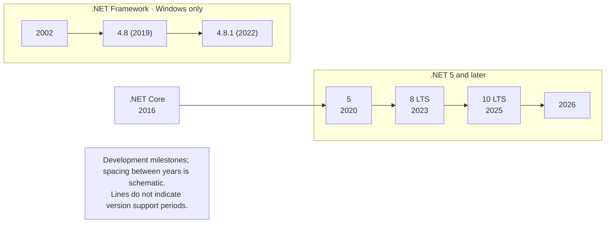
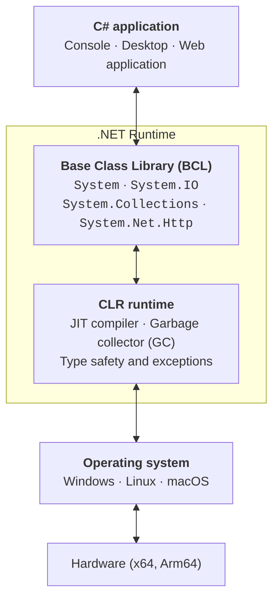
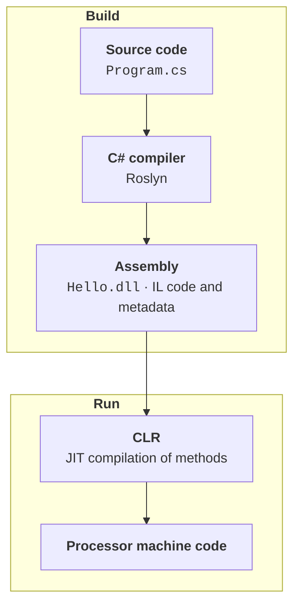
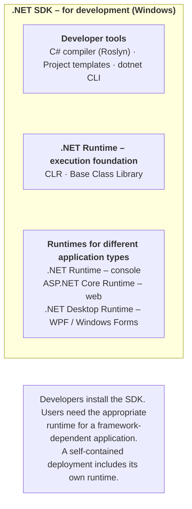

# C# and the .NET platform

## C# and the .NET platform

**.NET** (<https://dotnet.microsoft.com>) is Microsoft's free, open-source development platform. It is used to create console and desktop applications, websites and web services, mobile applications, games, and cloud services. .NET applications run on Windows, Linux, and macOS, as well as Android and iOS mobile devices.

The .NET platform is more than a programming language. It includes:

- **programming languages** — C#, F#, and Visual Basic;
- **a runtime** — a program that starts and controls application execution;
- **libraries** — thousands of ready-made classes for working with text, files, networking, and databases;
- **tools** — a compiler, the `dotnet` command-line tool, and the NuGet package manager.

**C#** (pronounced “C sharp”) is the main language of the .NET platform. Its creator is Anders Hejlsberg, who previously created Turbo Pascal and Delphi. The language was introduced in 2000, and its first version was released in 2002 alongside .NET Framework 1.0. C# is a modern **object-oriented** language with **strong static typing**: each variable's type is known at compile time, and all code belongs to a particular type—a class, structure, record, or interface. C# syntax resembles C++ and Java, so knowing C# makes other languages easier to learn. The official language documentation is available at <https://learn.microsoft.com/dotnet/csharp/>.

The platform's history can be divided into three stages (Fig. 1.1):

- **.NET Framework** (since 2002) — a Windows-only platform; version 4.8.1 was released in 2022, is included with Windows, and receives fixes, but no new features;
- **.NET Core** (2016–2020) — a new open-source, cross-platform implementation for Windows, Linux, and macOS;
- **.NET 5 and later** (since 2020) — a unified platform that continues .NET Core. “Core” is no longer part of its name, and version 4 was skipped to avoid confusion with .NET Framework 4.x.



Figure 1.1. Stages in the development of .NET {.caption}

A new version of .NET is released every November along with a new version of C#. There are two release types: **LTS** (*Long Term Support*) provides three years of support, and **STS** (*Standard Term Support*) provides two years. LTS versions have even numbers (.NET 8, .NET 10), while STS versions have odd numbers. The current LTS version is usually chosen for learning and real projects. Table 1.1 lists the versions supported as of September 2026.

Table 1.1. Supported .NET versions {.caption}

| **Version** | **Language** | **Type** | **Release** | **End of support** |
| --- | --- | --- | --- | --- |
| .NET 8 | C# 12 | LTS | November 2023 | November 10, 2026 |
| .NET 9 | C# 13 | STS | November 2024 | November 10, 2026 |
| .NET 10 | C# 14 | LTS | November 2025 | November 14, 2028 |

This course uses **.NET 10** and **C# 14**. The next version, .NET 11 (STS), is expected in November 2026. Current support dates are published at <https://dotnet.microsoft.com/platform/support/policy/dotnet-core>, and new .NET 10 features are described at <https://learn.microsoft.com/dotnet/core/whats-new/dotnet-10/overview>.

The main uses of .NET are:

- console utilities and services;
- Windows desktop applications — Windows Forms and WPF;
- web applications and web services — ASP.NET Core, Blazor;
- cross-platform mobile and desktop applications — .NET MAUI;
- games — the Unity engine uses C# for scripting;
- cloud services, microservices, and applications with artificial intelligence.

## Supported operating systems

.NET 10 runs on three major operating systems (Table 1.2) on **x64** (Intel, AMD) and **Arm64** (Apple Silicon, Snapdragon, Raspberry Pi 4 and later) processors, and on some systems also on **x86** and **Arm32**. Each OS version is supported for as long as its vendor supports it. The complete, current list is available at <https://github.com/dotnet/core/blob/main/release-notes/10.0/supported-os.md>.

Table 1.2. Operating systems supported by .NET 10 {.caption}

| **OS** | **Versions** | **Architectures** |
| --- | --- | --- |
| Windows | Windows 11 (24H2 and later); Windows 10 — long-term support editions only (Enterprise LTSC, IoT); Windows Server 2012–2025 | x64, x86, Arm64 |
| Linux | Ubuntu 22.04, 24.04, 25.10; Debian 12, 13; Fedora 42–44; Red Hat Enterprise Linux 8–10; CentOS Stream 9, 10; Alpine 3.21–3.23; openSUSE Leap 16.0; SUSE Linux Enterprise 15.7, 16.0 | x64, Arm64, Arm32 |
| macOS | macOS 14 Sonoma, 15 Sequoia, 26 Tahoe | x64, Arm64 |
| Android, iOS | .NET MAUI applications: Android 14–16, iOS 18, 26 | Arm64, x64 |

An application created on one OS can run on another if the .NET runtime is installed there. However, development environments do not support every system (Table 1.3).

Table 1.3. C# development environments {.caption}

| **Environment** | **OS** | **Student license** |
| --- | --- | --- |
| Visual Studio 2026 | Windows 11, Windows Server | Community edition — free |
| Visual Studio Code + C# Dev Kit | Windows, Linux, macOS | free for education |
| JetBrains Rider | Windows, Linux, macOS | free for non-commercial use |

## .NET platform architecture

To understand how a program runs, consider the main .NET platform concepts:

- **CLR** (*Common Language Runtime*) — the runtime that loads a program, compiles its intermediate code to machine code, manages memory, handles exceptions, and ensures type safety;
- **IL** (*Intermediate Language*, CIL) — the intermediate language into which the compiler translates C# source code;
- **JIT compilation** (*Just-In-Time*) — converting methods from IL to machine code immediately before their first execution;
- **BCL** (*Base Class Library*) — the base class library for working with strings, collections, files, networking, and more;
- **CTS** and **CLS** — the Common Type System and Common Language Specification, which allow code written in different .NET languages to interact;
- **assembly** — the result of compiling a project: a `.dll` file with IL code and metadata;
- **NuGet** — the .NET package manager used to add third-party libraries to a project;
- **garbage collector** — the CLR mechanism that automatically releases memory occupied by objects that are no longer used.

These components form layers (Fig. 1.2): application code accesses the Base Class Library, which runs on top of the CLR runtime, and the CLR runs on top of the operating system. This allows the same C# code to run on different operating systems: the BCL and CLR hide the differences between them.



Figure 1.2. .NET platform architecture {.caption}

A C# program executes in two stages (Fig. 1.3). First, the C# compiler (Roslyn) converts `.cs` source files into an assembly containing IL code. At startup, the CLR loads the assembly, and the JIT compiler converts methods to the processor's machine code.



Figure 1.3. Compilation and execution stages of a .NET program {.caption}

This approach offers several advantages:

- **portability** — a single assembly containing IL code runs on different processors and operating systems with .NET installed;
- **language interoperability** — C#, F#, and Visual Basic compile to the same IL and use the shared CTS type system, so a library written in one language can be used in another;
- **safety** — the CLR checks type correctness, checks array bounds, and prevents access to arbitrary memory locations;
- **machine-specific optimization** — the JIT compiler generates code tailored to the processor on which the program runs.

A method is JIT-compiled on its first call: the generated machine code is stored in memory and used on subsequent calls. To speed up startup, .NET also supports ahead-of-time compilation: **ReadyToRun** and **Native AOT** (*Ahead-Of-Time*), where an application is compiled directly to machine code for a particular OS and processor.

Objects are created on the managed heap, and the garbage collector periodically finds objects that are no longer referenced and releases their memory. Unlike C++ programmers, C# programmers therefore do not need to free memory explicitly.

Base Class Library types are grouped into **namespaces**: `System`, `System.IO`, `System.Collections.Generic`, `System.Net.Http`, and others. In addition to IL code, an assembly contains **metadata** (descriptions of all types and their members) and a manifest with the assembly version and a list of dependencies.

## .NET SDK and .NET Runtime packages

Microsoft distributes .NET in two forms (Fig. 1.4):

- **.NET Runtime** — the execution environment: the CLR and libraries. It is enough to **run** existing applications. There are three variants: **.NET Runtime** (console applications), **ASP.NET Core Runtime** (web applications), and **.NET Desktop Runtime** (Windows desktop applications);
- **.NET SDK** (*Software Development Kit*) — the **development** package: runtimes, the C# compiler, project templates, and the `dotnet` command-line tool.

Developers need the .NET SDK, which also installs the runtimes. Multiple SDK and Runtime versions, such as .NET 8 and .NET 10, can coexist on one computer: each project uses the version specified in its project file.



Figure 1.4. Contents of the .NET SDK and .NET Runtime packages {.caption}

An SDK version number has three parts, for example **10.0.401**: 10.0 is the platform version, 4 is the SDK release (new tooling features), and 01 is the patch number. The runtime has its own version number, such as **10.0.12**. The following commands show installed versions:

```
dotnet --info            # all SDK, runtime, and OS information
dotnet --version         # SDK version in use
dotnet --list-sdks       # all installed SDKs
dotnet --list-runtimes   # all installed runtimes
```
