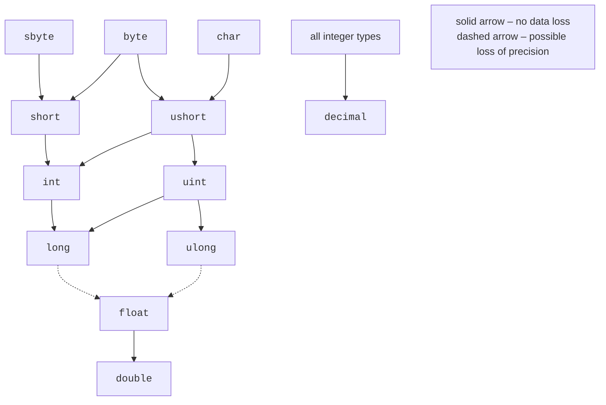

# Conversions and arithmetic

## Type conversions

A value of one type often needs to be used as another: adding an `int` to a `double`, storing a fractional result as an integer, or obtaining a number from a string. C# offers several conversion mechanisms (<https://learn.microsoft.com/dotnet/csharp/language-reference/builtin-types/numeric-conversions>).

### Implicit conversions

An **implicit conversion** happens automatically when it is safe: a source-type value always fits in the target type (Fig. 2.7). For example, `int` converts to `long` or `double`, and `char` to `int`:

```cs
int count = 3;
long total = count;          // int → long
double average = count;      // int → double
int code = 'A';              // char → int, 65
```

Conversions from `long` to `float` or `double` are also implicit but may lose precision: large integers have more significant digits than `float` can hold.



Figure 2.7. Implicit numeric type conversions {.caption}

### Explicit conversions (type casts)

If a conversion may lose data, the compiler requires an **explicit conversion**, or *cast*: write the type in parentheses before the value. Without it, error CS0266 occurs (Fig. 2.8):

```cs
double price = 3.99;
int n = price;         // CS0266: Cannot implicitly convert type
                       // 'double' to 'int'
int whole = (int)price;           // 3
int negative = (int)-3.99;        // -3
int big = 300;
byte low = (byte)big;             // 44
```


Figure 2.8. Implicit conversion error CS0266 {.caption}

Casting a floating-point number to an integer **discards the fractional part** (toward zero) rather than rounding. Casting an integer to a smaller integer type discards the high-order bits: 300 = 256 + 44, so `(byte)300` is 44. The program does not report this data loss, so check the range before casting or use `checked` (see below).

The literal `12.5` has type `double`, so `decimal price = 12.5;` and `float f = 1.5;` cause CS0664. A suffix is required: `12.5m`, `1.5f`.

### String conversions and the `Convert` class

Use `Parse` and `TryParse` to convert a string to a number, and the `Convert` class to convert between different types (Table 2.4).

Table 2.4. String and number conversions {.caption}

| **Expression** | **Result** |
| --- | --- |
| `int.Parse("42")` | 42 |
| `int.Parse("12,5")` | `FormatException` |
| `int.TryParse("abc", out int x)` | `false`, `x` is 0, no exception |
| `double.Parse("12,5")` | 12.5 (Ukrainian settings) |
| `double.Parse("12.5")` | `FormatException` (Ukrainian settings) |
| `double.Parse("12.5", inv)` | 12.5 with any settings |
| `12.5.ToString("F2", inv)` | `"12.50"` — a string with a period |
| `Convert.ToInt32(3.5)` | 4 — to the nearest even integer |
| `Convert.ToInt32(2.5)` | 2 — to the nearest even integer |
| `Convert.ToInt32("ff", 16)` | 255 — from a string in the specified base |
| `Convert.ToString(10, 2)` | `"1010"` — representation in the specified base |

Notice the difference: `(int)3.5` discards the fractional part (3), whereas `Convert.ToInt32(3.5)` rounds (4). In the table, `inv` means `CultureInfo.InvariantCulture`. Without parameters, `Parse` and `ToString` use the current user's **regional settings**: in Ukraine, the decimal separator is a comma. For files, command-line arguments, and data exchange between programs, use `CultureInfo.InvariantCulture` (in `System.Globalization`), where the separator is a period (<https://learn.microsoft.com/dotnet/standard/base-types/parsing-numeric>).

::: tip Tip
Always validate user input with `TryParse`: `Parse` terminates the program with an exception if the user makes an input mistake.
:::

## Arithmetic operators

An **expression** combines values, variables, method calls, and **operators** and evaluates to a single value. Table 2.5 lists arithmetic operators (<https://learn.microsoft.com/dotnet/csharp/language-reference/operators/arithmetic-operators>).

Table 2.5. Arithmetic operators {.caption}

| **Operator** | **Name** | **Example** | **Result** |
| --- | --- | --- | --- |
| `+` | addition | `7 + 2` | 9 |
| `-` | subtraction | `7 - 2` | 5 |
| `*` | multiplication | `7 * 2` | 14 |
| `/` | integer division | `7 / 2` | 3 |
| `/` | floating-point division | `7.0 / 2` | 3.5 |
| `%` | remainder | `7 % 3` | 1 |
| `++`, `--` | increment, decrement | `x++` | `x` + 1 |
| `-x` | unary minus | `-(2 + 3)` | −5 |

### Integer division and remainder

If both operands are integers, `/` performs **integer division**: the fractional part is discarded (toward zero). For a fractional result, at least one operand must be floating-point:

```cs
int total = 7, parts = 2;
Console.WriteLine(total / parts);             // 3
Console.WriteLine(-total / parts);            // -3
Console.WriteLine((double)total / parts);     // 3,5
Console.WriteLine((double)(total / parts));   // 3
Console.WriteLine(total / parts * 2.0);       // 6
```

The fourth line performs integer division first (3), then converts the result to `double`. In the last line, operations proceed left to right: `7 / 2` is 3, which is then multiplied by `2.0`.

The `%` operator returns the **remainder**; its sign matches the dividend: `7 % 3` is 1, and `-7 % 3` is −1. Use remainders to test divisibility (`n % 2 == 0` means an even number), get the last digit (`n % 10`), or split a quantity into units: 125 minutes is `125 / 60` hours and `125 % 60` minutes.

### Increment and decrement

`++` increases a variable by 1, and `--` decreases it. In **prefix** form (`++x`), the expression yields the new value; in **postfix** form (`x++`), it yields the old value:

```cs
int x = 5;
int y = x++;     // y = 5, x = 6: value first, then increment
int z = ++x;     // z = 7, x = 7: increment first, then value
```

When increment is a separate statement (`count++;`), both forms are equivalent. Avoid incrementing the same variable several times in one expression: such code is difficult to read.

### Compound assignment

`x += 5` means `x = x + 5`; `-=`, `*=`, `/=`, and `%=` work similarly. Compound assignment also implicitly casts the result to the variable's type:

```cs
byte level = 250;
level += 10;           // compiles, level = 4 (overflow)
level = level + 10;    // CS0266: byte + int produces int
```

Arithmetic on `byte`, `sbyte`, `short`, and `ushort` is performed as `int`, so adding two `byte` values produces an `int`.

### Division by zero

Division by zero behaves differently depending on the type:

- integer types and `decimal` — `DivideByZeroException` (*Attempted to divide by zero*);
- `float` and `double` — infinity (`∞`, `-∞`) or `NaN`, without an exception.

## Integer overflow

**Overflow** occurs when the result of an integer operation does not fit in its type. By default, C# does not check for overflow: the high-order result bits are discarded, and the value “wraps around” to the other end of the range:

```cs
int max = int.MaxValue;
Console.WriteLine(max + 1);       // -2147483648
```

This behavior is called an **unchecked** context. It is fast but hides errors: a sum calculated with overflow looks like an ordinary number. To make overflow throw `OverflowException`, use a **checked** context—a `checked` operator or block (Fig. 2.9):

```cs
Console.Write("Seconds: ");
int seconds = int.Parse(Console.ReadLine() ?? "0");
int millis = checked(seconds * 1000);   // OverflowException

checked
{
    int total = seconds * 1000 + 500;   // all operations are checked
}
```


Figure 2.9. Overflow exception in a checked context {.caption}

You can enable checking for the whole project with a `.csproj` property, then use `unchecked` blocks in individual places where overflow is acceptable:

```xml
<PropertyGroup>
  <CheckForOverflowUnderflow>true</CheckForOverflowUnderflow>
</PropertyGroup>
```

The compiler always checks constant expressions: `int x = int.MaxValue + 1;` causes CS0220. Casting a floating-point number outside the `int` range with `(int)` produces the nearest range boundary: if `double huge = 1e10;`, then `(int)huge` is 2 147 483 647 (<https://learn.microsoft.com/dotnet/csharp/language-reference/statements/checked-and-unchecked>).

Floating-point types do not throw an overflow exception: `double.MaxValue * 2` is infinity. By contrast, `decimal` always checks for overflow and throws `OverflowException`.
