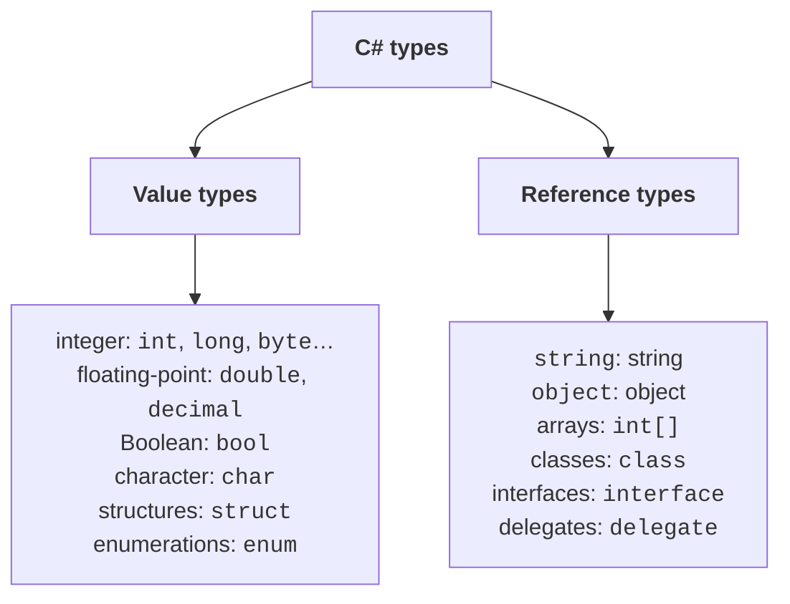
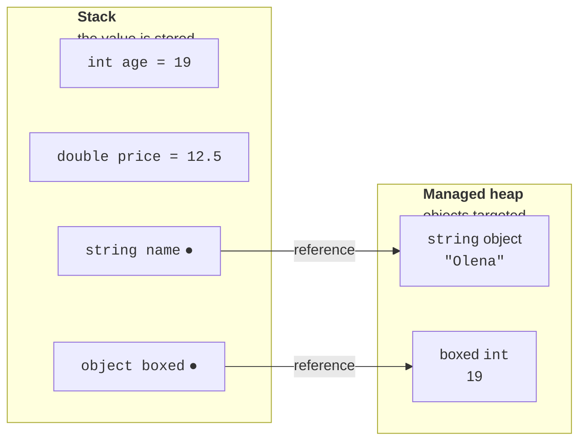
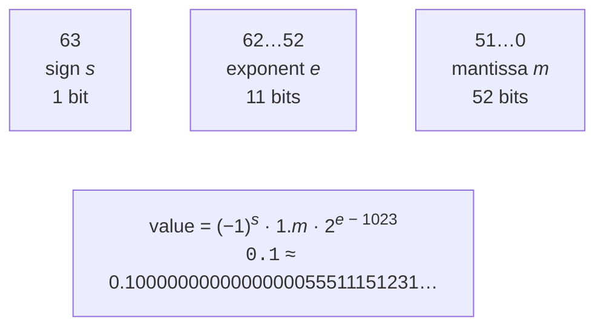
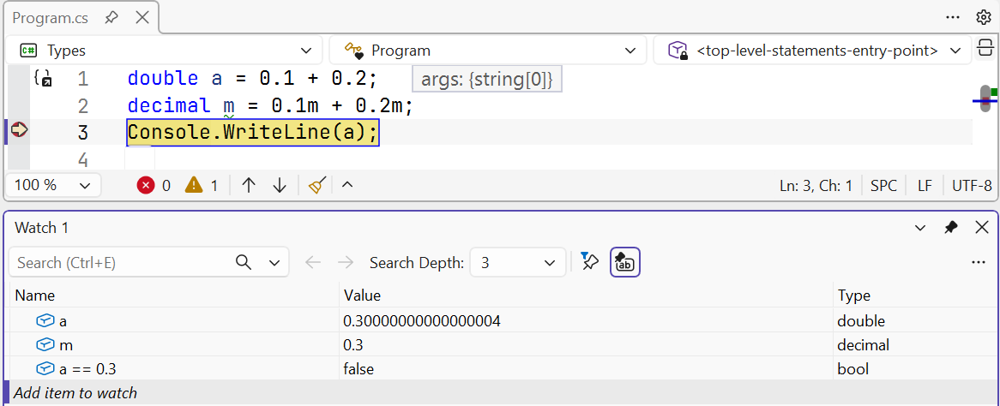

# The type system and numeric types

## The C# type system

A program processes **data**: numbers, text, dates, and Boolean values. Every value in C# has a **type**, which determines:

- how much memory the value occupies;
- which values are allowed (the range);
- which operations can be performed on the value.

C# uses **strong static typing**: each variable's type is known at compile time and does not change. The compiler checks that operations are valid for their operand types, so an error such as “multiply a string by a Boolean value” is detected before the program runs.

The most common types are built into the language and have **keywords**: `int`, `double`, `bool`, `string`, and so on. Each keyword is an alias for a .NET type in the `System` namespace: `int` means `System.Int32`, and `string` means `System.String`. `int x` and `System.Int32 x` are equivalent, but keywords are used by convention. All C# types derive directly or indirectly from `object` (`System.Object`). The built-in types are listed at <https://learn.microsoft.com/dotnet/csharp/language-reference/builtin-types/built-in-types>.

C# types fall into two broad groups (Fig. 2.1):

- **value types** — the variable contains the value directly. These include numeric types, `bool`, `char`, structures (`struct`), and enumerations (`enum`);
- **reference types** — the variable contains a **reference** to an object located elsewhere in memory. These include `string`, `object`, arrays, classes, interfaces, and delegates.



Figure 2.1. Classification of C# types {.caption}

### The stack and managed heap

In a simplified model, program memory consists of two regions (Fig. 2.2):

- **stack** — the region for a method's local variables. Stack memory is allocated and released very quickly: when a method ends, its variables disappear;
- **managed heap** — the region for objects. An object lives as long as at least one reference points to it; the garbage collector removes unneeded objects (<https://learn.microsoft.com/dotnet/standard/garbage-collection/fundamentals>).

A local value-type variable stores its value directly on the stack. A local reference-type variable stores only a reference on the stack, while the object itself resides on the heap.



Figure 2.2. Variables on the stack and managed heap {.caption}

The difference between these groups is most visible during assignment. Value-type assignment **copies the value**, so the variables remain independent. Reference-type assignment **copies the reference**, and both variables point to the same object. Arrays are covered in detail in Topic 4, but already illustrate the difference well:

```cs
int a = 1;
int b = a;                   // copy of the value
b = 2;
Console.WriteLine(a);        // 1 – variable a has not changed

int[] first = { 1, 2 };
int[] second = first;        // copy of the reference
second[0] = 9;
Console.WriteLine(first[0]); // 9 – this is the same array
```

### Boxing and unboxing

A value of any type can be assigned to an `object` variable. For a value type, this performs **boxing**: an object is created on the heap and the value is copied into it. The reverse operation, **unboxing**, uses an explicit cast and is possible only to the same type:

```cs
int n = 42;
object boxed = n;              // boxing: a copy of 42 on the heap
n = 43;
Console.WriteLine(boxed);      // 42
int m = (int)boxed;            // unboxing
long l = (long)boxed;          // InvalidCastException
```

The last line throws `InvalidCastException` because the object contains an `int`, not a `long`. Boxing occurs implicitly, for example when passing a number to an `object` parameter, and requires additional memory, so it is avoided in frequently executed code (<https://learn.microsoft.com/dotnet/csharp/programming-guide/types/boxing-and-unboxing>).

## Integer types

Integer types (*integral numeric types*) store numbers without a fractional part. They differ in size and signedness (Table 2.1). Unsigned types (`byte`, `ushort`, `uint`, `ulong`) cannot store negative numbers, but their maximum value is twice as large.

Table 2.1. C# integer types {.caption}

| **Type** | **.NET type** | **Bytes** | **Range** |
| --- | --- | --- | --- |
| `sbyte` | `SByte` | 1 | −128…127 |
| `byte` | `Byte` | 1 | 0…255 |
| `short` | `Int16` | 2 | −32 768…32 767 |
| `ushort` | `UInt16` | 2 | 0…65 535 |
| `int` | `Int32` | 4 | −2 147 483 648…2 147 483 647 |
| `uint` | `UInt32` | 4 | 0…4 294 967 295 |
| `long` | `Int64` | 8 | ≈ ±9.22 · 10<sup>18</sup> |
| `ulong` | `UInt64` | 8 | 0…≈ 1.84 · 10<sup>19</sup> |
| `nint`, `nuint` | `IntPtr`, `UIntPtr` | 4 or 8 | depends on the process bitness |

The main integer type is `int`: use it unless there is a reason to choose another. Use `long` for large values (a count of milliseconds or file size in bytes) and `byte` for data bytes (color components or file contents). Each type's exact limits are available through `MinValue` and `MaxValue`: `int.MaxValue` is 2 147 483 647. Documentation: <https://learn.microsoft.com/dotnet/csharp/language-reference/builtin-types/integral-numeric-types>.

**Integer literals** can use decimal, hexadecimal (`0x` prefix), or binary (`0b` prefix) notation. Separate digits with `_` for readability:

```cs
int million = 1_000_000;
int mask = 0xFF;             // 255
int flags = 0b1010_0001;     // 161
long population = 8_100_000_000L;
uint big = 4_000_000_000U;
```

A literal's type is determined by its value: it is the first of `int`, `uint`, `long`, and `ulong` that can hold it. Thus `3_000_000_000` has type `uint`. The `L` suffix makes a literal `long`, `U` makes it `uint`, and `UL` makes it `ulong`. Lowercase `l` is allowed, but easily confused with the digit one, so uppercase `L` is used.

## Floating-point types

C# provides three types for numbers with fractional parts (Table 2.2). `float` and `double` store numbers in **binary** floating-point format following IEEE 754, while `decimal` uses **decimal** format.

Table 2.2. C# floating-point types {.caption}

| **Type** | **.NET type** | **Bytes** | **Approximate range** | **Digits** |
| --- | --- | --- | --- | --- |
| `float` | `Single` | 4 | ±1.5 · 10<sup>−45</sup>…±3.4 · 10<sup>38</sup> | 6–9 |
| `double` | `Double` | 8 | ±5.0 · 10<sup>−324</sup>…±1.7 · 10<sup>308</sup> | 15–17 |
| `decimal` | `Decimal` | 16 | ±1.0 · 10<sup>−28</sup>…±7.9 · 10<sup>28</sup> | 28–29 |

A literal containing a decimal point or exponent (`12.5`, `1.5e3`) has type `double`. Add `f` for `float` (`12.5f`) or `m` for `decimal` (`12.5m`). In C# code, the decimal separator is always a period, regardless of regional settings.

### Binary fraction representation error

A `double` occupies 64 bits: sign, exponent, and mantissa (Fig. 2.3). Most decimal fractions, such as 0.1, cannot be represented exactly in binary, just as 1/3 cannot be represented exactly as a decimal fraction. A `double` therefore stores the nearest binary value, introducing small errors during calculations:



Figure 2.3. IEEE 754 representation of a `double` {.caption}

```cs
double a = 0.1 + 0.2;
Console.WriteLine(a);             // 0,30000000000000004
Console.WriteLine(a == 0.3);      // False
decimal m = 0.1m + 0.2m;
Console.WriteLine(m);             // 0,3
```

The error is clearly visible in the Visual Studio debugger's *Watch* window (Fig. 2.4). The debugger displays values with a period because it is independent of regional settings.



Figure 2.4. Floating-point representation error in *Watch* {.caption}

Practical conclusions:

- **do not compare** `double` values with `==`; check that their difference is below a tolerance: `Math.Abs(a - 0.3) < 1e-9`;
- use `decimal` for **monetary amounts**: it stores decimal fractions exactly up to 28 digits;
- use `double` for **scientific and engineering** calculations (physics, geometry, graphics): it is much faster than `decimal` and has a larger range; choose `float` when conserving memory matters (for example, in graphics).

### Infinity and NaN

Integer division by zero throws `DivideByZeroException`. The floating-point types `float` and `double`, however, have special values: **infinity** and **NaN** (*Not a Number*):

```cs
double zero = 0;
Console.WriteLine(1 / zero);        // ∞
Console.WriteLine(-1 / zero);       // -∞
Console.WriteLine(zero / zero);     // NaN
Console.WriteLine(double.NaN == double.NaN);    // False
Console.WriteLine(double.IsNaN(zero / zero));   // True
```

NaN is not equal to any number, including itself, so test for it with `double.IsNaN`. Infinity can be tested with `double.IsInfinity` and `double.IsPositiveInfinity`. `decimal` has no such values: division by zero and values outside its range cause exceptions. Documentation: <https://learn.microsoft.com/dotnet/csharp/language-reference/builtin-types/floating-point-numeric-types>.
