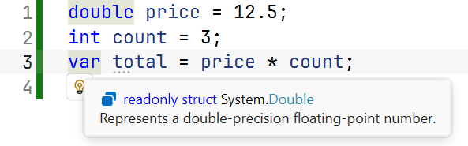
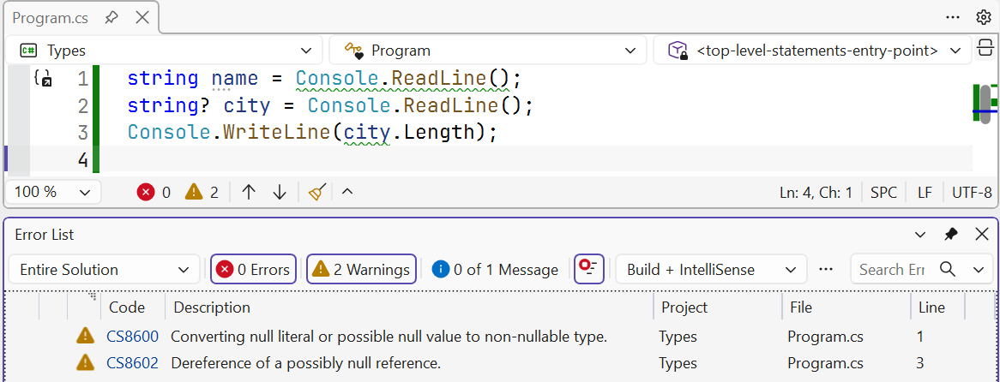

# Characters, strings, variables, and null

## Boolean, character, and string types

The **Boolean type** `bool` has two values: `true` and `false`. Comparison operators produce these values, which are used in conditions. Unlike C and C++, C# does not allow a number to be used as a Boolean value: `bool flag = 1;` causes error CS0029.

The **character type** `char` stores one Unicode character in UTF-16 encoding and occupies 2 bytes. Character literals use single quotes: `'A'`, `'\u0457'`, `'7'`. Special characters use **escape sequences** (Table 2.3).

Table 2.3. Escape sequences {.caption}

| **Notation** | **Character** | **Notation** | **Character** |
| --- | --- | --- | --- |
| `\n` | new line | `\'` | single quote |
| `\t` | tab | `\"` | double quote |
| `\\` | backslash | `\0` | character with code 0 |
| `\r` | carriage return | `\u0410` | Unicode character by code (Cyrillic A) |

A character has a numeric code, so you can perform arithmetic on it, but the result has type `int`:

```cs
char letter = 'A';
Console.WriteLine(letter + 1);          // 66
Console.WriteLine((char)(letter + 1));  // B
Console.WriteLine('7' - '0');           // 7 – the digit as a number
Console.WriteLine(char.IsDigit('7'));   // True
Console.WriteLine(char.ToUpper('\u0457'));   // U+0407 (Ukrainian capital letter Yi)
```

The **string type** `string` is a sequence of `char` characters. It is a reference type with two special properties: strings are **immutable**—every “change” creates a new string—and `==` compares string **contents**, not references. Strings are covered in detail in Topic 4.

```cs
string s = "Hello";
string t = s;
t += "!";                    // a new string is created
Console.WriteLine(s);        // Hello
Console.WriteLine(t);        // Hello!
Console.WriteLine(s.Length); // 5
```

The `object` type can store a value of any type. It is useful when the type is not known in advance, but loses the benefits of static typing: to perform operations on the value again, you must explicitly cast it to the required type.

## Variables and constants

A **variable** is a named memory location that stores a value of a particular type. Declare a variable by specifying its type and name, and usually **initialize** it immediately—assign an initial value:

```cs
int count = 10;
double price = 12.5, discount = 0.1;   // two variables of the same type
string city;                           // declaration without a value
city = "Kryvyi Rih";                   // assignment
```

A local variable cannot be used until it has been assigned a value: the compiler reports CS0165, *Use of unassigned local variable*. You can change a variable, but only to values of its type.

A local variable's **scope** extends from its declaration to the end of the `{ … }` block in which it is declared. You cannot declare a variable with the same name in a nested block (error CS0136).

**Naming rules.** A name consists of letters, digits, and `_`; it cannot begin with a digit or match a keyword. Case matters: `count` and `Count` are different names. .NET conventions use camelCase for local variables (`totalPrice`) and PascalCase for constants (`MaxCount`). Names should explain their meaning: `distanceKm` is better than `d`. Although C# permits Ukrainian letters in names, English words are used by convention (<https://learn.microsoft.com/dotnet/csharp/fundamentals/coding-style/identifier-names>).

### Implicit typing with `var`

You can use `var` instead of a type: the compiler then determines the variable's type from its initializer. The variable still has a specific type that does not change (Fig. 2.5):

```cs
var count = 5;           // int
var price = 12.5;        // double
var sum = 12.5m;         // decimal
var big = 5L;            // long
var name = "Olena";      // string
var total = price * count;   // double
```



Figure 2.5. A `var` variable's type in *Quick Info* {.caption}

A `var` variable must be initialized (error CS0818), and its initializer cannot be `null` (CS0815). Use `var` when the type is obvious from the right-hand side; if it is not obvious, as in `var result = Calculate();`, writing the type explicitly is preferable.

### Constants

A **constant** is a named value set at compile time that does not change. Declare it with `const`:

```cs
const double G = 9.81;               // gravitational acceleration
const int SecondsPerHour = 60 * 60;  // evaluated by the compiler
const string Currency = "UAH";
```

A constant's value must be known to the compiler: a number, string, Boolean value, or expression made from them. A method call, such as `const double Root = Math.Sqrt(2);`, causes CS0133. Constants replace “magic numbers” in code: `total * VatRate` is clearer than `total * 0.2m`, and the rate needs to be changed in only one place.

### Default values

Each type has a **default value**, assigned to class fields and array elements without explicit initialization: `0` for numeric types, `false` for `bool`, `'\0'` for `char`, and `null` for reference types. The expression `default(T)` or the `default` literal returns it:

```cs
int zero = default;             // 0
bool flag = default(bool);      // False
string? text = default;         // null
```

## Types that allow `null`

`null` means “no value” or “the reference points nowhere.” A value type such as `int` always contains a number, so when a value may be absent (an optional form field or an unknown grade), use a **nullable value type**: `int?`, `double?`, or `bool?`.

```cs
int? age = null;
Console.WriteLine(age.HasValue);             // False
Console.WriteLine(age.GetValueOrDefault());  // 0
Console.WriteLine(age + 1 == null);          // True
age = 19;
Console.WriteLine(age.Value);                // 19
```

`HasValue` indicates whether a value is present, and `Value` returns it; if no value is present, accessing `Value` throws `InvalidOperationException`. An arithmetic operation involving `null` produces `null` (<https://learn.microsoft.com/dotnet/csharp/language-reference/builtin-types/nullable-value-types>).

### The `??` and `??=` operators

The **null-coalescing operator** `a ?? b` returns `a` if it is not `null`, otherwise `b`. The `a ??= b` operator assigns `b` to `a` only if `a` is `null` (<https://learn.microsoft.com/dotnet/csharp/language-reference/operators/null-coalescing-operator>):

```cs
int? discount = null;
int percent = discount ?? 0;        // 0

string? name = Console.ReadLine();
name ??= "Guest";                   // if input has ended
string input = Console.ReadLine() ?? "";
```

### Nullable reference types

Reference variables have always been able to contain `null`, and accessing a member through `null` (`name.Length`) causes the very common `NullReferenceException`. To find such errors at compile time, C# provides a **nullable context** (*nullable reference types*). New projects enable it with `<Nullable>enable</Nullable>` in the `.csproj` file. In this context:

- `string` is a string that **should not** be `null`;
- `string?` is a string that **may** be `null`, such as the result of `Console.ReadLine()`.

The compiler analyzes the code and issues **warnings** (not errors) (Fig. 2.6):

```cs
string name = Console.ReadLine();   // CS8600
string? city = Console.ReadLine();
Console.WriteLine(city.Length);     // CS8602
```

CS8600 means a potentially `null` value is assigned to a variable whose type has no `?`; CS8602 means a potentially `null` variable is dereferenced without a check. Fix this by supplying a default value with `??` or checking for `null`. Do not ignore these warnings: each indicates a possible runtime exception. The nullable context is covered in detail in Topic 7 (<https://learn.microsoft.com/dotnet/csharp/nullable-references>).



Figure 2.6. Warning about a possible `null` value {.caption}
