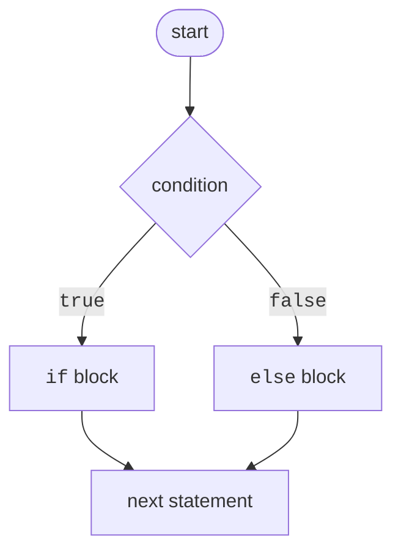

# Blocks and the conditional statement

## Code blocks and scope

A **block** is a sequence of statements enclosed in braces `{ }`. A block can appear wherever the language allows one statement, so blocks form the bodies of branches and loops.

A variable declared inside a block is **visible** only within it: from its declaration to the closing brace. After leaving the block, the name is unavailable (CS0103); a nested block cannot declare a variable with the same name as one in an outer block (CS0136):

```cs
int total = 0;
{
    int bonus = 5;        // visible only in this block
    total += bonus;
}
Console.WriteLine(total); // 5
// Console.WriteLine(bonus);  – error CS0103
```

C# convention uses **Allman** style: each brace goes on its own line, and block contents are indented by 4 spaces. Visual Studio formats code automatically (**Ctrl+K, Ctrl+D**). Use braces even around a single statement: this prevents mistakes when adding lines (<https://learn.microsoft.com/dotnet/csharp/fundamentals/coding-style/coding-conventions>).

## The `if` statement

`if` executes a block if the **condition**, an expression of type `bool`, is `true`. The optional `else` part executes if the condition is `false` (Fig. 3.1):

```cs
int temperature = -3;

if (temperature < 0)
{
    Console.WriteLine("It is freezing. Dress warmly.");
}
else
{
    Console.WriteLine("The temperature is above zero.");
}
```



Figure 3.1. Flowchart of an `if`/`else` branch {.caption}

A C# condition always has type `bool`: `if (count)` with an integer `count` causes CS0029, and the compiler also rejects assignment `if (x = 5)` in place of comparison `if (x == 5)`. Build complex conditions with `&&`, `||`, and `!` (Topic 2) (<https://learn.microsoft.com/dotnet/csharp/language-reference/statements/selection-statements>).

### `else if` chains and nested conditions

For more than two alternatives, use an `else if` chain. Conditions are checked in order, and only the block for the **first** true condition executes, so order matters:

```cs
double bmi = 23.4;
string category;

if (bmi < 18.5)
{
    category = "underweight";
}
else if (bmi < 25)
{
    category = "normal";
}
else if (bmi < 30)
{
    category = "overweight";
}
else
{
    category = "obesity";
}
Console.WriteLine(category);   // normal
```

The second condition, `bmi < 25`, does not check `bmi >= 18.5`: a lower index would have matched the first condition. The compiler also sees that `category` is assigned in every branch; removing the final `else` would make use of the variable cause CS0165.

You can nest one `if` inside another. Deep nesting is difficult to read, so an **early return** is often used: check error cases first and exit with `return`, leaving the main logic unindented:

```cs
Console.Write("Age: ");
if (!int.TryParse(Console.ReadLine(), out int age))
{
    Console.WriteLine("An integer is required.");
    return;
}
if (age < 0 || age > 150)
{
    Console.WriteLine("Invalid age.");
    return;
}
Console.WriteLine(age >= 18 ? "Adult" : "Minor");
```

::: tip Common mistake
A semicolon after the condition in `if (x > 0);` creates an **empty statement**: the braced block that follows always executes. The compiler warns with CS0642, *Possible mistaken empty statement*.
:::

## The ternary operator `?:`

The **conditional (ternary) operator** `condition ? expression1 : expression2` returns `expression1` if the condition is true, otherwise `expression2`. Unlike `if`, it is an **expression**: it has a value that can be assigned, passed to a method, or inserted into an interpolated string:

```cs
int n = 7;
string parity = n % 2 == 0 ? "even" : "odd";
int abs = n >= 0 ? n : -n;
Console.WriteLine($"{n} – {parity}, absolute value {abs}");
Console.WriteLine($"Found {n} file{(n == 1 ? "" : "s")}");
```

Both expressions must have the same type or convert to a common type. Parenthesize the ternary operator inside an interpolated string because a colon otherwise introduces a format. The ternary operator is convenient for choosing between two simple values; nested `?:` expressions are hard to read, so prefer `if` or a `switch` expression in those cases.
