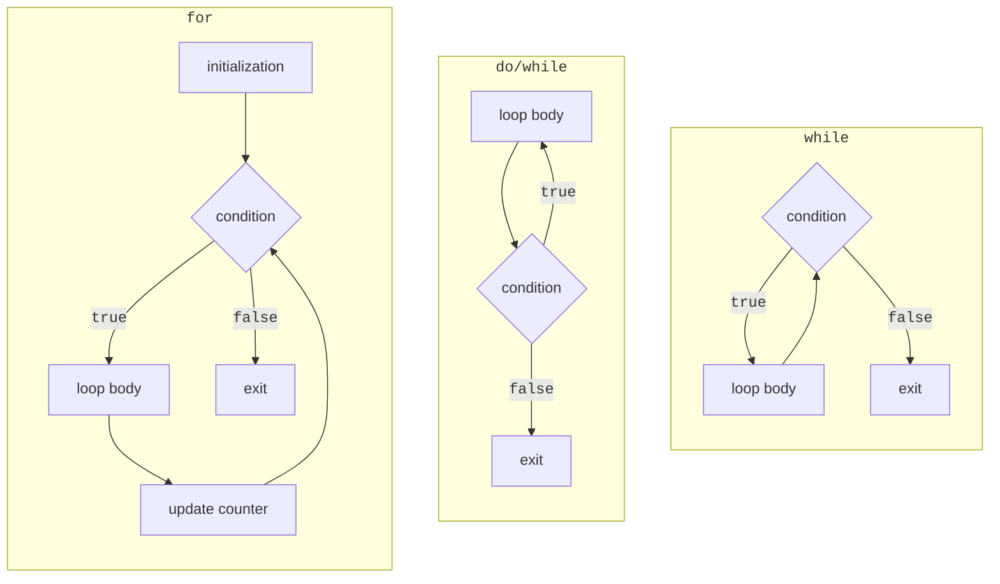
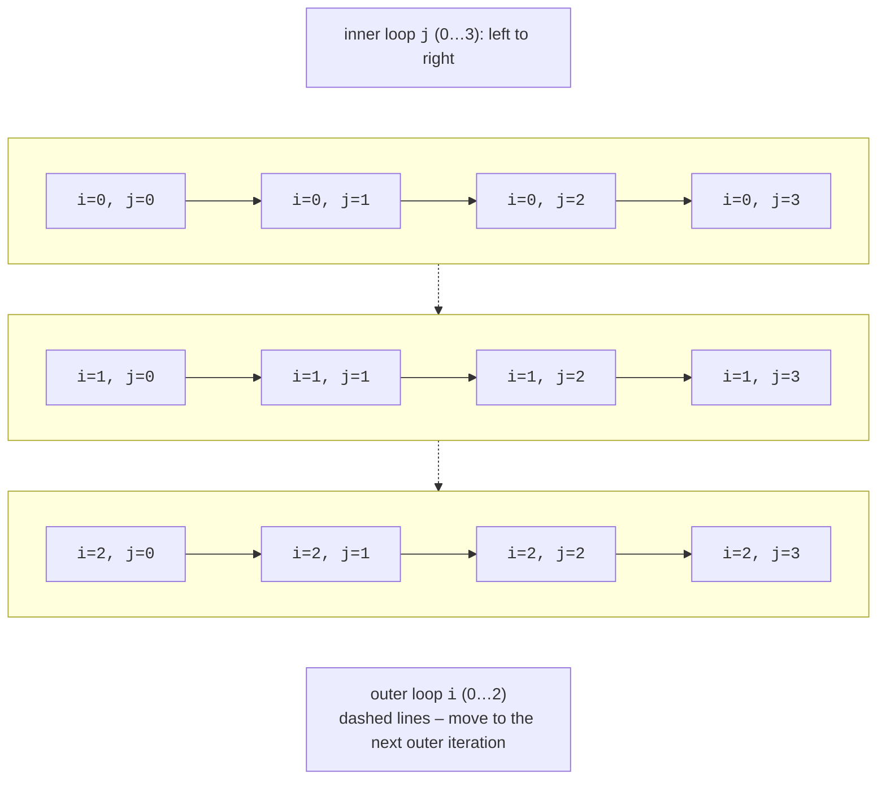
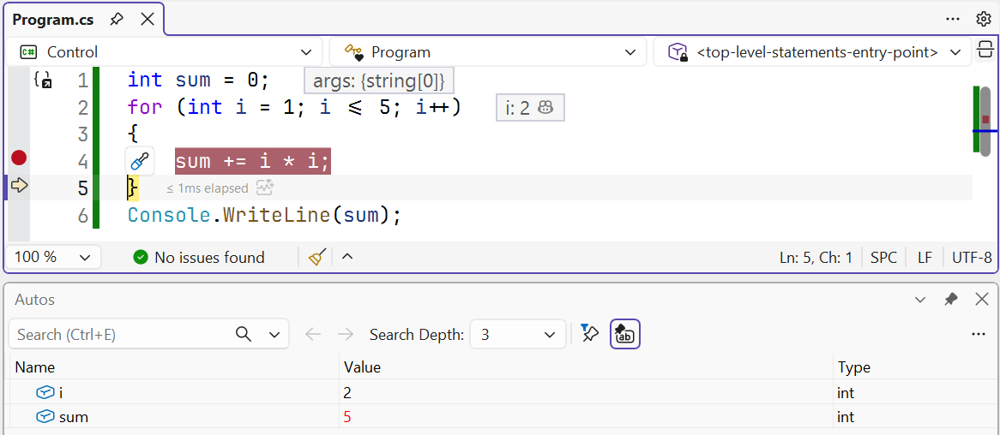

# Loops

## `while` and `do`/`while` loops

A **loop** repeats its **body**, a statement or block, while a condition holds. One execution of the body is an **iteration**. C# provides four loops: `while`, `do`/`while`, `for`, and `foreach`. Figure 3.5 compares the first three (<https://learn.microsoft.com/dotnet/csharp/language-reference/statements/iteration-statements>).



Figure 3.5. Flowcharts of `while`, `do`/`while`, and `for` loops {.caption}

### The `while` loop

A `while` loop (a **pre-test** loop) checks its condition **before** each iteration. If the condition is initially false, the body never executes. Choose `while` when the number of repetitions is unknown, for example when reading input until an empty line:

```cs
int number = 1_234_567;
int digits = 0;
int sum = 0;

while (number > 0)
{
    sum += number % 10;   // last digit
    number /= 10;         // discard the last digit
    digits++;
}
Console.WriteLine($"Digits: {digits}, digit sum: {sum}");
```

Output: `Digits: 7, digit sum: 28`. The loop body **must change** something affecting the condition, or the loop becomes **infinite**. An intentional infinite loop uses `while (true)` and exits through `break` or `return` (see below). Stop a stuck program with **Ctrl+C** in the console or **Shift+F5** in Visual Studio.

### The `do`/`while` loop

A `do`/`while` loop (a **post-test** loop) executes its body before checking the condition, so the body runs **at least once**. This is natural for menus and repeated input prompts: you must ask before checking the answer. A semicolon is required after the condition:

```cs
int level;
do
{
    Console.Write("Difficulty level (1–3): ");
}
while (!int.TryParse(Console.ReadLine(), out level)
       || level is < 1 or > 3);

Console.WriteLine($"Selected level {level}");
```

## The `for` loop

`for` is convenient when the repetition count is known or a counter is involved. The header has three semicolon-separated parts: **initialization** (executed once), **condition** (checked before every iteration), and **iterator** (executed after every iteration):

```cs
for (int i = 1; i <= 5; i++)
{
    Console.Write($"{i * i} ");      // 1 4 9 16 25
}
Console.WriteLine();

for (int i = 10; i > 0; i -= 3)
{
    Console.Write($"{i} ");          // 10 7 4 1
}
Console.WriteLine();

for (int left = 0, right = 9; left < right; left++, right--)
{
    Console.Write($"{left}-{right} "); // 0-9 1-8 2-7 3-6 4-5
}
Console.WriteLine();
```

A variable declared in the `for` header is visible only inside the loop. Any header part may be omitted: `for (;;)` is an infinite loop. Every `for` loop can be rewritten as `while`, but `for` collects all counter information on one line, making it easier to read.

### Nested loops

A loop can contain another loop. For each **outer** iteration, the **inner** loop runs in full (Fig. 3.6). If the outer loop runs *n* times and the inner loop *m* times, the inner body executes *n* · *m* times. Nested loops are used for tables, rectangular patterns, and iterating over pairs of values:



Figure 3.6. Execution order of nested loops {.caption}

```cs
for (int row = 1; row <= 4; row++)
{
    for (int col = 1; col <= row; col++)
    {
        Console.Write('*');
    }
    Console.WriteLine();
}
```

The program prints a triangle: one asterisk on the first line, four on the fourth. The inner counter depends on the outer one (`col <= row`), so its iteration count increases with each row.

### Stepping through a loop

To understand how variables change, step through the loop in the debugger: set a breakpoint (**F9**) inside the body, start with **F5**, and press **F10** (*Step Over*). *Autos* or *Locals* shows current values, highlighting those changed in the last step in red (Fig. 3.7). **F5** continues to the next breakpoint hit, meaning the next iteration (<https://learn.microsoft.com/visualstudio/debugger/navigating-through-code-with-the-debugger>).



Figure 3.7. Stepping through a `for` loop in the debugger {.caption}

## The `foreach` loop

`foreach` iterates over **collection** elements: characters in a string, array elements, or command-line arguments. No counter is needed: each iteration assigns the next element to the variable:

```cs
string text = "Object-oriented programming";
int vowels = 0;

foreach (char ch in text)
{
    if ("aeiouAEIOU".Contains(ch))
    {
        vowels++;
    }
}
Console.WriteLine($"Vowels: {vowels}");   // Vowels: 9
```

A `foreach` variable is read-only: you cannot assign to it (CS1656). Iterate over command-line arguments similarly: `foreach (string arg in args)`. Arrays and collections are covered in detail in Topics 4 and 13.
