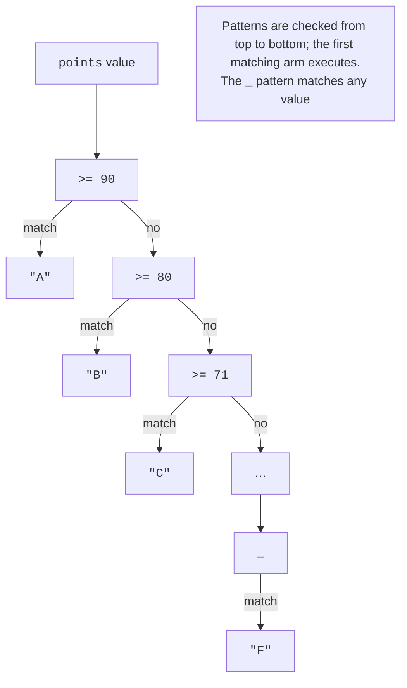
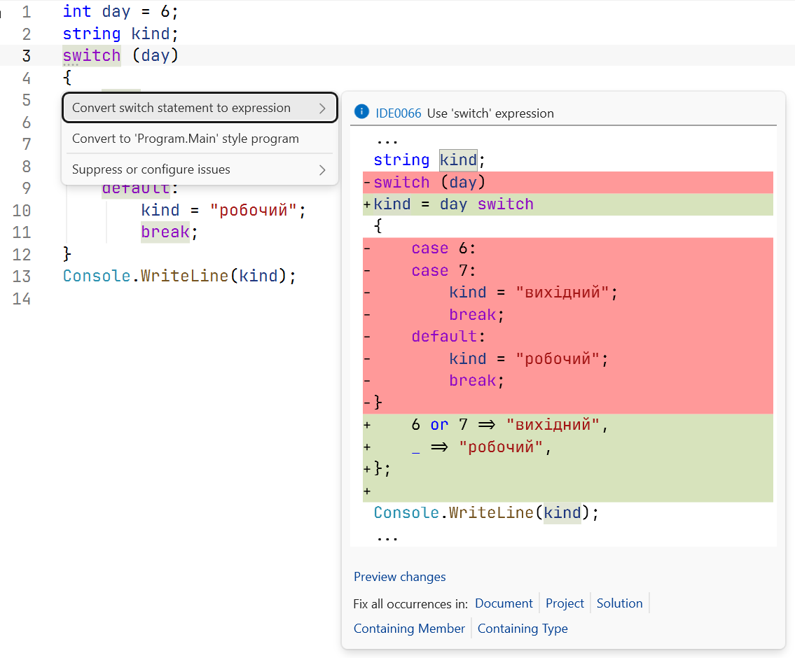
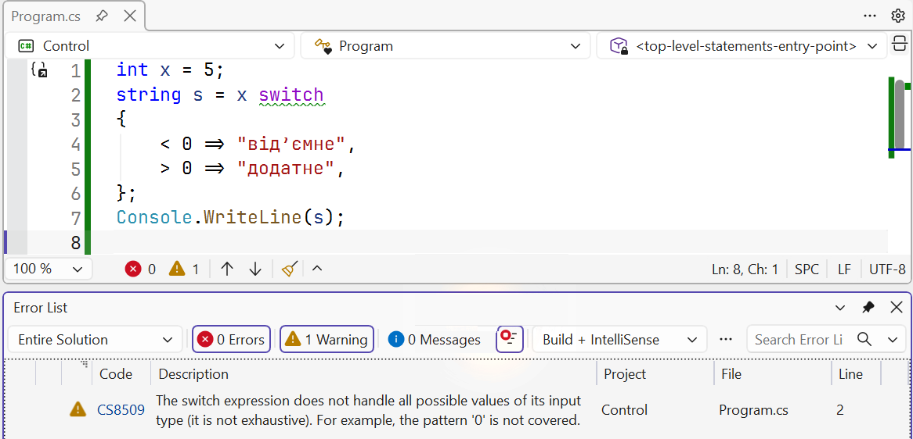

# switch and patterns

## The `switch` statement

A `switch` statement selects one of several branches based on an expression's value. Each branch (*switch section*) begins with one or more `case` labels and ends with a statement that exits it, most often `break`. The `default` label handles all other values:

```cs
int day = 6;

switch (day)
{
    case 1:
    case 2:
    case 3:
    case 4:
    case 5:
        Console.WriteLine("Working day");
        break;
    case 6:
    case 7:
        Console.WriteLine("Weekend");
        break;
    default:
        Console.WriteLine("No such day of the week");
        break;
}
```

Consecutive labels (`case 6:` `case 7:`) lead to one block. Unlike C and C++, C# **does not allow fall-through** from one nonempty branch to the next: forgetting `break` causes CS0163, *Control cannot fall through from one case label to another*. To deliberately transfer to another branch, use `goto case 7;`, though this makes code harder to read. A branch may also end with `return`, `continue` (inside a loop), or `throw`.

The expression tested by `switch` can be `int`, `char`, `string`, `bool`, or an enumeration, and with patterns (see below), any type. String comparisons are case-sensitive: `"Q"` and `"q"` are different values.

## Patterns

**Pattern matching** checks whether a value has a particular form. Patterns are used with `is`, in `case` labels, and in `switch` expressions (<https://learn.microsoft.com/dotnet/csharp/language-reference/operators/patterns>). Table 3.1 lists the main patterns.

Table 3.1. Main C# patterns {.caption}

| **Pattern** | **What it checks** | **Example** |
| --- | --- | --- |
| constant | equality to a constant | `0`, `"q"`, `null` |
| relational | comparison with a constant | `< 0`, `>= 90` |
| logical `and` | both patterns match | `>= 1 and <= 12` |
| logical `or` | at least one pattern matches | `6 or 7` |
| logical `not` | the pattern does not match | `not null` |
| parenthesized | grouping patterns | `not (< 0 or > 100)` |
| discard `_` | any value (in a `switch` expression) | `_` |
| declaration | a type and a new variable | `int n` |

### The `is` operator

`expression is pattern` returns `true` if the value matches the pattern. Combined with logical patterns, it produces concise, clear conditions that mention a variable only once:

```cs
int month = 7;
char c = 'k';
string? name = null;

bool isSummer = month is 6 or 7 or 8;             // True
bool valid = month is >= 1 and <= 12;             // True
bool isLetter = c is (>= 'a' and <= 'z')
                  or (>= 'A' and <= 'Z');         // True
bool hasName = name is not null;                  // False
Console.WriteLine($"{isSummer} {valid} {isLetter} {hasName}");
```

`month is 6 or 7 or 8` is equivalent to `month == 6 || month == 7 || month == 8`. The `not null` pattern is the recommended way to check for `null`.

### Patterns in `switch` statements and the `when` condition

A `case` label can contain a pattern followed by an additional `when` condition. Branches are checked from top to bottom, and the first matching branch executes:

```cs
int score = 87;
bool isRetake = true;

switch (score)
{
    case < 0 or > 100:
        Console.WriteLine("Invalid score");
        break;
    case >= 50 when isRetake:
        Console.WriteLine("Retake passed");
        break;
    case >= 50:
        Console.WriteLine("Passed");
        break;
    default:
        Console.WriteLine("Failed");
        break;
}
```

## The `switch` expression

A `switch` **expression** selects a **value** by pattern. Its syntax is shorter than a statement: the value precedes `switch`, and comma-separated `pattern => result` arms need no `case` or `break` (<https://learn.microsoft.com/dotnet/csharp/language-reference/operators/switch-expression>):

```cs
int points = 76;

string ects = points switch
{
    >= 90 => "A",
    >= 80 => "B",
    >= 71 => "C",
    >= 61 => "D",
    >= 50 => "E",
    >= 30 => "FX",
    _ => "F",
};
Console.WriteLine(ects);    // C
```

Arms are checked in order (Fig. 3.2), so `>= 80` does not need `< 90`. The discard pattern `_` matches any value and always comes last. If a pattern can never match because earlier arms already cover it, the compiler reports CS8510.



Figure 3.2. Pattern checking order in a `switch` expression {.caption}

Visual Studio suggests converting a `switch` statement whose branches only assign values to an expression: place the cursor on `switch`, press **Ctrl+.**, and select *Convert switch statement to expression* (Fig. 3.3).



Figure 3.3. Converting a `switch` statement to a `switch` expression {.caption}

A `switch` expression must be **exhaustive**: every possible value must match an arm. If the compiler finds an uncovered value, it issues CS8509 and gives an example (Fig. 3.4). At runtime, that value would cause `SwitchExpressionException`. Numeric and string expressions therefore almost always include `_`.



Figure 3.4. Warning about a non-exhaustive `switch` expression {.caption}

Arm results must convert to a common type, and arms can be grouped with logical patterns:

```cs
int month = 4;
int year = 2028;
bool isLeap = (year % 4 == 0 && year % 100 != 0) || year % 400 == 0;

int days = month switch
{
    2 => isLeap ? 29 : 28,
    4 or 6 or 9 or 11 => 30,
    >= 1 and <= 12 => 31,
    _ => 0,
};
Console.WriteLine(days);    // 30
```
