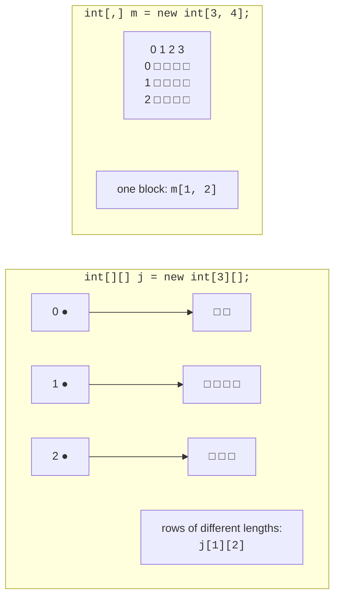

# The Array class and multidimensional arrays

## The `Array` class

The static `Array` class provides methods for working with arrays of any type (Table 4.1, <https://learn.microsoft.com/dotnet/api/system.array>).

Table 4.1. Main array methods {.caption}

| **Method** | **Purpose** |
| --- | --- |
| `Array.Sort(a)` | sorts the array in ascending order (modifies the array itself) |
| `Array.Reverse(a)` | reverses the element order |
| `Array.IndexOf(a, x)` | index of the first element equal to `x`, or −1 |
| `Array.LastIndexOf(a, x)` | index of the last such element, or −1 |
| `Array.BinarySearch(a, x)` | fast search in a **sorted** array; a negative value if the element is absent |
| `Array.Fill(a, x)` | fills all elements with `x` |
| `Array.Resize(ref a, n)` | creates a new array of length `n` and copies the elements |
| `Array.Exists(a, x => x < 0)` | whether an element satisfies the condition |
| `Array.Copy(src, dst, n)` | copies `n` elements from one array to another |
| `a.Contains(x)` | whether the array contains `x` |

```cs
int[] data = [42, 7, 19, 7, 88, 3];

Array.Sort(data);
Console.WriteLine(string.Join(" ", data));        // 3 7 7 19 42 88
Console.WriteLine(Array.BinarySearch(data, 42));  // 4
Console.WriteLine(Array.IndexOf(data, 7));        // 1
Console.WriteLine(Array.Exists(data, x => x > 50)); // True

Array.Resize(ref data, 8);                  // add 2 slots
Console.WriteLine(string.Join(" ", data));  // 3 7 7 19 42 88 0 0
Array.Fill(data, -1);
Console.WriteLine(string.Join(" ", data));  // -1 -1 … -1
```

The `Array.Resize` method does not change an existing array’s length: it creates a new array and stores a reference to it in the variable (which is why the parameter uses `ref`, Topic 5). The condition in `Array.Exists` is a **lambda expression** `x => x > 50`: “for element `x`, check `x > 50`” (covered in detail in Topic 14). If the element count is unknown in advance and changes frequently, use a `List<T>` instead of an array (Topic 13).

## Rectangular and jagged arrays

A **rectangular** (multidimensional) array `int[,]` stores a table with the same number of elements in every row: a matrix, game board, or schedule. The `GetLength(n)` method returns the number of elements in a dimension, and `Length` returns the total element count:

```cs
int[,] matrix =
{
    { 1, 2, 3 },
    { 4, 5, 6 },
};
int rows = matrix.GetLength(0);     // 2
int cols = matrix.GetLength(1);     // 3

for (int i = 0; i < rows; i++)
{
    for (int j = 0; j < cols; j++)
    {
        Console.Write($"{matrix[i, j] * 10,4}");
    }
    Console.WriteLine();
}
Console.WriteLine($"Elements: {matrix.Length}");   // 6
```

A **jagged array** `int[][]` is an array of arrays: every row is a separate one-dimensional array and can have its own length. Create rows separately (Fig. 4.4):

```cs
int[][] jagged = new int[3][];
jagged[0] = [1, 2];
jagged[1] = [3, 4, 5, 6];
jagged[2] = [7, 8, 9];

for (int i = 0; i < jagged.Length; i++)
{
    Console.WriteLine($"Row {i}: {string.Join(" ", jagged[i])}");
}
Console.WriteLine(jagged[1][2]);    // 5
```



Figure 4.4. Rectangular and jagged arrays {.caption}

Comparing the two array types:

- rectangular array: one object, access with `m[i, j]`, dimensions `GetLength(0)` and `GetLength(1)`; a row cannot be accessed as a separate array;
- jagged array: an array of row references, access with `j[i][k]`, row count `j.Length`, row length `j[i].Length`; a row can be passed to a method, replaced, or sorted independently. Before rows are created, the `j[i]` elements are `null`.

In the debugger, rectangular array elements are shown with two indices `[0, 0]`, `[0, 1]`, … (Fig. 4.5).


Figure 4.5. A two-dimensional array in the *Watch* window {.caption}
