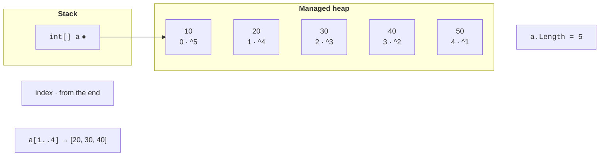
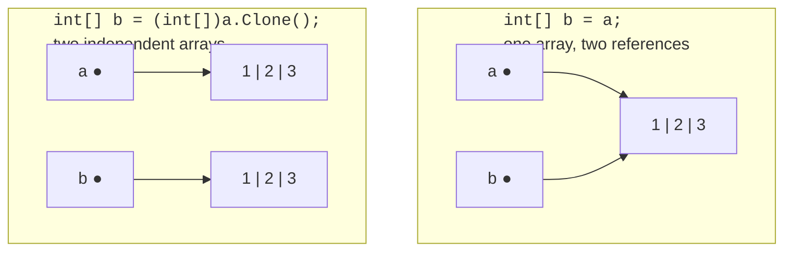

# One-dimensional arrays

## One-dimensional arrays

An **array** is an ordered collection of elements of **one type** with a fixed length. Each element is accessed by an **index** — a number starting at zero. Arrays are useful when you need to store and process many values in the same way: a group’s grades, temperature measurements, or image pixels (<https://learn.microsoft.com/dotnet/csharp/language-reference/builtin-types/arrays>).

An array type is written as the element type followed by square brackets: `int[]`, `double[]`, `string[]`. Create an array using `new` with a length, or supply its values immediately. The primary modern form is a **collection expression** in square brackets (<https://learn.microsoft.com/dotnet/csharp/language-reference/operators/collection-expressions>):

```cs
int[] scores = new int[5];                 // 5 zeros
string[] days = ["Mon", "Tue", "Wed", "Thu", "Fri"];
double[] prices = [12.5, 7.99, 105];
int[] empty = [];                          // an empty array

// Older forms found in existing code:
int[] old1 = { 1, 2, 3 };
int[] old2 = new int[] { 1, 2, 3 };
var old3 = new[] { 1.5, 2.5 };             // double[]
```

When `new int[5]` is created, every element receives its type’s **default value**: `0` for numbers, `false` for `bool`, `'\0'` for `char`, and `null` for strings and other reference types. An array’s length cannot change after creation; read it using the `Length` property.

An array is a **reference type**: the variable stores a reference to an array object in the managed heap (Fig. 4.1). Even an integer array, whose elements are value types, is itself allocated on the heap.



Figure 4.1. An array in memory, indices, and a range {.caption}

## Accessing elements

Read or modify an array element using an index in square brackets: `scores[0]` is the first element and `scores[scores.Length - 1]` is the last. An index outside `0…Length − 1` causes an `IndexOutOfRangeException`: C# always checks array bounds.

An **index from the end** uses the `^` operator: `a[^1]` is the last element and `a[^2]` is the second to last. A **range** `a[start..end]` creates a **new array** containing elements from `start` inclusive to `end` exclusive; either bound can be omitted:

```cs
int[] a = [10, 20, 30, 40, 50];

Console.WriteLine(a[0]);                       // 10
Console.WriteLine(a[^1]);                      // 50
Console.WriteLine(string.Join(" ", a[1..4]));  // 20 30 40
Console.WriteLine(string.Join(" ", a[..2]));   // 10 20
Console.WriteLine(string.Join(" ", a[^2..]));  // 40 50
a[2] = 35;
Console.WriteLine(string.Join(" ", a));        // 10 20 35 40 50
```

The `string.Join(separator, array)` method joins elements into a string with a separator: it is convenient for displaying an array. `Console.WriteLine(a)` displays only the type name `System.Int32[]`.

You can conveniently inspect array elements in the debugger: in the *Locals* window, an array expands into a list of elements `[0]`, `[1]`, … (Fig. 4.2).


Figure 4.2. An array in the *Locals* window {.caption}

## Traversing and copying arrays

Traverse an array using `for` when you need an index (to modify an element or compare adjacent elements), or `foreach` when you need only the values:

```cs
double[] temps = [-2.5, 0.8, 3.1, -0.4, 5.6];

for (int i = 0; i < temps.Length; i++)
{
    temps[i] = Math.Round(temps[i]);      // modify the element
}

int frosty = 0;
foreach (double t in temps)
{
    if (t < 0)
    {
        frosty++;
    }
}
Console.WriteLine($"{string.Join("; ", temps)}, freezing: {frosty}");
```

Output: `-2; 1; 3; -0; 6, freezing: 1`. Rounding −0.4 produces “negative zero,” displayed as `-0`, which is not less than zero.

Because an array is a reference type, `b = a` **does not copy** its elements: both variables refer to the same array, and a change through `b` is visible through `a`. To get an independent copy, use `Clone`, the range `a[..]`, `Array.Copy`, or `CopyTo` (Fig. 4.3):

```cs
int[] a = [1, 2, 3];
int[] same = a;                 // the same reference
int[] copy = (int[])a.Clone();  // a new array
int[] part = new int[5];
Array.Copy(a, 0, part, 2, 3);   // from a[0] to part[2], 3 elements

same[0] = 100;
Console.WriteLine(a[0]);                     // 100
Console.WriteLine(copy[0]);                  // 1
Console.WriteLine(string.Join(" ", part));   // 0 0 1 2 3
Console.WriteLine(a == copy);                // False
```



Figure 4.3. Copying a reference and copying an array {.caption}

The `==` operator compares array **references**, not contents: two arrays with identical elements are not equal. The `Clone` and `Array.Copy` methods create a **shallow copy**: for an array of strings or objects, references to the same objects are copied.
