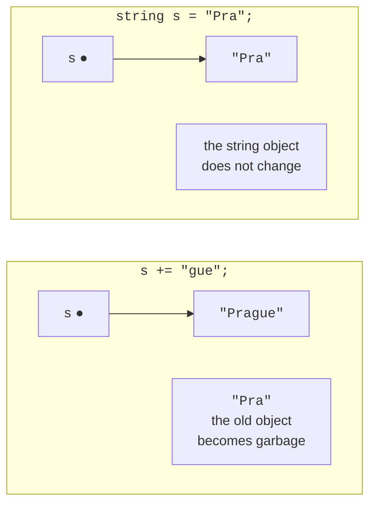

# Strings and formatting

## Strings

The `string` type (`System.String`) stores text as a sequence of `char` values encoded in UTF-16 (<https://learn.microsoft.com/dotnet/csharp/programming-guide/strings/>). The main properties of strings are:

- **length**: the `Length` property is the number of `char` values;
- **indexer**: `s[i]` returns a character, `s[^1]` the last character, and `s[1..4]` a substring;
- **immutability**: you cannot change a character in a string (`s[0] = 'A'` does not compile), and any operation that “changes” a string creates a new one (Fig. 4.6);
- **comparison**: `==` compares string contents, not references.



Figure 4.6. String immutability {.caption}

To analyze characters, use static `char` methods: `char.IsDigit`, `char.IsLetter`, `char.IsLetterOrDigit`, `char.IsWhiteSpace`, `char.IsUpper`, and `char.ToUpper`:

```cs
string code = "Ab-12 \u0457";
int letters = 0, digits = 0, spaces = 0;

foreach (char c in code)
{
    if (char.IsLetter(c)) letters++;
    else if (char.IsDigit(c)) digits++;
    else if (char.IsWhiteSpace(c)) spaces++;
}
Console.WriteLine(
    $"Letters {letters}, digits {digits}, spaces {spaces}");
Console.WriteLine($"{code[0]} {code[^1]} {code[3..5]}");  // A ї 12
```

Output of the first line: `Letters 3, digits 2, spaces 1`. For brevity, each branch body is written on the same line without braces; in programs, it is better to always use braces.

### Comparing strings

The `==` operator and `Equals` method compare strings **character by character, with case sensitivity**. For other comparison rules, supply a `StringComparison` parameter (<https://learn.microsoft.com/dotnet/standard/base-types/best-practices-strings>):

- `Ordinal` — by character codes, fastest and predictable; for identifiers, keys, and file names;
- `OrdinalIgnoreCase` — by codes, ignoring case; for commands and login names;
- `CurrentCulture`, `CurrentCultureIgnoreCase` — by the user’s language rules; for sorting and displaying human-readable text.

```cs
string city = "London";
Console.WriteLine(city == "london");                // False
Console.WriteLine(string.Equals(city, "LONDON",
    StringComparison.OrdinalIgnoreCase));           // True
Console.WriteLine(city.StartsWith("lo",
    StringComparison.CurrentCultureIgnoreCase));    // True
Console.WriteLine(string.Compare("ґанок", "гора",
    StringComparison.CurrentCulture));              // 1
```

The `string.Compare` method returns a negative number, zero, or a positive number when the first string is respectively less than, equal to, or greater than the second. In Ukrainian alphabetical order, Ghe with upturn (U+0491) follows Ghe (U+0433), so `"ґанок"` is greater than `"гора"`.

## String methods

No string method modifies the string: each returns a **new** string or a search result, so you must store the result in a variable. Table 4.2 lists the main methods; IntelliSense displays them with descriptions after a dot (Fig. 4.7).

Table 4.2. Main string methods {.caption}

| **Method** | **Example and result** |
| --- | --- |
| `Length` | `"London".Length` — 6 |
| `ToUpper`, `ToLower` | `"London".ToUpper()` — `"LONDON"` |
| `Trim`, `TrimStart`, `TrimEnd` | `" a b ".Trim()` — `"a b"` |
| `Contains` | `"program".Contains("gram")` — `true` |
| `StartsWith`, `EndsWith` | `"report.pdf".EndsWith(".pdf")` — `true` |
| `IndexOf`, `LastIndexOf` | `"a-b-c".IndexOf('-')` — 1, or −1 if not found |
| `Substring` | `"program".Substring(3, 4)` — `"gram"` |
| `Replace` | `"1,5".Replace(',', '.')` — `"1.5"` |
| `Insert`, `Remove` | `"abc".Insert(1, "X")` — `"aXbc"`, `"abcd".Remove(1, 2)` — `"ad"` |
| `PadLeft`, `PadRight` | `"7".PadLeft(3, '0')` — `"007"` |
| `Split` | `"a;b;;c".Split(';')` — `["a", "b", "", "c"]` |
| `string.Join` | `string.Join("-", ["a", "b"])` — `"a-b"` |
| `string.IsNullOrWhiteSpace` | `true` for `null`, `""`, and a whitespace-only string |


Figure 4.7. String methods in the IntelliSense list {.caption}

### Splitting and joining strings

The `Split` method splits a string into an array of parts using one or more separators. The `StringSplitOptions.RemoveEmptyEntries` option discards empty parts (for example between consecutive spaces), and `TrimEntries` trims whitespace around each part:

```cs
string line = "  12, 7,,  -3 , 40 ";
string[] parts = line.Split(',',
    StringSplitOptions.RemoveEmptyEntries
    | StringSplitOptions.TrimEntries);
Console.WriteLine(parts.Length);                  // 4

int sum = 0;
foreach (string p in parts)
{
    sum += int.Parse(p);
}
Console.WriteLine($"{string.Join(" + ", parts)} = {sum}");
```

Output: `12 + 7 + -3 + 40 = 56`. Parsing a string of numbers this way is common in tasks; for user input, use `int.TryParse` instead of `int.Parse`.

### Finding and extracting parts

```cs
string email = "olena.koval@knu.edu.ua";
int at = email.IndexOf('@');

if (at > 0)
{
    string user = email[..at];                 // before @
    string domain = email[(at + 1)..];         // after @
    Console.WriteLine($"{user} | {domain}");
    Console.WriteLine(domain.EndsWith(".ua"));  // True
    Console.WriteLine(user.Replace('.', ' ').ToUpper());
}
```

Output: `olena.koval | knu.edu.ua`, `True`, and `OLENA KOVAL`. The range `email[..at]` is equivalent to `email.Substring(0, at)`.

## String literals and formatting

C# has several kinds of string literals:

- **regular** `"C:\\Temp\\data.txt"` — escape sequences `\n`, `\t`, `\"`, `\\`;
- **verbatim** `@"C:\Temp\data.txt"` — the backslash has no special meaning, and quotes are doubled `""`; convenient for file paths;
- **interpolated** `$"Total: {total:N2}"` — expressions in braces with field widths and formats (Topic 1); can be combined with `@`: `$@"{folder}\{file}"`;
- **raw string literal** `"""…"""` — text between triple quotes is preserved, including quotes and backslashes, while common line indentation is removed (<https://learn.microsoft.com/dotnet/csharp/language-reference/tokens/raw-string>).

```cs
string name = "Olena";
int score = 92;
string json = $$"""
    {
      "student": "{{name}}",
      "score": {{score}}
    }
    """;
Console.WriteLine(json);
```

In a raw interpolated string with two dollar signs `$$`, expressions use double braces <code v-pre>&#123;&#123;…}}</code>, so single JSON braces remain ordinary text. The program displays the JSON object without the indentation present in the source code:

```
{
  "student": "Olena",
  "score": 92
}
```

Multiline strings are easy to inspect in the debugger: hover over the variable, click the magnifying-glass icon, and select *Text Visualizer* (Fig. 4.8).


Figure 4.8. Viewing a string in *Text Visualizer* {.caption}
