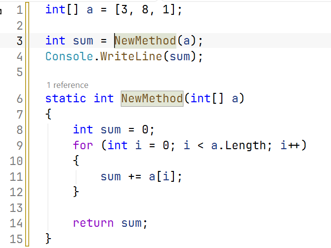
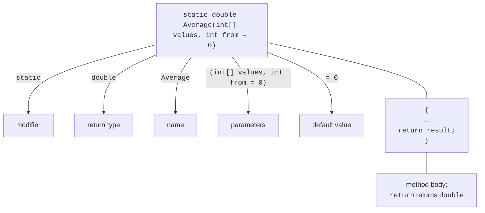

# Declaring methods

## Why methods are needed

A **method** is a named block of code that performs a specific task and can be called from different places in a program. So far, we have used existing methods: `Console.WriteLine`, `int.TryParse`, and `Math.Round`. Your own methods let you:

- **divide** a large task into smaller, understandable parts (**decomposition**);
- **avoid repeating** code: write an action once and call it many times;
- **name** an action: `ReadInt("Age: ", 0, 120)` explains its purpose better than ten lines of loop code;
- **test** and **debug** each part separately.

A good method performs **one task**, has a verb-based name that describes it, and fits on one screen. If you have to describe a method with “and… and…,” consider splitting it (<https://learn.microsoft.com/dotnet/csharp/programming-guide/classes-and-structs/methods>).

Visual Studio can extract a method automatically: select a code fragment, press **Ctrl+.**, and choose *Extract method*. The IDE creates a method, passes the necessary variables as parameters, and prompts for a name (Fig. 5.1).



Figure 5.1. Extracting a method with *Extract method* {.caption}

## Method declarations

A method declaration consists of a **header** and **body** (Fig. 5.2): modifiers (such as `static`), a **return type**, **name**, a parenthesized **parameter** list, and a body in braces. If the method returns nothing, its return type is `void`. The `return` statement ends the method and, when the return type is not `void`, returns a value of that type. The name together with the list of parameter types is called the method’s **signature**.



Figure 5.2. Parts of a method declaration {.caption}

```cs
Console.WriteLine(Average([4, 5, 3]));      // 4
Console.WriteLine(Average([4, 5, 3], 1));   // 4
PrintLine('=', 20);

// Average of the elements starting at index from.
static double Average(int[] values, int from = 0)
{
    double sum = 0;
    for (int i = from; i < values.Length; i++)
    {
        sum += values[i];
    }
    return sum / (values.Length - from);
}

// Displays a line of count identical characters.
static void PrintLine(char symbol, int count)
{
    Console.WriteLine(new string(symbol, count));
}
```

Values supplied in a call are **arguments**, while variables in the method header are **parameters**. The compiler checks argument counts and types: `Average("abc")` will not compile. A method whose return type is not `void` must return a value on every execution path; otherwise, error CS0161, *not all code paths return a value*, occurs.

### Local functions and class methods

In a program with top-level statements, methods are declared **after** the main code: they are **local functions** of the generated `Main` method (<https://learn.microsoft.com/dotnet/csharp/programming-guide/classes-and-structs/local-functions>). The `static` modifier prevents a local function from using variables from the main program: it receives all data through parameters. This makes the method independent and understandable, so this course declares local functions as `static`.

The same program with an explicit `Program` class contains class methods:

```cs
namespace Methods;

internal class Program
{
    static void Main()
    {
        Console.WriteLine(Square(12));   // 144
    }

    static int Square(int x) => x * x;
}
```

There is an important difference between the forms: local functions **cannot be overloaded** (declaring two functions with the same name causes CS0128). Methods with the same name are declared in a class. A small static class can be placed in the same file after the top-level statements, as in the “Array statistics” example at the end of the lecture; the `public` modifier makes a method accessible outside the class (covered in detail in Topics 7 and 8).

## Expression-bodied methods and naming

If a method body consists of one expression, it can be written concisely with `=>` (an *expression-bodied member*). The expression’s result is the method’s result:

```cs
Console.WriteLine(IsEven(10));             // True
Console.WriteLine(Hypotenuse(3, 4));       // 5
Greet("Olena");                            // Hello, Olena!

static bool IsEven(int n) => n % 2 == 0;
static double Hypotenuse(double a, double b) =>
    Math.Sqrt(a * a + b * b);
static void Greet(string name) =>
    Console.WriteLine($"Hello, {name}!");
```

.NET conventions use PascalCase for method names, starting with a **verb**: `Calculate`, `ReadInt`, `PrintReport`. Methods returning `bool` often start with `Is`, `Has`, or `Can` (`IsEven`, `HasErrors`), while methods that do not throw on failure start with `Try` (`TryParse`). Parameter names use camelCase.
