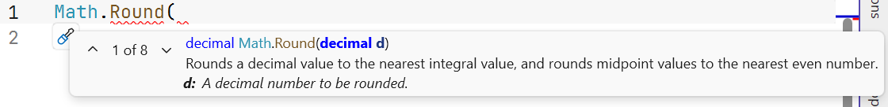
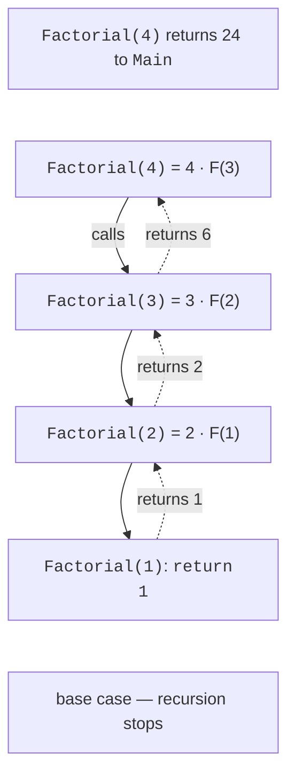
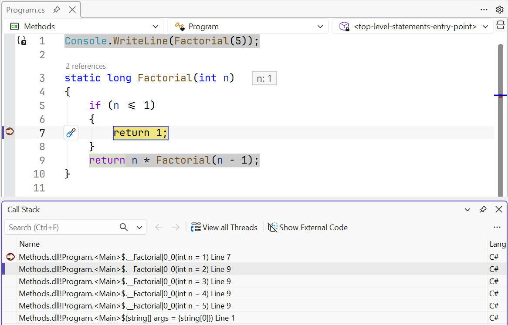
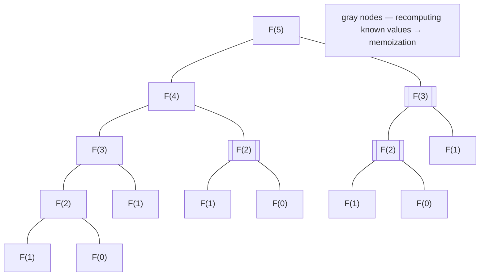
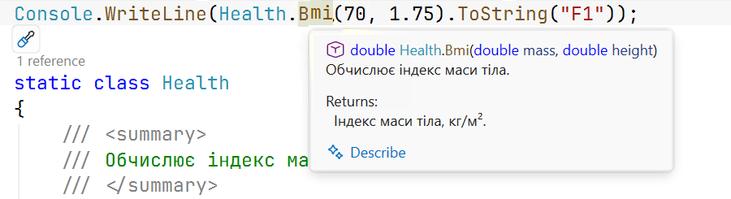

# Overloading and recursion

## Method overloading

**Overloading** means declaring several methods in one class with the same name but different **signatures**: parameter counts, types, or modifiers (`ref`, `out`). The return type is not part of the signature, so methods cannot be overloaded by return type alone. Overloading lets you give the same name to equivalent operations on different data: `Math.Round(double)`, `Math.Round(decimal)`, `Math.Round(double, int)`.

At a call, the compiler chooses the **best** overload: first it looks for an exact match of argument types, then for the option requiring the least “distant” implicit conversions. If two options are equally suitable, ambiguity error CS0121 occurs:

```cs
Console.WriteLine(Describe.Value(5));       // int: 5
Console.WriteLine(Describe.Value(5L));      // long: 5
Console.WriteLine(Describe.Value(5.0));     // double: 5
Console.WriteLine(Describe.Value('A'));     // int: 65
Console.WriteLine(Describe.Value("5"));     // string: 5

static class Describe
{
    public static string Value(int x) => $"int: {x}";
    public static string Value(long x) => $"long: {x}";
    public static string Value(double x) => $"double: {x}";
    public static string Value(string x) => $"string: {x}";
}
```

There is no exact overload for `'A'`, so the compiler chooses `int` because `char` → `int` is the best available conversion. If the class had only `F(decimal)` and `F(double)`, calling `F(5)` would cause CS0121: `int` converts equally well to both types.

The *Parameter Info* tooltip lists method overloads and parameter descriptions. It appears after the opening parenthesis of a call; use its arrows to switch overloads (Fig. 5.4).



Figure 5.4. Tooltip with method overloads {.caption}

**Overloading or optional parameters?** If the variants differ only in a few default values, use optional parameters: one method instead of several. If they accept **different data types** and process them differently, use overloading.

## Returning multiple values

A method returns one value, but sometimes several results are needed. There are two approaches: `out` parameters and a **tuple** — a parenthesized group of values that can be returned as one result (tuples are covered in detail in Topic 11):

```cs
int[] values = [4, -1, 7, 2];

MinMaxOut(values, out int min, out int max);
Console.WriteLine($"out: {min}..{max}");         // out: -1..7

var (low, high) = MinMaxTuple(values);
Console.WriteLine($"tuple: {low}..{high}");     // tuple: -1..7

static void MinMaxOut(int[] a, out int min, out int max)
{
    (min, max) = MinMaxTuple(a);
}

static (int Min, int Max) MinMaxTuple(int[] a)
{
    int min = a[0], max = a[0];
    foreach (int x in a)
    {
        min = Math.Min(min, x);
        max = Math.Max(max, x);
    }
    return (min, max);
}
```

A tuple is more convenient when all results have equal status; an `out` parameter fits the `TryXxx` pattern, where the method returns a success indicator and supplies the result through a parameter.

## Recursion

**Recursion** is a method calling itself. A recursive method solves a problem by reducing it to a **smaller** problem of the same kind. Every recursive method must have:

- a **base case** — a condition under which the result is known without a recursive call;
- a **recursive step** — a call for a smaller problem that is guaranteed to approach the base case.

```cs
Console.WriteLine(Factorial(5));      // 120
Console.WriteLine(Gcd(1071, 462));    // 21
Console.WriteLine(Power(2, 10));      // 1024

// n! = n · (n - 1)!, 0! = 1
static long Factorial(int n) => n <= 1 ? 1 : n * Factorial(n - 1);

// Euclid’s algorithm: GCD(a, b) = GCD(b, a % b), GCD(a, 0) = a.
static int Gcd(int a, int b) => b == 0 ? a : Gcd(b, a % b);

// Fast exponentiation: x^n = (x^(n/2))^2.
static long Power(long x, int n)
{
    if (n == 0)
    {
        return 1;
    }
    long half = Power(x, n / 2);
    return n % 2 == 0 ? half * half : half * half * x;
}
```

### Call stack

On every method call, the CLR creates a **frame** in the **call stack** containing that call’s parameters and local variables. A recursive method has as many stack frames as its recursion depth: `Factorial(4)` calls `Factorial(3)`, which calls `Factorial(2)`, and so on until the base case; results then return in reverse order (Fig. 5.5).



Figure 5.5. Call stack of the recursive method `Factorial(4)` {.caption}

You can inspect the call stack in the debugger: set a breakpoint at the base case, run the program (**F5**), and open *Debug → Windows → Call Stack*. It shows all `Factorial` frames with parameter values, with `Main` at the bottom (Fig. 5.6).



Figure 5.6. The *Call Stack* window during recursion {.caption}

### Stack overflow

Stack size is limited (typically 1 MB for the main thread). If recursion has no base case or is too deep, the stack overflows and the program **crashes**: `StackOverflowException` cannot be caught. A method without a base case

```cs
static int Depth(int n) => Depth(n + 1);
```

terminates the program with `Stack overflow.` and a list of repeated frames. Use recursion for problems with modest depth (tens to thousands of levels): tree traversal, searching alternatives, and divide and conquer. Linear problems such as summing an array or computing a factorial are simpler and more reliable with a loop.

### Memoization

Some recursive algorithms compute the same values repeatedly. The method `Fib(n) = Fib(n - 1`

1. Fib(n - 2)` for `Fib(5)` computes `Fib(3)` twice and `Fib(2)` three times (@fig-met-fib); the number`

of calls grows exponentially, and `Fib(40)` requires over 331 million calls. **Memoization** stores previously computed results, for example in an array: before computing, the method checks whether the result is already known. The “Fibonacci numbers” example compares three approaches.



Figure 5.7. Recursive call tree for `Fib(5)` {.caption}

## XML comments

Before a method, you can write an XML **documentation comment** using three slashes `///`. Visual Studio generates a template when you type `///` above the method declaration. The description appears in IntelliSense tooltips when calling the method (Fig. 5.8) and can be converted into documentation (<https://learn.microsoft.com/dotnet/csharp/language-reference/xmldoc/>):

```cs
Console.WriteLine(Bmi(70, 1.75).ToString("F1"));   // 22,9

/// <summary>
/// Computes the body mass index.
/// </summary>
/// <param name="mass">Mass, kg.</param>
/// <param name="height">Height, m.</param>
/// <returns>Body mass index, kg/m².</returns>
static double Bmi(double mass, double height) =>
    mass / (height * height);
```

The main tags are `<summary>` — a brief description, `<param name="…">` — parameter description, `<returns>` — return-value description, and `<exception>` — exceptions the method can throw.



Figure 5.8. An XML comment in the *Quick Info* tooltip {.caption}
