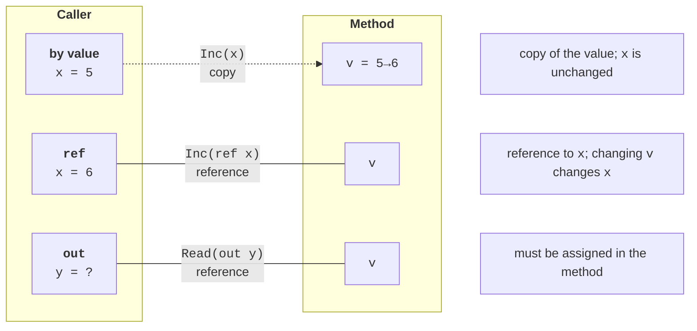

# Passing parameters

## Passing parameters by value

By default, arguments are passed **by value**: the parameter receives a **copy** of the argument’s value (<https://learn.microsoft.com/dotnet/csharp/language-reference/keywords/method-parameters>). For value types, changing the parameter does not affect the caller’s variable. For reference types, the **reference** is copied, so the method can modify the object itself, such as array elements, but cannot make the caller’s variable refer to a different object:

```cs
int n = 5;
Increment(n);
Console.WriteLine(n);                       // 5 — the copy changed

int[] data = [1, 2, 3];
ChangeArray(data);
Console.WriteLine(string.Join(" ", data));  // 100 2 3

static void Increment(int x) => x++;

static void ChangeArray(int[] array)
{
    array[0] = 100;     // modifies the shared array
    array = [7, 7, 7];  // changes only the local reference copy
}
```

## `ref`, `out`, and `in` parameters

Parameter modifiers change how arguments are passed (Fig. 5.3):

- `ref` — the parameter is a **reference** to the caller’s variable: changing the parameter changes that variable. The variable must be initialized before the call, and the modifier is written in both the declaration and the call;
- `out` — an output parameter: the method **must** assign it a value (otherwise CS0177 occurs), while the caller’s variable need not be initialized and can even be declared directly in the call (`out int value`). This is how the `TryParse` pattern works;
- `in` — the parameter is passed by **read-only** reference: it cannot be changed inside the method (error CS8331). It is used for large structures to avoid copying them. The related `ref readonly` modifier also passes a read-only parameter but requires the argument to be a variable.



Figure 5.3. Passing parameters by value, `ref`, and `out` {.caption}

```cs
int count = 10;
AddBonus(ref count, 5);
Console.WriteLine(count);                          // 15

if (TryParsePercent("45%", out int percent))
{
    Console.WriteLine($"Percentage: {percent}");     // 45
}
Console.WriteLine(TryParsePercent("abc", out _));  // False

static void AddBonus(ref int value, int bonus) => value += bonus;

// Parses a string such as "45%"; false if the format is invalid.
static bool TryParsePercent(string text, out int result)
{
    result = 0;
    return text.EndsWith('%')
        && int.TryParse(text[..^1], out result)
        && result is >= 0 and <= 100;
}
```

The `_` symbol in place of a variable name (a *discard*) means the output value is not needed. The `ref` and `out` parameters make code less obvious, so use them only when necessary: for swapping variable values, the `TryXxx` pattern, or returning multiple results.

## Optional parameters and named arguments

A parameter can have a **default value**, allowing its argument to be omitted in a call. Optional parameters must appear **after** required ones (error CS1737). A default value must be a constant: a number, string, `null`, or `default` (<https://learn.microsoft.com/dotnet/csharp/programming-guide/classes-and-structs/named-and-optional-arguments>).

A **named argument** is written as `name: value`. Named arguments make calls clearer and let you omit some optional parameters or change argument order:

```cs
PrintPrice(1299.5m);
PrintPrice(1299.5m, "USD");
PrintPrice(1299.5m, decimals: 0);
PrintPrice(currency: "EUR", decimals: 1, amount: 49.99m);

static void PrintPrice(decimal amount, string currency = "UAH",
    int decimals = 2)
{
    string format = "N" + decimals;
    Console.WriteLine($"{amount.ToString(format)} {currency}");
}
```

Output: `1 299,50 UAH`, `1 299,50 USD`, `1 300 UAH`, `50,0 EUR`. Named arguments are especially useful for Boolean parameters: `Format(date, withWeekday: true)` is clearer than `Format(date, true)`.

## `params` parameters

The `params` modifier allows a **variable number** of arguments: the compiler collects them into an array. A `params` parameter must be last in the list. The method can be called with individual arguments, an array, or no arguments at all:

```cs
Console.WriteLine(Max(3, 9, 4));        // 9
Console.WriteLine(Max(12, [5, 8]));     // 12
Console.WriteLine(Sum(1, 2, 3, 4));     // 10
Console.WriteLine(Sum());               // 0

static int Max(int first, params int[] others)
{
    int max = first;
    foreach (int value in others)
    {
        max = Math.Max(max, value);
    }
    return max;
}

// C# 13: params collections without creating an array.
static int Sum(params ReadOnlySpan<int> values)
{
    int sum = 0;
    foreach (int value in values)
    {
        sum += value;
    }
    return sum;
}
```

The `Max` method has a required first parameter, so it cannot be called without arguments and does not need to check for an empty array. An array can be passed instead of individual arguments: `Max(12, [5, 8])`. Starting with C# 13, `params` can apply to collections other than arrays, including `ReadOnlySpan<T>` and `List<T>`: the `ReadOnlySpan<int>` version does not allocate an array on the heap for every call. For a first-year course, `params T[]` is sufficient. The familiar `string.Join` and format-string `Console.WriteLine` methods work this way.
