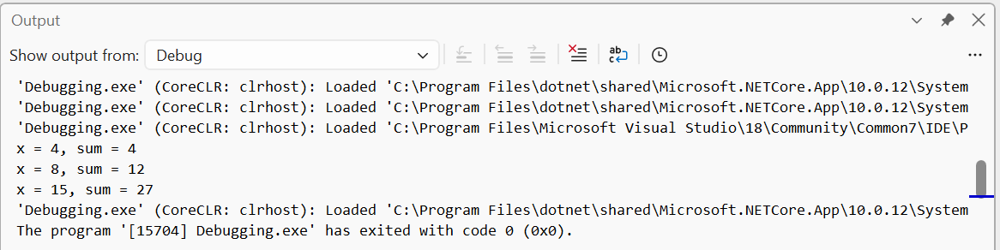
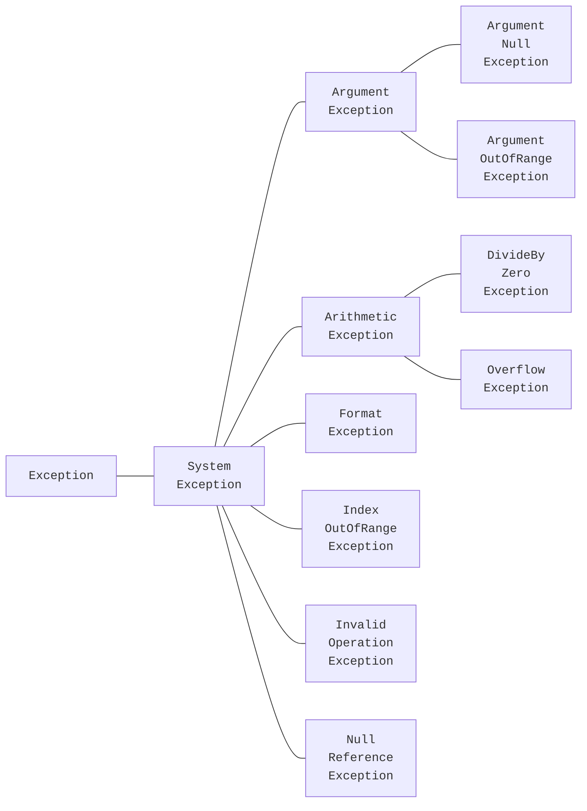
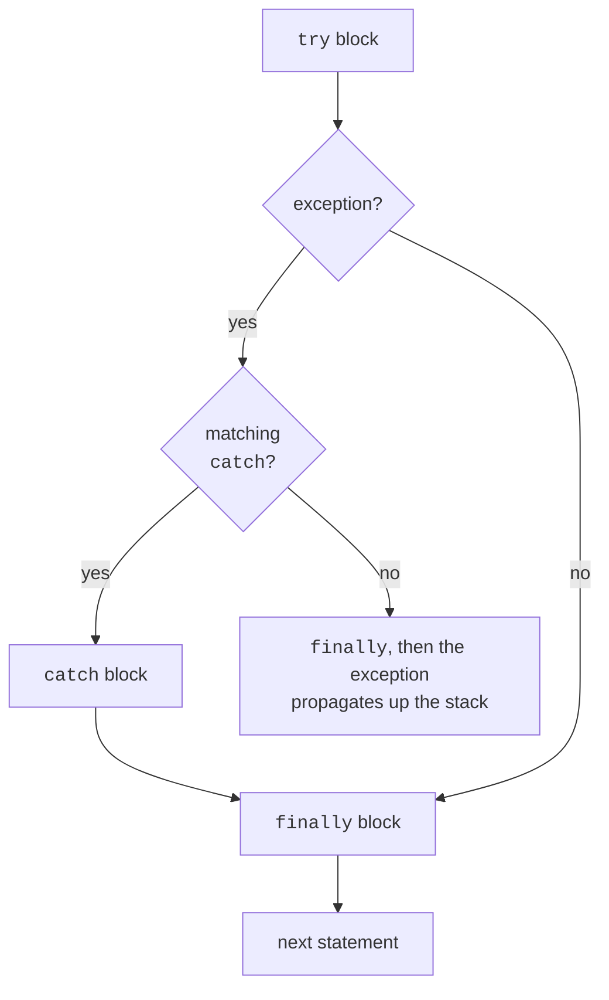

# Debug.Assert and exception handling

## The `Debug` class: `WriteLine` and `Assert`

The `System.Diagnostics.Debug` class provides diagnostic methods that work only in the **Debug** configuration: in Release, the compiler removes their calls entirely.

- `Debug.WriteLine(message)` — writes a message to the Visual Studio *Output* window, not the console (Fig. 6.5);
- `Debug.Assert(condition, message)` — checks an **invariant**, a condition that should always hold when the program works correctly. If it is false, execution pauses under a debugger; without one, a console application crashes with `Assertion failed.`

```cs
using System.Diagnostics;

int[] data = [4, 8, 15];
int sum = 0;
foreach (int x in data)
{
    sum += x;
    Debug.WriteLine($"x = {x}, sum = {sum}");
}
Debug.Assert(sum >= 0, "The sum of nonnegative numbers is negative");
Console.WriteLine(sum);                        // 27
```

`Debug.Assert` checks **programmer** errors, not user errors: validate input using ordinary conditions or exceptions, which also work in Release.



Figure 6.5. `Debug.WriteLine` messages in the *Output* window {.caption}

## Exceptions

An **exception** is an object reporting a runtime error (<https://learn.microsoft.com/dotnet/csharp/fundamentals/exceptions/>). When a method cannot do its work, it **throws** an exception: the method stops executing, and the CLR searches for code to **catch** it. If none exists, the program terminates with an **unhandled exception** message. When debugging, Visual Studio pauses on the line where the exception occurred and displays *Exception Helper* (Fig. 6.6).


Figure 6.6. An unhandled exception in the debugger {.caption}

All exceptions are objects of classes derived from `System.Exception`. Standard .NET exceptions form a hierarchy (Fig. 6.7); Table 6.2 lists the most common ones.



Figure 6.7. Hierarchy of standard .NET exceptions {.caption}

Table 6.2. Common standard exceptions {.caption}

| **Exception** | **When it occurs (example)** |
| --- | --- |
| `FormatException` | the string has the wrong format: `int.Parse("12a")` |
| `IndexOutOfRangeException` | array index out of bounds: `a[a.Length]` |
| `NullReferenceException` | accessing a member through `null`: `s.Length` where `s == null` |
| `DivideByZeroException` | integer or `decimal` division by zero |
| `OverflowException` | overflow in `checked`, `Convert.ToByte("300")`, `int.MinValue / -1` |
| `ArgumentException` | invalid method argument |
| `ArgumentNullException` | an argument is `null` when it must not be |
| `ArgumentOutOfRangeException` | argument outside the valid range |
| `InvalidOperationException` | operation impossible in the current state: maximum of an empty sequence |

Every exception has `Message` (error description), `StackTrace` (the call stack when it occurred), and `InnerException` (the exception that caused this one) properties, and a `GetType()` method that returns its type.

## The `try`/`catch`/`finally` statement

Place code that may throw in a `try` block and handlers in one or more `catch` blocks (<https://learn.microsoft.com/dotnet/csharp/language-reference/statements/exception-handling-statements>). A typed `catch` handles exceptions of that type **and its derived types**. The blocks are checked in order, so arrange them **from specific to general**: placing `catch (Exception)` before `catch (FormatException)` would make the second block unreachable (CS0160).

The `finally` block **always** runs: after a successful `try`, after an exception is handled in `catch`, and even when an uncaught exception propagates further (Fig. 6.8). Use it to release resources: close files and restore state.



Figure 6.8. Execution order of `try`/`catch`/`finally` {.caption}

```cs
string[] inputs = ["42", "abc", "99999999999"];

foreach (string text in inputs)
{
    try
    {
        int value = int.Parse(text);
        Console.WriteLine($"{text}: {value * 2}");
    }
    catch (FormatException)
    {
        Console.WriteLine($"{text}: not a number");
    }
    catch (OverflowException ex)
    {
        Console.WriteLine($"{text}: {ex.Message}");
    }
    finally
    {
        Console.WriteLine("  check complete");
    }
}
```

Output:

```
42: 84
  check complete
abc: not a number
  check complete
99999999999: Value was either too large or too small for an Int32.
  check complete
```

The `ex` variable in `catch` is needed only when using exception properties; omit it if the type alone is sufficient for handling.

### `when` exception filters

A `when` condition can follow `catch`: the block catches the exception only if the condition is true. A filter lets you handle exceptions of the same type differently or catch several types in one block:

```cs
int[] values = [10, 20, 30];
string[] requests = ["1", "7", "x"];

foreach (string request in requests)
{
    try
    {
        Console.WriteLine(values[int.Parse(request)]);
    }
    catch (Exception ex) when (ex is FormatException
                                 or IndexOutOfRangeException)
    {
        Console.WriteLine($"Request “{request}”: {ex.GetType().Name}");
    }
}
```

Output: `20`, `Request “7”: IndexOutOfRangeException`, `Request “x”: FormatException`. This block does not catch other exception types.
