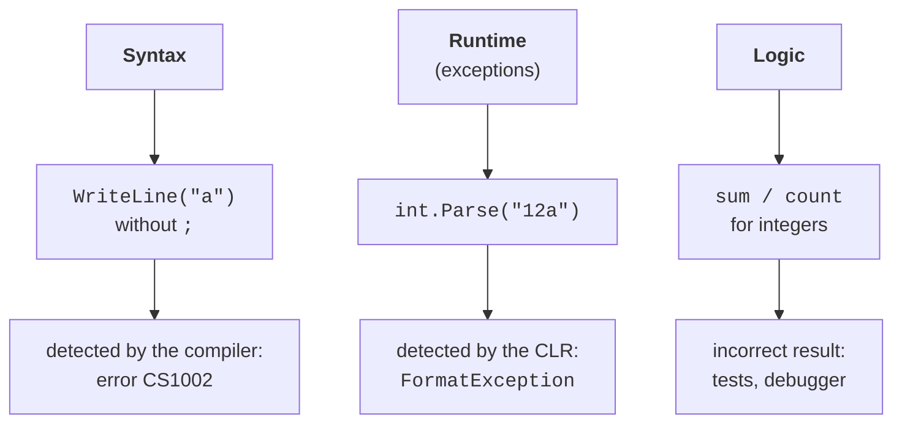
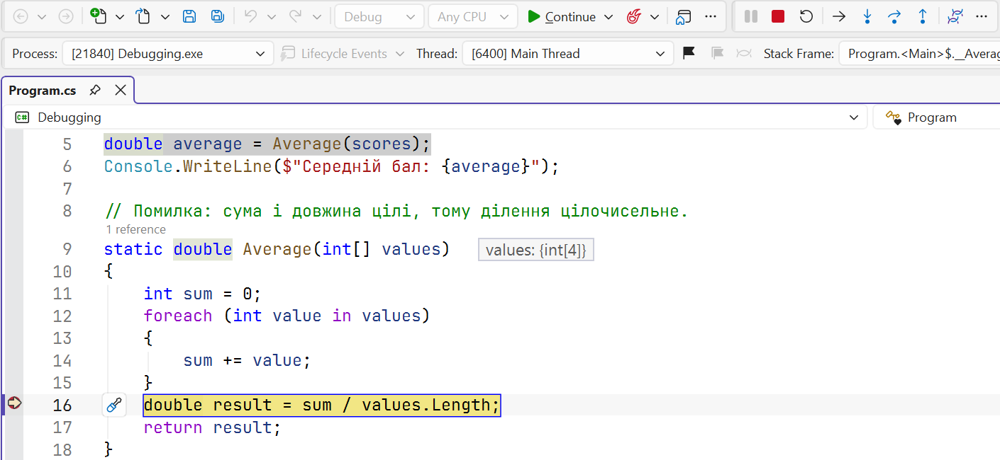
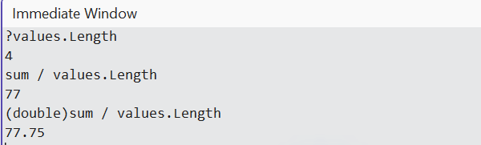
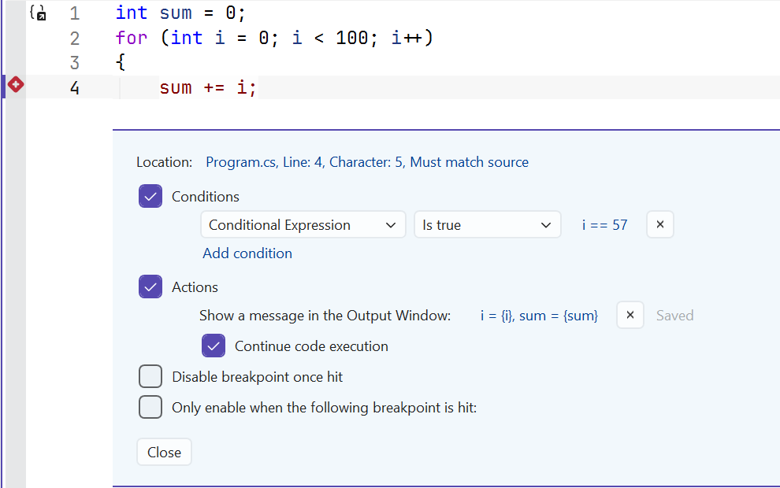

# Errors and the debugger

## Types of errors

Program errors fall into three categories (Fig. 6.1):

- **syntax errors** (compilation errors) — violations of language rules: a missing semicolon, undeclared variable, or type mismatch. The compiler finds them, and the program cannot run until they are fixed. **Warnings** and **code analyzer** messages are related: the program builds, but the code probably contains an error (for example CS8602 about a possible `null` value);
- **runtime errors** — situations in which the program cannot continue: invalid input, integer division by zero, or an array access out of bounds. In .NET, they appear as **exceptions**;
- **logic errors** — the program runs without messages but gives an incorrect result: a wrong formula, `<` instead of `<=`, or integer division. Find them through testing and debugging.

Figure 6.1. Types of errors and how they are detected {.caption}

Logic errors are the most dangerous: the program does not report them. A **debugger** is designed to help find them.

## The Visual Studio debugger

The debugger lets you pause a program at a chosen location, execute one statement at a time, and inspect variable values (<https://learn.microsoft.com/visualstudio/debugger/debugger-feature-tour>). Table 6.1 lists the main actions.

Table 6.1. Stepping commands {.caption}

| **Keys** | **Command** | **Action** |
| --- | --- | --- |
| **F9** | *Toggle Breakpoint* | set or remove a breakpoint on the current line |
| **F5** | *Start Debugging* / *Continue* | start debugging or continue to the next breakpoint |
| **F10** | *Step Over* | execute the line; method calls run in full |
| **F11** | *Step Into* | execute the line, entering the called method |
| **Shift+F11** | *Step Out* | finish the method and return to its caller |
| **Ctrl+F10** | *Run To Cursor* | run to the line containing the cursor |
| **Ctrl+Shift+F10** | *Set Next Statement* | choose another line to execute next (drag the yellow arrow) |
| **Shift+F5** | *Stop Debugging* | stop debugging |
| **Ctrl+Shift+F5** | *Restart* | restart the program |

A **breakpoint** marks a line before which execution pauses. Set one by clicking the margin to the left of the line number or pressing **F9**; the line is marked with a red dot. When execution pauses, a yellow arrow shows the line that will execute **next**, and stepping buttons appear on the *Debug* toolbar (Fig. 6.2).

Figure 6.2. The debug toolbar and execution paused at a breakpoint {.caption}

A typical procedure for finding a logic error:

1. Identify **which result is incorrect** and for which inputs.
2. Set a breakpoint before the code that computes this result.
3. Run the program (**F5**) and step through it (**F10**, **F11**), comparing variable values with expected values calculated by hand.
4. Find the first line after which a value becomes incorrect — that is where the error is.

## Debugger windows

While execution is paused, several windows show program state (*Debug → Windows*):

- *Locals* — all local variables in the current method;
- *Autos* — variables used on the current and previous lines;
- *Watch* — expressions you add (`sum / values.Length`, `values[i] > max`); values update after each step;
- *Call Stack* — the chain of method calls leading to the current line (Topic 5);
- *Immediate* — a window for evaluating expressions or calling methods while paused (Fig. 6.3).

A **DataTip** also shows a variable’s value when you hover over it in the editor. In *Locals*, *Watch*, and DataTips, you can **change** values by double-clicking: this lets you test whether another value fixes the error without restarting the program.

Figure 6.3. Evaluating expressions in the *Immediate* window {.caption}

## Conditional breakpoints and tracepoints

If an error occurs only on the 57th loop iteration, for example, pausing on every iteration is inconvenient. In breakpoint settings (right-click the red dot → *Conditions…*), you can specify (<https://learn.microsoft.com/visualstudio/debugger/using-breakpoints>):

- a **condition** (*Conditional Expression*) — a C# expression such as `i == 57` or `sum > 1000`; execution pauses only when it is true;
- a **hit count** (*Hit Count*) — pause, for example, on every tenth hit;
- an **action** (*Actions*) — write a message to the *Output* window, such as `i = {i}, sum = {sum}`. If *Continue code execution* remains selected, the breakpoint becomes a **tracepoint**: execution continues while values are logged (Fig. 6.4).

Figure 6.4. Configuring a conditional breakpoint {.caption}

**Hot Reload** (the flame button on the toolbar or **Alt+F10**) applies code changes to a running program without restarting it. It supports most changes inside method bodies, so you can test a corrected formula immediately while debugging.
