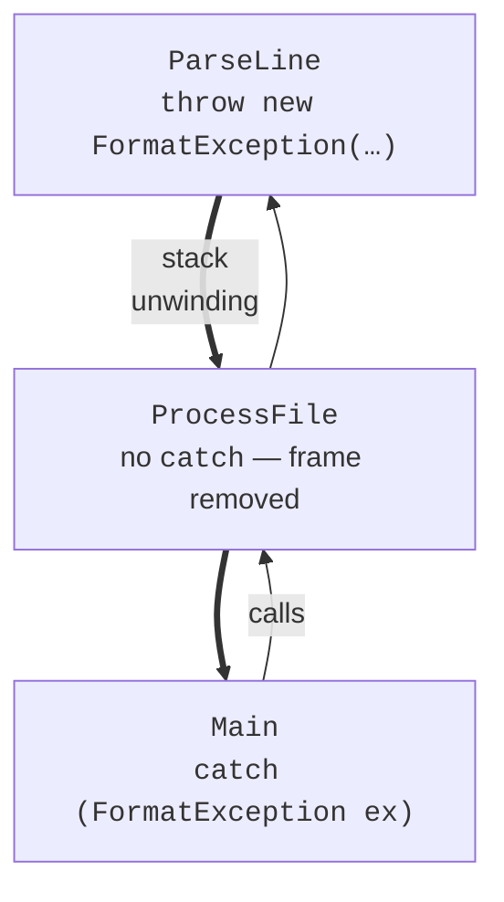
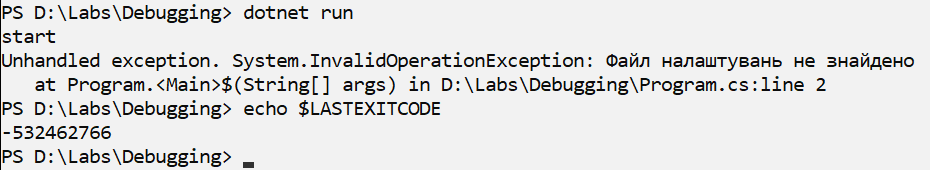
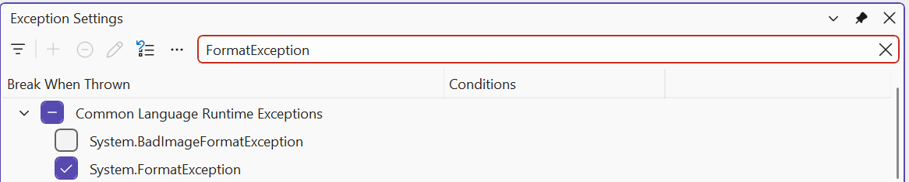

# Throwing exceptions and strategy

## Throwing exceptions

Your own method reports an error using `throw` with an exception object. Most often, a method validates its arguments: invalid data from the caller is an error the method cannot fix itself. .NET provides static helper methods for common checks (<https://learn.microsoft.com/dotnet/standard/exceptions/best-practices-for-exceptions>):

```cs
Console.WriteLine(Discount(1200m, 10));        // 1080

try
{
    Console.WriteLine(Discount(850m, 150));
}
catch (ArgumentOutOfRangeException ex)
{
    Console.WriteLine($"{ex.ParamName}: {ex.ActualValue}");
}

static decimal Discount(decimal price, int percent)
{
    ArgumentOutOfRangeException.ThrowIfNegative(price);
    ArgumentOutOfRangeException.ThrowIfNegative(percent);
    ArgumentOutOfRangeException.ThrowIfGreaterThan(percent, 100);
    return Math.Round(price * (100 - percent) / 100, 2);
}
```

Output: `1080` and `percent: 150`. The helpers build messages and record the parameter name (`ParamName`) and value automatically. Other helpers include `ArgumentNullException.ThrowIfNull(arg)`, `ArgumentException.ThrowIfNullOrWhiteSpace(text)`, and `ArgumentOutOfRangeException.ThrowIfZero(n)`. You can also create an exception explicitly: `throw new InvalidOperationException("Insufficient funds");`.

**`throw` expressions** let you throw within an expression, for example with the `??` and `?:` operators:

```cs
string? input = "Olena";
string name = input ?? throw new ArgumentNullException(nameof(input));
Console.WriteLine(name);
```

The `nameof` operator returns a variable’s name as a string and keeps working when the variable is renamed.

### Rethrowing: `throw;` versus `throw ex;`

Sometimes an exception is caught only to log something before propagating it. Write `throw;` without an argument inside `catch`: the exception propagates **unchanged**, preserving its stack trace. Writing `throw ex;` throws the same object again and **loses** information about its original location. To replace an exception with a clearer one, pass the original as `InnerException`: `throw new FormatException("Line 3 is invalid", ex);`.

## Unhandled exceptions and exit codes

If no `catch` handles an exception, it passes through the methods on the call stack (**stack unwinding**) (Fig. 6.9). Each method without a matching `catch` exits, and its `finally` blocks execute.



Figure 6.9. Exception propagation through the call stack {.caption}

If an exception reaches the top level of the program, the CLR writes its text and stack trace to standard error and terminates the process with code `-532462766` (`0xE0434352`) (Fig. 6.10):

```
Unhandled exception. System.InvalidOperationException:
Configuration file not found
   at Program.<Main>$(String[] args) in C:\Labs\Demo\Program.cs:line 2
```



Figure 6.10. An unhandled exception in the terminal {.caption}

An **exit code** tells the operating system and automation scripts whether the program succeeded: 0 means success; another value means an error. Set it by returning from an `int`-returning `Main` or assigning `Environment.ExitCode`. Write error messages to `Console.Error` instead of `Console.Out` so they can be separated from results (`dotnet run > result.txt` writes only normal output to the file).

```cs
if (args.Length == 0)
{
    Console.Error.WriteLine("Usage: Demo <file>");
    return 2;
}
Console.WriteLine($"Processing {args[0]}...");
return 0;
```

In PowerShell, `$LASTEXITCODE` shows the last program’s exit code.

## When to use exceptions

Exceptions are intended for **exceptional** situations that a method cannot handle itself. A few rules:

- check **expected** situations without exceptions: users often make input mistakes, so use `int.TryParse` instead of `try`/`catch` around `int.Parse`; check the divisor before dividing;
- **do not leave an empty** `catch { }`: it hides the error and allows the program to continue with incorrect data;
- **do not catch** `Exception` where you do not know how to handle the error: catch specific types and keep a general handler at the program’s top level;
- catch an exception **where you can take action**: retry input, skip a line, or inform the user;
- throw the **most specific** exception type with a message explaining the cause.

### Custom exception classes

If standard types do not describe a domain error, create a custom exception class. The notation `: Exception` means the new class **inherits** from `Exception` (inheritance is covered in detail in Topic 9); the constructor passes the message to the base class:

```cs
decimal balance = 500m;
try
{
    Withdraw(ref balance, 800m);
}
catch (InsufficientFundsException ex)
{
    Console.WriteLine($"{ex.Message} Shortfall: {ex.Shortage:N2} UAH");
}

static void Withdraw(ref decimal balance, decimal amount)
{
    if (amount > balance)
    {
        throw new InsufficientFundsException(amount - balance);
    }
    balance -= amount;
}

class InsufficientFundsException(decimal shortage)
    : Exception("Insufficient funds in the account.")
{
    public decimal Shortage { get; } = shortage;
}
```

Output: `Insufficient funds in the account. Shortfall: 300,00 UAH`. By convention, exception class names end with `Exception`.

The *Exception Settings* window (*Debug → Windows → Exception Settings*, **Ctrl+Alt+E**) lets you choose which exceptions cause the debugger to pause **as soon as they are thrown**, even if a later `catch` handles them (Fig. 6.11). This helps locate an exception that the program handles silently (<https://learn.microsoft.com/visualstudio/debugger/managing-exceptions-with-the-debugger>).



Figure 6.11. The *Exception Settings* window {.caption}
