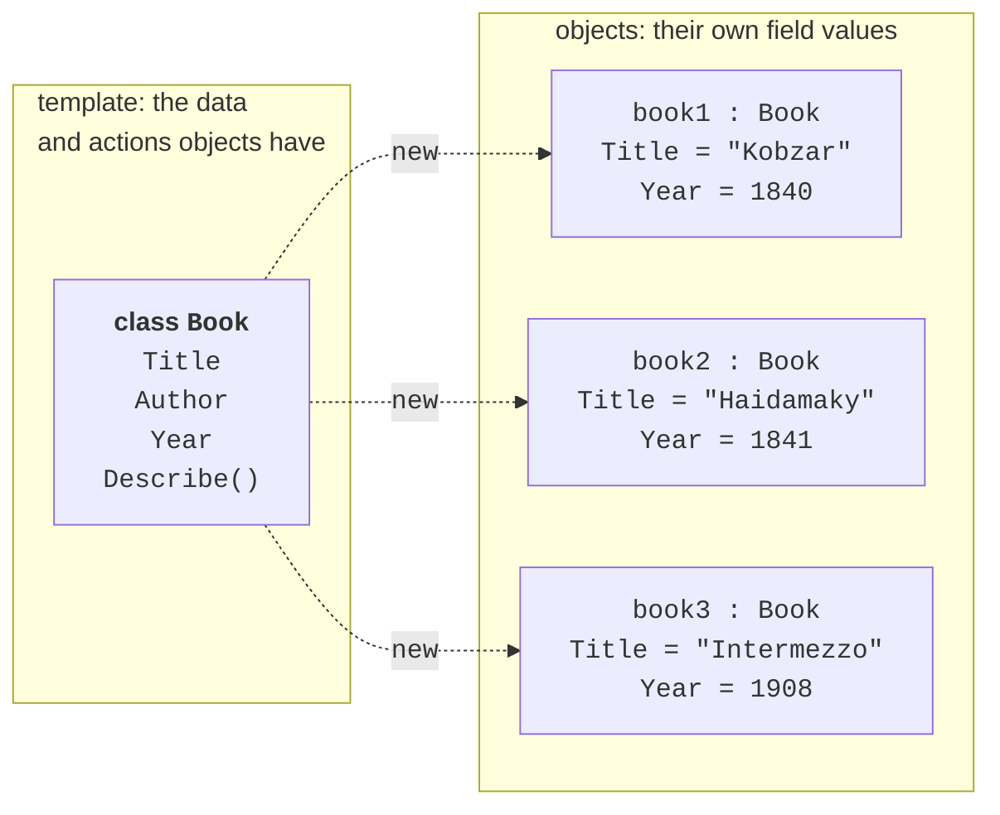
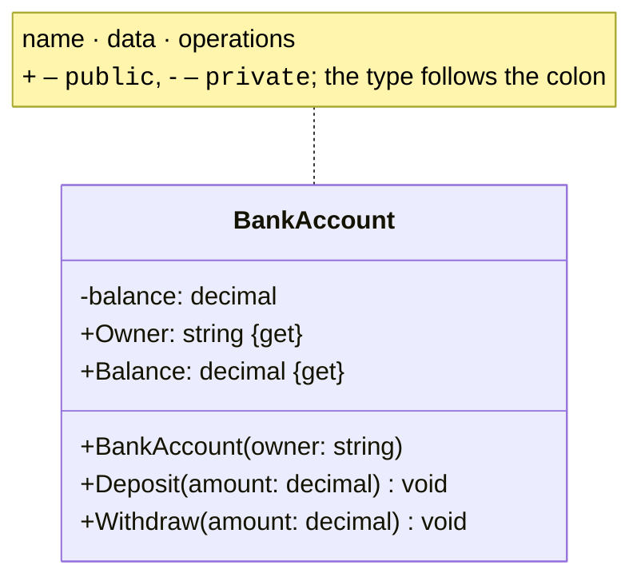
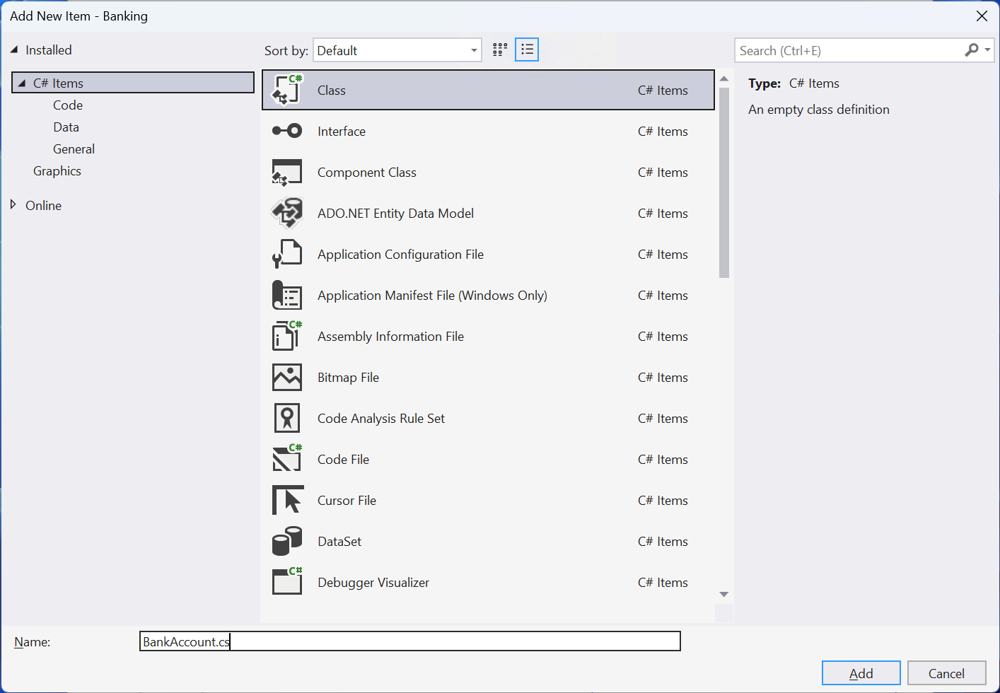
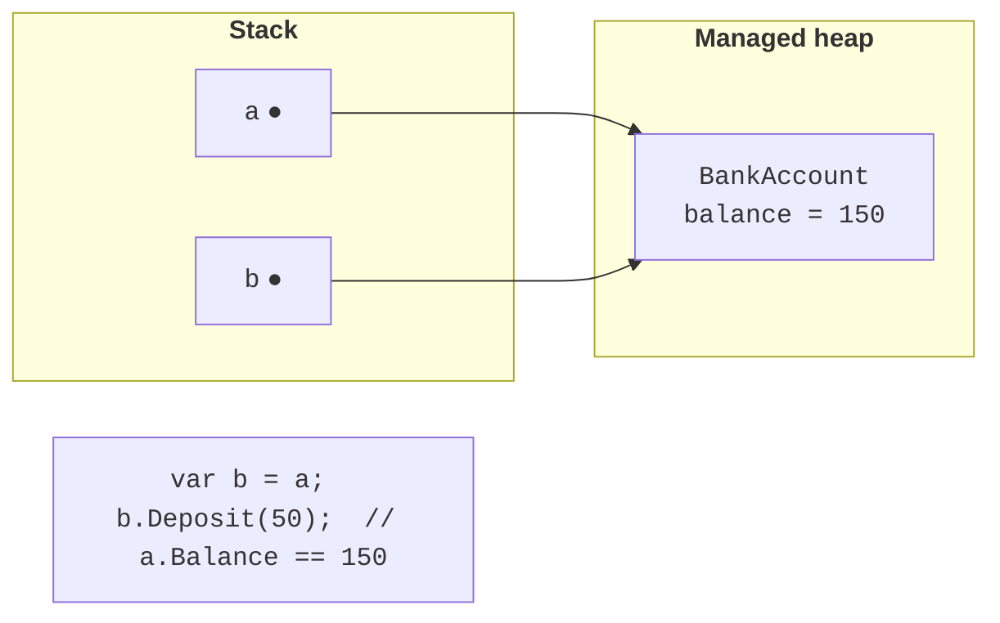
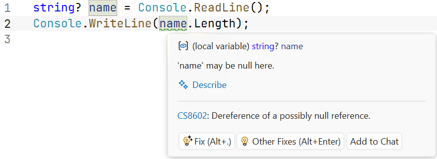

# Classes, objects, and fields

## The object-oriented approach

In previous topics, data and the actions performed on it were separate: individual methods processed arrays of product prices, quantities, and names. As a program grows, this **procedural** style becomes harder to manage: it is easy to pass the wrong array to a method or forget to update one of the parallel arrays.

**Object-oriented programming** (OOP) combines data and the actions performed on it into **objects**. An object has:

- **state** — its data values: an account balance, a product name and price;
- **behavior** — the actions it performs: deposit money, calculate a cost;
- **identity** — each object is a separate entity, even if its state matches another object’s state.

A **class** is a description (template) of objects of the same kind: what data they store and what they can do. An object created from a class is called an **instance** of that class. One class describes many objects with different states (Fig. 7.1) (<https://learn.microsoft.com/dotnet/csharp/fundamentals/object-oriented/objects>).



Figure 7.1. A class and its objects {.caption}

Classes model domain concepts: `Student`, `BankAccount`, `Order`. A well-designed class is responsible for one concept and keeps its own state valid: for example, an account does not allow withdrawals greater than its balance.

## Declaring a class

Declare a class with the `class` keyword; place its **members** inside braces: fields, properties, constructors, and methods (<https://learn.microsoft.com/dotnet/csharp/fundamentals/types/classes>). A **UML class diagram** conveniently represents a class’s structure: a rectangle with three sections — name, data, and operations (Fig. 7.2).



Figure 7.2. Class notation in a UML diagram {.caption}

In small examples, classes are declared in `Program.cs` after the top-level statements. In real projects, **place each class in a separate file** named after the class: `BankAccount.cs`. In Visual Studio, add a class file with *Project → Add Class…* or from the project’s context menu in *Solution Explorer* (Fig. 7.3). The new file uses the project’s namespace:

```cs
namespace Banking;

public class BankAccount
{
    // class members
}
```



Figure 7.3. Adding a class to a project {.caption}

The *Class View* window (*View → Class View*, **Ctrl+Shift+C**) shows all classes in the project and their members (Fig. 7.4).


Figure 7.4. Class members in the *Class View* window {.caption}

## Creating objects and reference semantics

Create an object with `new`, which allocates memory on the managed heap, calls the constructor, and returns a **reference** to the object. If the variable’s type is already specified, you can omit the type after `new` (target-typed `new()`):

```cs
BankAccount first = new BankAccount("Olena", 100m);
var second = new BankAccount("Petro", 0m);
BankAccount third = new("Iryna", 250m);
```

A class is a **reference type**: a variable stores a reference rather than the object itself. Assignment `b = a` copies the reference, so both variables refer to **the same** object: a change made through one variable is visible through the other (Fig. 7.5). By default, `==` compares **references** for classes: two distinct objects with the same state are not equal.



Figure 7.5. Two variables refer to one object {.caption}

A class-type variable can have the value `null`, meaning “refers to nothing.” Accessing a member through `null` causes `NullReferenceException`. To avoid this, mark variables that can be `null` with `?` and check them: the **null-conditional** operator `?.` returns `null` if the object is `null`; otherwise, it accesses the member (<https://learn.microsoft.com/dotnet/csharp/nullable-references>):

```cs
string? name = args.Length > 0 ? args[0] : null;

int? length = name?.Length;          // null if name == null
int safeLength = name?.Length ?? 0;  // 0 instead of null
Console.WriteLine($"{length} {safeLength}");

if (name is not null)
{
    Console.WriteLine(name.ToUpper());
}
```

The compiler warns (CS8602) if a potentially `null` variable is used without a check (Fig. 7.6).



Figure 7.6. Warning about a possible `null` value {.caption}

## Fields, methods, and `this`

A **field** is a variable declared in a class. Each object has its own copy of instance fields, which make up its state. An **instance method** works with the fields of the object on which it is called. Inside a method, the `this` keyword refers to the current object; use it when a parameter name matches a field name (`this.hours = hours;`).

**Access modifiers** control access to class members. This topic uses two:

- `public` — the member is accessible to any code: this is the class’s **interface**, used by other parts of the program;
- `private` — the member is accessible only inside the class; fields are usually private so that only class methods that perform validation can change the object’s state.

If no modifier is specified, class members are `private`. The `readonly` modifier on a field allows assignment only in its declaration or a constructor. Topic 8 covers access modifiers and encapsulation in detail.

```cs
var counter = new Counter();
counter.Increment();
counter.Increment(5);
Console.WriteLine(counter.Value);    // 6

class Counter
{
    private int value;               // object state

    public int Value => value;

    public void Increment(int step = 1)
    {
        ArgumentOutOfRangeException.ThrowIfNegativeOrZero(step);
        value += step;               // same as this.value += step
    }
}
```

Trying to access a private field from outside (`counter.value = 100;`) causes error CS0122: state can be changed only through the `Increment` method, which validates the step.
