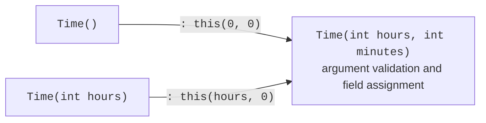
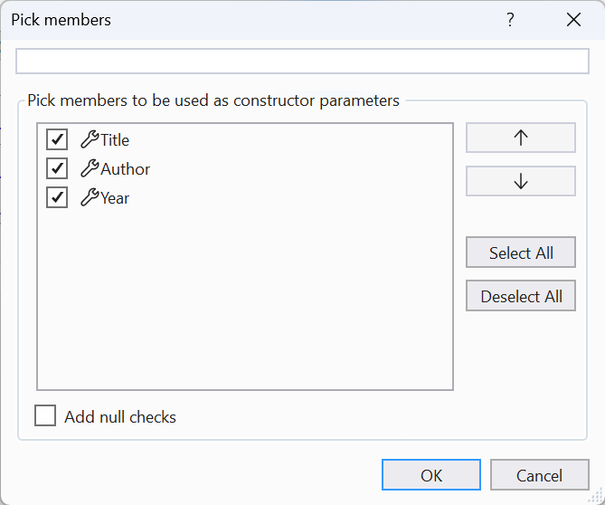

# Properties and constructors

## Properties

A **property** is a class member that looks like a field to its caller but has `get` (read) and `set` (write) accessors. Properties let you validate values, calculate them, and restrict writing (<https://learn.microsoft.com/dotnet/csharp/programming-guide/classes-and-structs/properties>).

### The full property form

The full form uses a private **backing field** to store the value. In the `set` accessor, the new value is available through the `value` keyword:

```cs
var product = new Item();
product.Price = 199.99m;
Console.WriteLine(product.Price);          // 199,99

try
{
    product.Price = -5m;
}
catch (ArgumentOutOfRangeException ex)
{
    Console.WriteLine(ex.ParamName);       // value
}

class Item
{
    private decimal price;

    public decimal Price
    {
        get => price;
        set
        {
            ArgumentOutOfRangeException.ThrowIfNegative(value);
            price = value;
        }
    }
}
```

Validation in `set` ensures that the object never receives an invalid price. For properties, the `ThrowIfNegative` helper puts the name `value` in `ParamName`.

### Auto-properties

If validation is unnecessary, use the short property form: the compiler creates a hidden field. Accessors can have their own modifiers and forms:

```cs
// read and write
public string Title { get; set; } = "";
// read-only: can be assigned in a constructor
public string Isbn { get; }
// write only during object creation
public int Year { get; init; }
// write only inside the class
public decimal Balance { get; private set; }
// required in the object initializer
public required string Name { get; init; }
```

- `init` — the value can be set only during object creation: in a constructor or object initializer; it cannot be changed later (error CS8852);
- `required` — the property must be set in an object initializer; otherwise, compilation error CS9035 occurs. This ensures that an object is not created without essential data;
- set a default value after `=` (`= "";`) so that a string property does not have the value `null`.

### Computed properties

A **computed** property does not store a value; it calculates it from other data each time. Write it with an expression body: `public double Area => Width * Height;`. Such properties cannot become inconsistent with the data they depend on.

### The `field` keyword

C# 14 introduced the `field` keyword: in auto-property accessors, it refers to the automatically generated field. This lets you add validation without declaring a field manually (<https://learn.microsoft.com/dotnet/csharp/whats-new/csharp-14>):

```cs
public string Name
{
    get;
    set => field = string.IsNullOrWhiteSpace(value)
        ? throw new ArgumentException("The name cannot be empty.")
        : value.Trim();
}
```

The full form with an explicit field remains the main form used in this course: it works in all language versions and clearly shows where state is stored. The `field` form is a shorter alternative.

## Constructors

A **constructor** is a special method called by `new` that puts a new object into a valid initial state. Its name matches the class name, and no return type is specified (<https://learn.microsoft.com/dotnet/csharp/programming-guide/classes-and-structs/constructors>).

- If a class has no constructors, the compiler creates a parameterless **default constructor** that leaves fields at their default values.
- Once at least one constructor is declared, a parameterless constructor is no longer created automatically.
- Constructors can be **overloaded**, providing different ways to create an object.
- A constructor validates arguments and throws an exception if a valid object cannot be created.

To avoid repeating validation in every overload, constructors with fewer parameters call the main constructor through a `: this(…)` **chain** (Fig. 7.7). The called constructor runs first, followed by the body of the current one.



Figure 7.7. Constructor chaining {.caption}

```cs
public Time(int hours, int minutes) { /* validation and assignment */ }
public Time(int hours) : this(hours, 0) { }
public Time() : this(0, 0) { }
```

Visual Studio generates a constructor from selected fields and properties: place the cursor inside the class, press **Ctrl+.**, and choose *Generate constructor…* (Fig. 7.8).



Figure 7.8. Generating a constructor from properties {.caption}

### Primary constructors

A **primary constructor** (C# 12) is written as parameters immediately after the class name: `class Sensor(string location, Temperature temperature)`. The parameters are available throughout the class body: in properties, methods, and initializers. Key points:

- primary constructor parameters **are not fields** and **are not properties**: they cannot be accessed from outside or through `this` (`this.location` causes error CS1061);
- to expose a value externally, assign it to a property: `public string Location { get; } = location;`;
- parameters are not validated automatically; write validation in a property initializer or another constructor, which must call the primary constructor through `: this(…)`.

Primary constructors are convenient for small classes that simply store the supplied values. Use a regular constructor when complex validation is needed.
