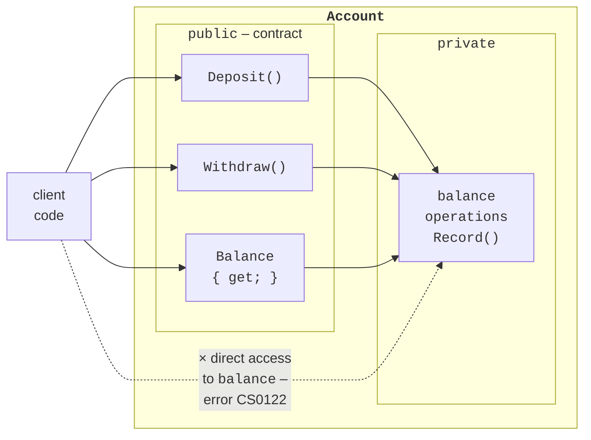
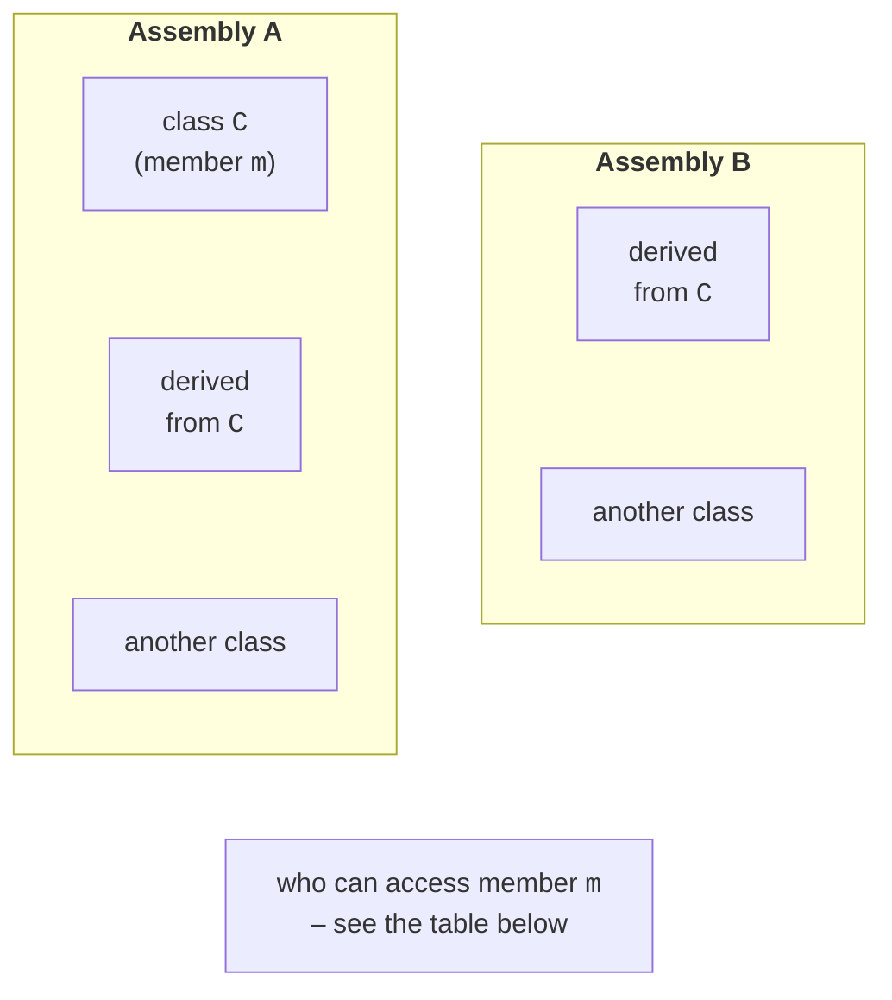
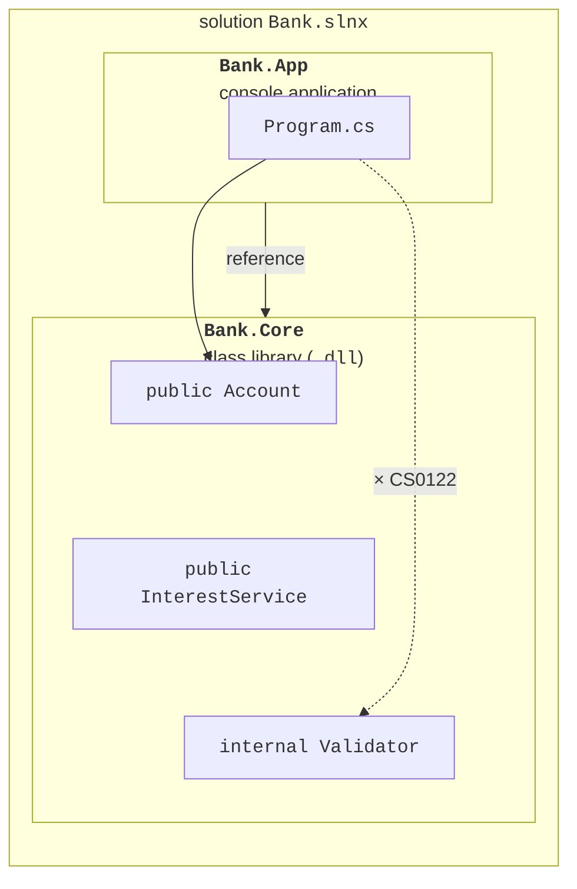
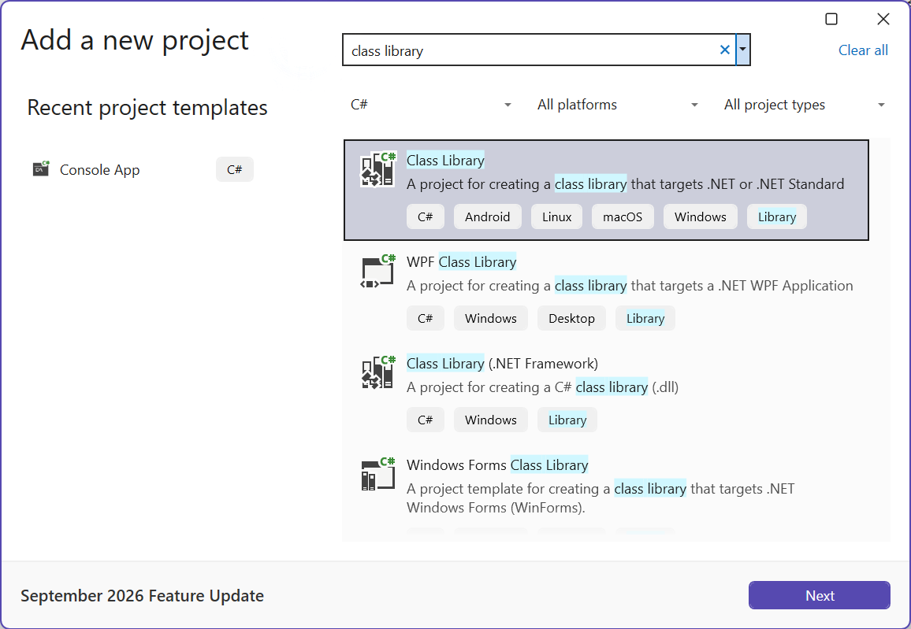

# Encapsulation and access modifiers

## Encapsulation

**Encapsulation** is one of the core principles of OOP: a class **hides** its internal state and implementation details and exposes only a **public contract**, the set of methods and properties through which you work with the object (Fig. 8.1).



Figure 8.1. Encapsulation: the public contract and hidden state {.caption}

Encapsulation ensures that an object is always in a valid state. A condition that must hold for every object of a class throughout its lifetime is called a **class invariant**: “the account balance is not negative,” “an event does not end before it starts,” “the quantity of goods does not exceed the warehouse capacity.” If the `balance` field is public, any line of the program can write −1000 to it and break the invariant. If the field is private, the balance can change only through the `Deposit` and `Withdraw` methods, which check the condition, so a violation becomes **impossible**.

Other benefits of encapsulation:

- **freedom to change**: you can change the internal implementation (an array instead of several fields, a different way of calculating) without changing the code that uses the class;
- **ease of use**: users of the class do not need to know how it works inside;
- **localized errors**: if the state is invalid, you only need to look for the bug in the class’s own methods.

That is why **fields are made private**, and access to data is provided through properties and methods.

## Access modifiers

Access modifiers determine where a type or type member can be accessed from (<https://learn.microsoft.com/dotnet/csharp/programming-guide/classes-and-structs/access-modifiers>). Fig. 8.2 and Table 8.1 show the access scopes.



Figure 8.2. Access scopes: the class, derived classes, and assemblies {.caption}

Table 8.1. Access to member `m` of class `C` depending on the modifier {.caption}

| **Modifier** | **The class itself** | **Derived, A** | **Other, A** | **Derived, B** | **Other, B** |
| --- | --- | --- | --- | --- | --- |
| `public` | yes | yes | yes | yes | yes |
| `protected internal` | yes | yes | yes | yes | no |
| `internal` | yes | yes | yes | no | no |
| `protected` | yes | yes | no | yes | no |
| `private protected` | yes | yes | no | no | no |
| `private` | yes | no | no | no | no |

- `public` — unrestricted access;
- `private` — only inside the class;
- `internal` — within the **assembly** (project);
- `protected` — in the class and its **derived** classes, even from another assembly;
- `protected internal` — within the assembly **or** in derived classes;
- `private protected` — in derived classes of **the same** assembly.

The three options involving `protected` relate to inheritance and are covered in detail in Topic 9. There is also a separate `file` modifier for types (C# 11): the type is visible only in the file where it is declared.

**Default access.** If no modifier is specified, class **members** (fields, methods, properties, nested types) are `private`, and top-level **types** (classes not nested in other classes) are `internal`. A member cannot be more accessible than its type: a `public` method of an `internal` class is effectively accessible only within the assembly. Attempting to access an inaccessible member causes error CS0122 *is inaccessible due to its protection level*.

## The assembly as an access boundary

An **assembly** is the result of compiling one project: a `.dll` or `.exe` file (Topic 1). The `internal` modifier lets classes in one assembly work together while hiding helper types from other assemblies. This becomes important when a program consists of several projects: for example, a **class library** containing domain logic and a console application that uses it (Fig. 8.3). This structure lets you use the same library in different applications and in a unit test project (Topic 18) (<https://learn.microsoft.com/dotnet/core/tutorials/library-with-visual-studio>).



Figure 8.3. A solution with a console application and a class library {.caption}

To create a two-project solution in Visual Studio, right-click the solution in *Solution Explorer* → *Add → New Project…* → the *Class Library* template (Fig. 8.4), then right-click the console project → *Add → Project Reference…* and select the library (Fig. 8.5). The same steps in the dotnet CLI:

```
dotnet new sln -n Bank
dotnet new classlib -n Bank.Core
dotnet new console -n Bank.App
dotnet sln add Bank.Core Bank.App
dotnet add Bank.App reference Bank.Core
dotnet run --project Bank.App
```



Figure 8.4. Creating a class library project {.caption}


Figure 8.5. Adding a project reference {.caption}

The reference is written to the console project file as a `ProjectReference` element:

```xml
<ItemGroup>
  <ProjectReference Include="..\Bank.Core\Bank.Core.csproj" />
</ItemGroup>
```

If the console project accesses an `internal` class of the library, the compiler reports error CS0122 (Fig. 8.6).


Figure 8.6. Error accessing an `internal` class {.caption}
