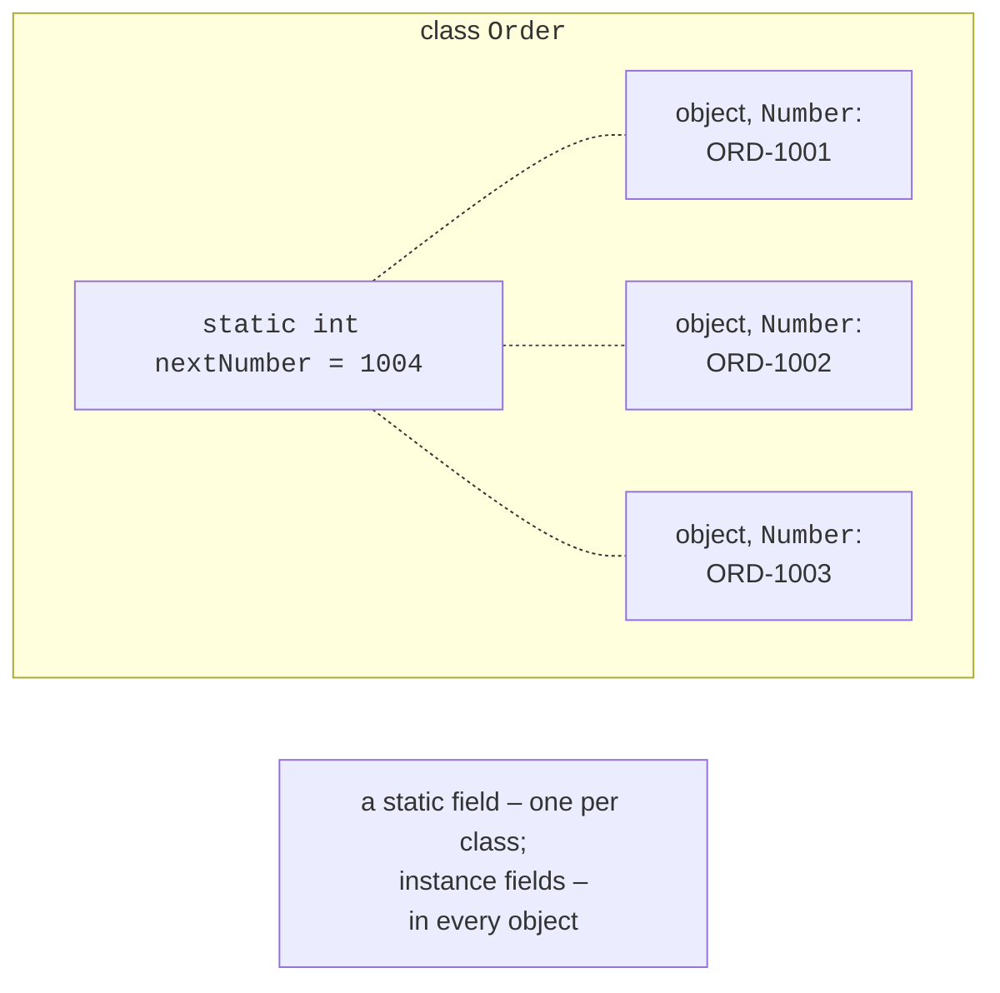

# Static members and namespaces

## Static members

A **static** member (the `static` modifier) belongs to the **class**, not to an individual object (<https://learn.microsoft.com/dotnet/csharp/programming-guide/classes-and-structs/static-classes-and-static-class-members>):

- a **static field** exists as a **single** instance for the whole class, regardless of the number of objects (Fig. 8.7). It is used for counters of created objects, number generators, and shared settings;
- a **static method** is called through the class name (`Math.Sqrt(2)`, `int.Parse(text)`); it has no access to `this` or instance fields because it is not associated with any object (accessing an instance member causes error CS0120);
- a **static property** provides access to static data: `DateTime.Now`, `Order.CreatedCount`.



Figure 8.7. A static field and instance fields {.caption}

A method that uses no object data should be made static: this shows that it does not change state. Visual Studio suggests this option (Fig. 8.8).


Figure 8.8. Suggestion to make a method static {.caption}

### Static constructor

A **static constructor** (`static ClassName() { … }`) initializes static fields. It has no access modifiers or parameters, is called automatically **once** before the first object is created or a static member is first accessed, and cannot be called explicitly (<https://learn.microsoft.com/dotnet/csharp/programming-guide/classes-and-structs/static-constructors>). The order is: static field initializers first, then the body of the static constructor, and only then the regular constructor of the first object. If a static constructor throws an exception, the class becomes unusable for the rest of the program’s run, so complex logic in it is avoided.

### Static classes and `using static`

A **static class** (`static class`) contains only static members; you cannot create an object of it. Sets of helper functions that are not tied to state are organized this way: `Math`, `Console`, `Convert`, and your own validation and conversion classes. The `using static` directive lets you call static members without the class name:

```cs
using static System.Math;

Console.WriteLine(Sqrt(Pow(3, 2) + Pow(4, 2)));   // 5
Console.WriteLine(Round(PI, 3));                  // 3,142
```

Static classes are convenient, but you should not use them for data that changes: **global mutable state** (static fields modified by different parts of the program) makes code harder to understand and test.

## Factory methods and private constructors

If an object can be created in several ways from parameters of **the same types** (a temperature in °C, °F, or K is always a `double`), constructor overloading is impossible. In that case, the constructor is made `private`, and objects are created by **static factory methods** with clear names: `Temperature.FromCelsius(36.6)`, `TimeSpan.FromMinutes(90)`. A factory method can also return an existing object or report failure without an exception, following the `TryCreate` or `TryParse` pattern. An example of such a class is given in the lab assignment.

## Namespaces and project organization

A **namespace** (`namespace`) groups related types and prevents naming conflicts. By convention, the namespace matches the project name and folder structure: a class in the file `Bank.Core/Models/Account.cs` has the namespace `Bank.Core.Models`. Types from another namespace are imported with a `using` directive or referenced by their fully qualified name.

Recommendations for organizing code:

- one public type per file with the same name;
- domain classes go in a class library, input and output in the application;
- use `internal` for helper types that are not part of the library’s contract.

The `partial` modifier lets you split the declaration of one class across several files (`partial class Report`). It is used mostly for code partly generated by tools (form designers, code generators), not to “hide” an overly large class; such a class is better split into several classes.
