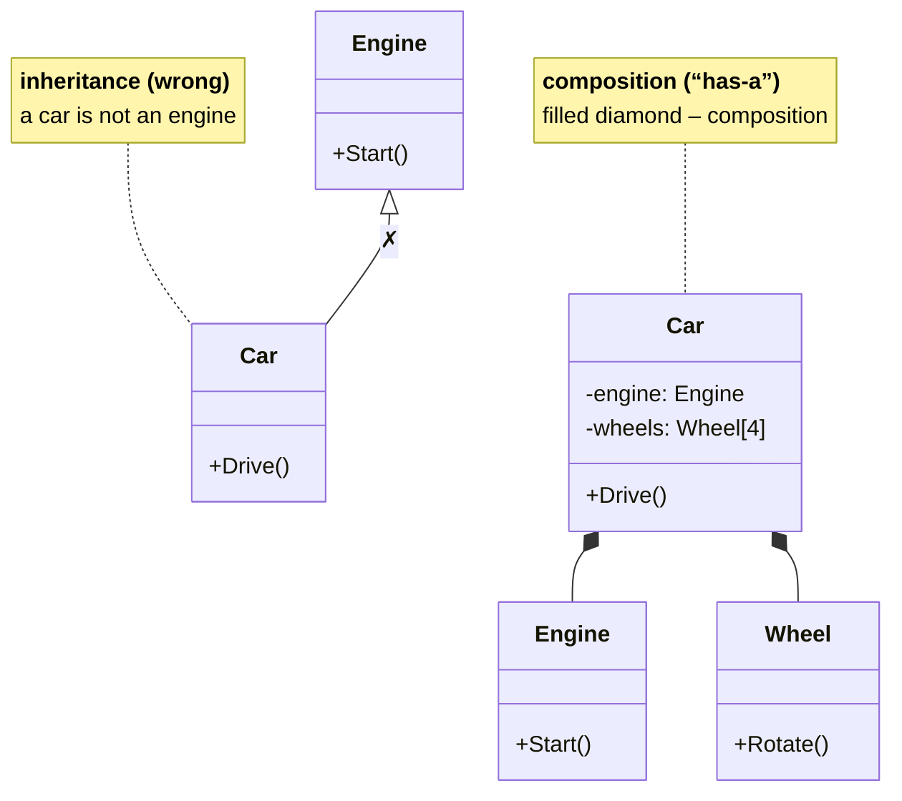

# Casting, sealed, and composition

## Type casting

Assigning a derived class object to a base type variable, **upcasting**, is always safe and happens implicitly. **Downcasting** to a derived type requires a check because the object may have a different type:

- `(Circle)shape` is an explicit cast; if the object is not a `Circle`, `InvalidCastException` occurs;
- `shape is Circle` checks the type (`true` also for descendants of `Circle`);
- `shape is Circle c` is a **type pattern**: it checks the type and declares the variable `c` at the same time;
- `shape as Circle` is a cast that returns `null` instead of throwing an exception;
- the **property pattern** `shape is Rect { Width: > 1 } r` checks the type and conditions on properties.

A `switch` expression on types lets you choose an action depending on the actual type:

```cs
string info = shape switch
{
    Circle c => $"circle, r = {c.Radius}",
    Rect { Width: var w, Height: var h } when w == h =>
        $"square {w}",
    Rect r => $"rectangle {r.Width} × {r.Height}",
    null => "no shape",
    _ => shape.GetType().Name,
};
```

**A virtual method or a `switch` on types?** If new **types** are added often, a virtual method is better: a new class brings its own implementation, and existing code does not change. If new **operations** are often added over a fixed set of types that cannot be changed, a `switch` is more convenient. Most programs in this course prefer virtual methods.

## Sealed classes and methods

The `sealed` modifier prohibits inheriting from a class (error CS0509 for an attempt to inherit) or further overriding a method (`public sealed override string Speak()`) (<https://learn.microsoft.com/dotnet/csharp/language-reference/keywords/sealed>). Classes are sealed when their behavior is not meant to be changed: for example, `string` is sealed so that every string is guaranteed to be immutable and to work correctly in dictionaries. A sealed class is also slightly more efficient because calls to its methods do not need late binding. If a class was not designed for inheritance, it is useful to mark it `sealed`.

## Custom exception classes

A custom exception is a class derived from `Exception` (Topic 6). According to .NET guidelines, its name ends with `Exception`, and the class contains three standard constructors: parameterless, with a message, and with a message and an inner exception (<https://learn.microsoft.com/dotnet/standard/exceptions/how-to-create-user-defined-exceptions>). Additional error data is stored in properties, like `Shortage` in the “Accounts and a custom exception” example. An exception hierarchy lets you catch groups of errors: a `catch` block for the `BankException` type catches all exceptions derived from it.

## Composition versus inheritance

With **composition**, an object contains other objects as fields and uses them: a car **has** an engine and wheels (a **“has-a”** relationship). Inheritance, by contrast, creates tight coupling: a derived class depends on the implementation details of the base class, and a change to the base class can silently break derived classes (the **fragile base class problem**). Hence the common rule: **favor composition**, and use inheritance only when there really is an “is-a” relationship and polymorphism is needed (Fig. 9.9).



Figure 9.9. Inheritance and composition {.caption}

UML class diagrams use the following relationships:

- **generalization** (inheritance): a solid line with a hollow triangle;
- **association**: a solid line; the classes are related (a student attends a course);
- **aggregation**: a line with a hollow diamond at the whole; the parts can exist separately (a department and its instructors);
- **composition**: a line with a filled diamond at the whole; the parts do not exist without the whole (an order and its line items).
