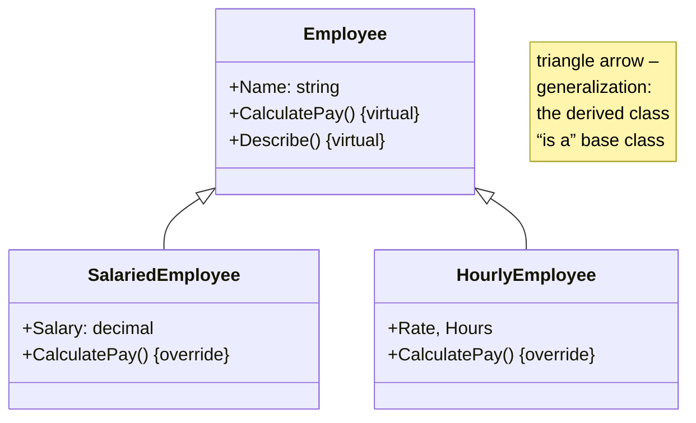
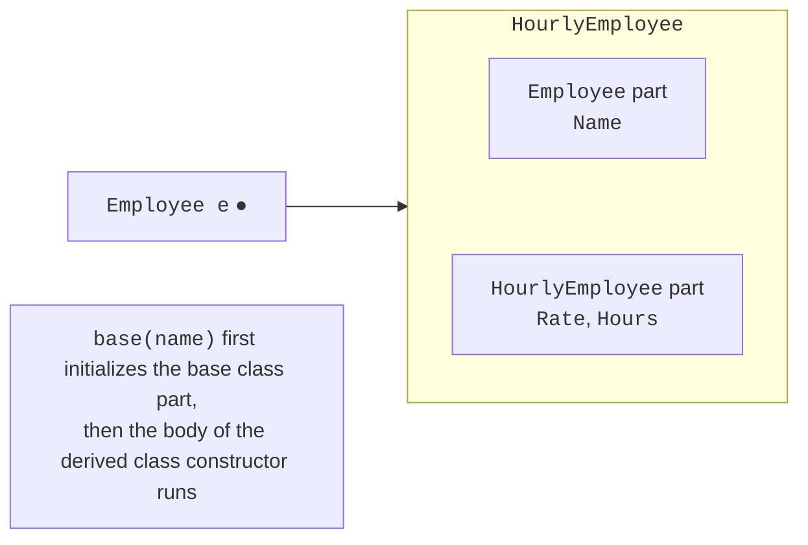

# Inheritance and constructors

## Inheritance

**Inheritance** is a mechanism that lets you create a new class based on an existing one: the new class receives all members of the existing class and can add its own or change the behavior of inherited ones (<https://learn.microsoft.com/dotnet/csharp/fundamentals/object-oriented/inheritance>). The class being inherited from is called the **base class** (parent), and the new class is the **derived class** (child). A derived class is declared with a colon:

```cs
class Employee { /* Name, CalculatePay() */ }
class HourlyEmployee : Employee { /* Rate, Hours */ }
```

Inheritance models an **“is-a”** relationship: an hourly employee **is** an employee, a car **is** a vehicle. Testing with this sentence helps avoid incorrect inheritance: if the sentence sounds absurd (“a car is an engine”), inheritance does not fit. In a UML diagram, inheritance (**generalization**) is shown as a line with a hollow triangle at the base class (Fig. 9.1).



Figure 9.1. UML diagram of an employee hierarchy {.caption}

Important C# restrictions:

- a class can have **only one** base class (error CS1721 for `class C : A, B`); multiple inheritance of behavior is replaced by interfaces (Topic 10);
- if no base class is specified, the base class is `object` (`System.Object`): all .NET types derive from it directly or indirectly;
- a chain can have several levels: `Puppy : Dog : Animal : object`.

## What is inherited

A derived class receives the fields, properties, and methods of the base class, but **access** to them is determined by modifiers (Topic 8):

- `public` and `internal` members are accessible as usual;
- `private` members exist in the derived class object, but code in the derived class cannot access them (error CS0122);
- `protected` members are accessible in the base class and all derived classes, but not from outside. This way, a base class exposes implementation details only to its “descendants”: `public decimal Balance { get; protected set; }` lets derived account classes change the balance, but not client code.

**Constructors are not inherited**: each class declares its own constructors.

An object of a derived class contains both the base class part and its own data (Fig. 9.2). That is why a derived class object can be assigned to a variable of the base type: `Employee e = new HourlyEmployee(…)`.



Figure 9.2. Structure of a derived class object {.caption}

## Derived class constructors

The base class constructor always runs before the body of the derived class constructor. Which constructor to call and with which arguments is specified after a colon with the `base` keyword:

```cs
var puppy = new Puppy("Rex");

class Animal
{
    public Animal(string name) =>
        Console.WriteLine($"Animal({name})");
}

class Dog : Animal
{
    public Dog(string name) : base(name) => Console.WriteLine("Dog");
}

class Puppy : Dog
{
    public Puppy(string name) : base(name) =>
        Console.WriteLine("Puppy");
}
```

Output: `Animal(Rex)`, `Dog`, `Puppy`: constructors run from the base class to the derived class. If `base(…)` is omitted, the parameterless base class constructor is called; if there is none, the compiler reports error CS7036. That is why a base class usually validates its own data, and a derived class validates only its own.
