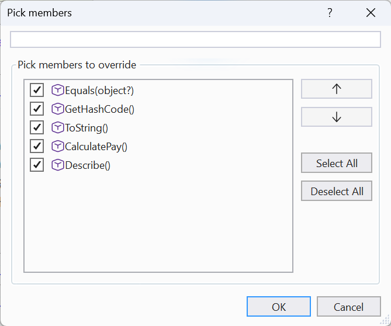
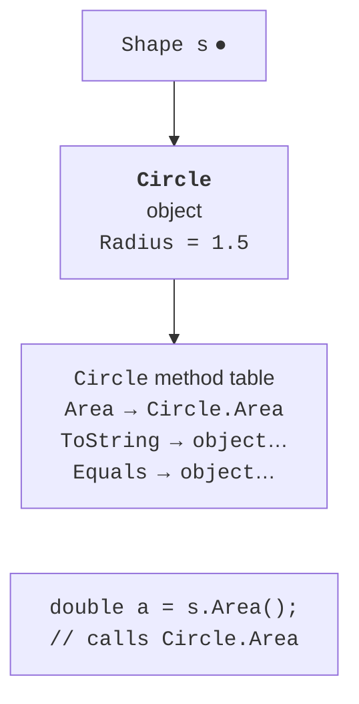
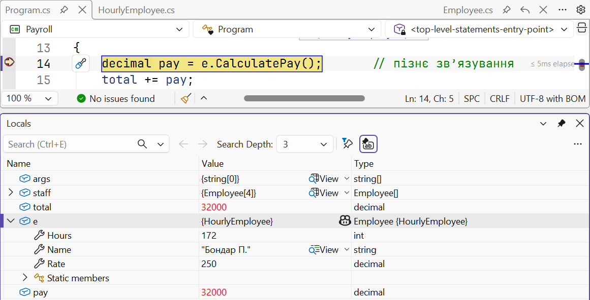
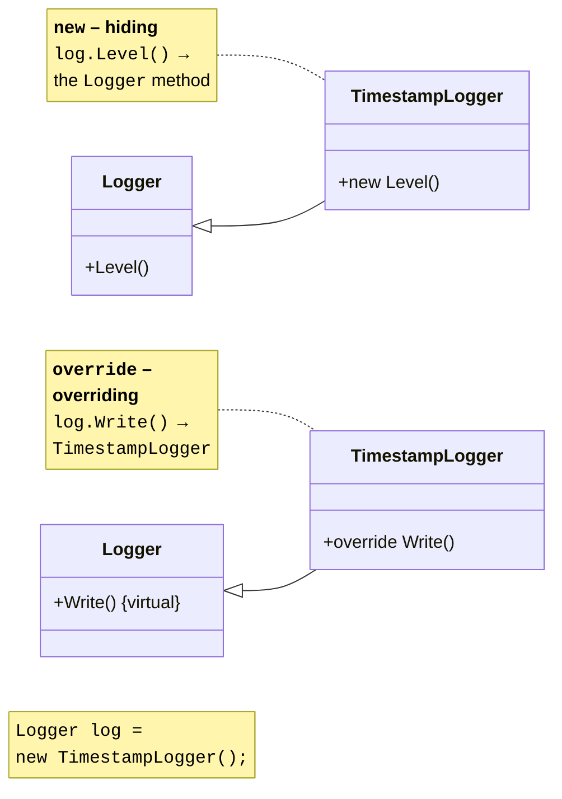
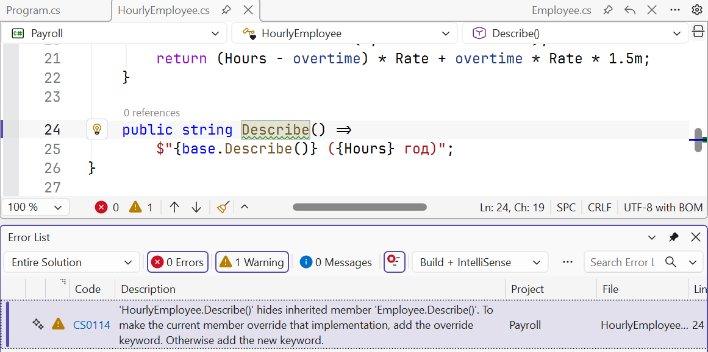

# Virtual methods and polymorphism

## Virtual methods and overriding

A derived class can **change the behavior** of an inherited method. To do this, mark the base class method `virtual`, and in the derived class declare a method with the same signature and the `override` modifier. Only a virtual, abstract, or already overridden method can be overridden (error CS0506). Inside an override, the base implementation is called through `base.Method()`:

```cs
Employee e = new SalariedEmployee("Koval O.", 32_000m);
Console.WriteLine(e.Describe());           // Koval O. (salaried)

class Employee(string name)
{
    public string Name { get; } = name;
    public virtual string Describe() => Name;
}

class SalariedEmployee(string name, decimal salary) : Employee(name)
{
    public decimal Salary { get; } = salary;
    public override string Describe() => $"{base.Describe()} (salaried)";
}
```

Properties can also be virtual (`protected virtual decimal Available => Balance;`). Visual Studio generates override stubs: place the cursor in the class → **Ctrl+.** → *Generate overrides…* (Fig. 9.3).



Figure 9.3. Generating method overrides {.caption}

The *Go To Implementation* command (**Ctrl+F12**) lists all overrides of a virtual method (Fig. 9.4).


Figure 9.4. Navigating to overrides of a virtual method {.caption}

## Polymorphism

**Polymorphism** (“many forms”) is the ability of code written for a base type to work in the same way with objects of different derived types, while each object executes **its own** version of a virtual method (<https://learn.microsoft.com/dotnet/csharp/fundamentals/object-oriented/polymorphism>):

```cs
Employee[] staff = [new SalariedEmployee(…), new HourlyEmployee(…)];
foreach (Employee e in staff)
{
    total += e.CalculatePay();   // each has its own calculation
}
```

The loop knows nothing about the specific employee types. If you later add a `PieceworkEmployee` class with piece-rate pay, the loop does not change: it is enough to override `CalculatePay` in the new class.

The method to be called is determined **at run time** by the **actual type of the object**, not by the type of the variable: this is **late** (dynamic) **binding**. In simplified terms, every object refers to the **virtual method table** of its class, which records, for each virtual method, the implementation that must be called (Fig. 9.5). For non-virtual methods, the call is determined **at compile time** by the variable’s type.



Figure 9.5. Calling a virtual method through a base type reference {.caption}

The debugger shows both types: in the *Locals* window, the variable `e` has the type `Employee {HourlyEmployee}`: first the variable’s type, then the actual type of the object in braces (Fig. 9.6).



Figure 9.6. The variable type and the actual object type in the *Locals* window {.caption}

## Hiding members with `new`

If a derived class declares a method with the same signature as in the base class **without** `override`, the new method **hides** the base one. The compiler warns about this: CS0108 for a non-virtual method and CS0114 for a virtual one (Fig. 9.8). The `new` modifier removes the warning and shows that hiding is intentional. Unlike overriding, a hidden method is selected by the **type of the variable** (Fig. 9.7):



Figure 9.7. Hiding with `new` and overriding with `override` {.caption}



Figure 9.8. Warning about hiding an inherited member {.caption}

Hiding is almost never needed in new code: it makes behavior depend on the variable’s type, which is confusing. It occurs mostly when a member with the same name appears in a base class from a third-party library. For more on the difference, see <https://learn.microsoft.com/dotnet/csharp/programming-guide/classes-and-structs/knowing-when-to-use-override-and-new-keywords>.

## The `object` class

The `System.Object` class contains methods that all objects have (<https://learn.microsoft.com/dotnet/api/system.object>):

- `ToString()` returns a text representation; by default, the type name;
- `Equals(object? obj)` checks equality; by default, for classes, it compares **references**;
- `GetHashCode()` returns a hash code for hash tables (dictionaries, sets; Topic 13);
- `GetType()` returns a `Type` object with information about the actual type (a non-virtual method).

The first three methods are virtual and are often overridden. If objects of a class should be considered equal by **value** (two books with the same ISBN), override `Equals` and `GetHashCode` **together**:

- `Equals` must be **reflexive** (`a.Equals(a)`), **symmetric** (`a.Equals(b) == b.Equals(a)`), and **transitive**; it returns `false` for `null` and for objects of another type;
- equal objects **must** have the same hash code; it is convenient to calculate it with the `HashCode.Combine` method from the same fields that participate in `Equals`;
- fields that determine equality should preferably be immutable.

For classes, the `==` operator still compares references unless it is overloaded (Topic 12). Records (`record`, Topic 11) generate value-based `Equals`, `GetHashCode`, and `==` automatically.
