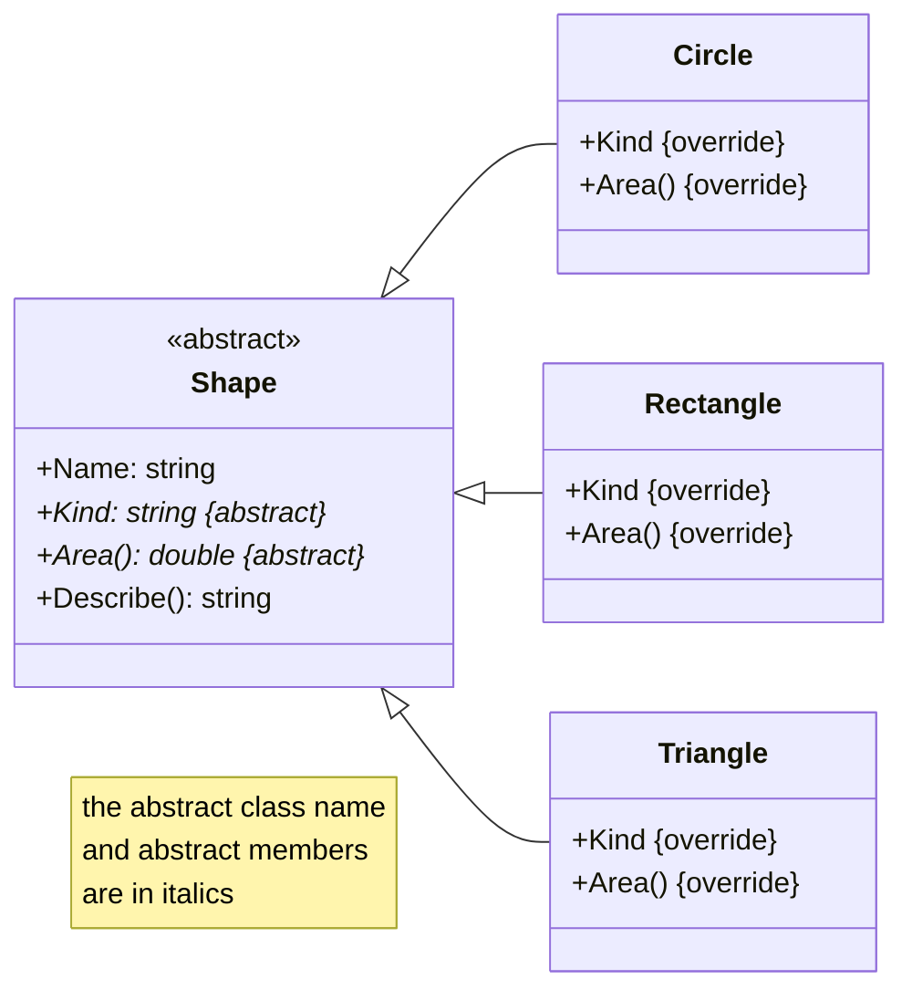
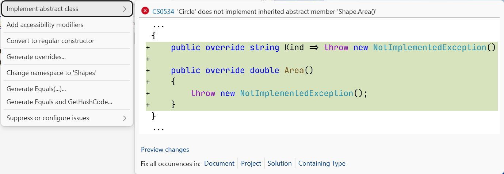
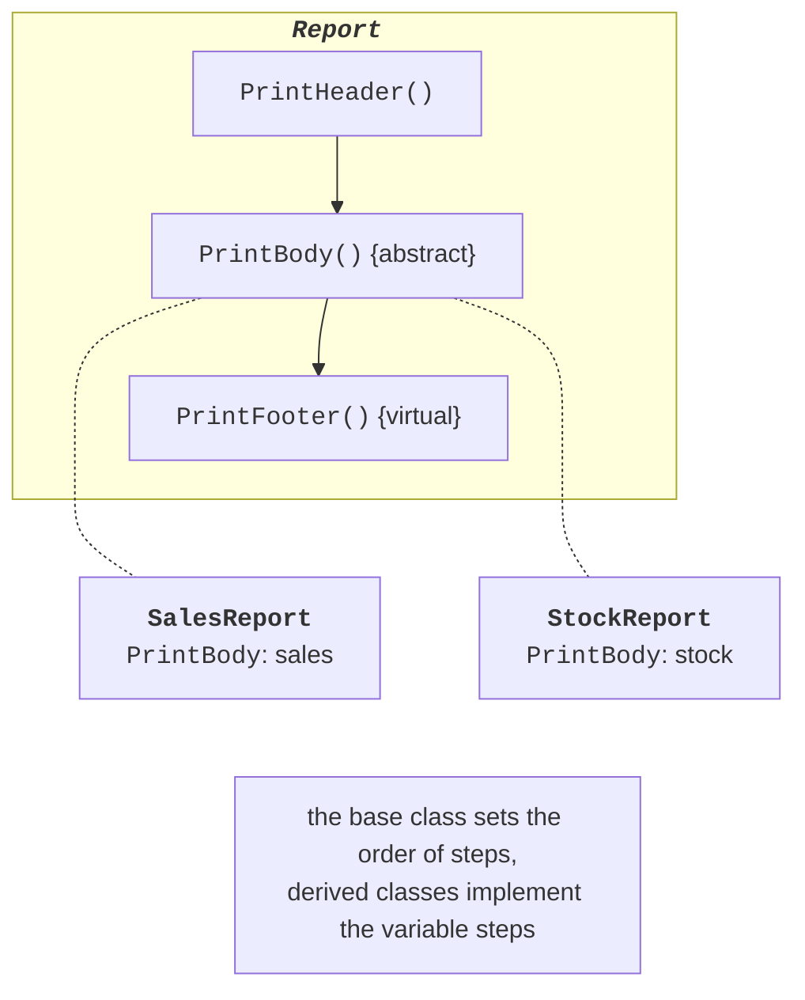

# Abstraction and abstract classes

## Abstraction

**Abstraction** means identifying the essential common features of objects and discarding irrelevant details. In the previous topic, the `Shape` base class had an `Area` method that returned 0: the area of a “shape in general” cannot be calculated, and that implementation was artificial. C# lets you express this idea directly: declare **what** derived classes must be able to do without specifying **how**. This is what **abstract classes** and **interfaces** are for.

## Abstract classes

An **abstract class** is marked with the `abstract` modifier. It can contain **abstract members**: methods, properties, and indexers without an implementation, which derived classes must implement (<https://learn.microsoft.com/dotnet/csharp/language-reference/keywords/abstract>):

```cs
abstract class Shape
{
    protected Shape(string name) => Name = name;

    public string Name { get; }
    public abstract double Area();          // no body
    public abstract string Kind { get; }

    public string Describe() => $"{Kind}: {Area():F2}";
}
```

Properties of an abstract class (Fig. 10.1):

- you cannot create an object of an abstract class: `new Shape("x")` causes error CS0144;
- an abstract class can have fields, regular methods, and constructors; a constructor is called from a derived class through `base(…)`, so it is made `protected`;
- an abstract member is implicitly virtual, and a non-abstract derived class must override **all** abstract members (`override`); otherwise, error CS0534 occurs;
- a variable of an abstract type can refer to an object of any derived class: polymorphism works the same way as with virtual methods.



Figure 10.1. An abstract class and its implementations {.caption}

Visual Studio creates override stubs for abstract members automatically: place the cursor on the class name with error CS0534 → **Ctrl+.** → *Implement abstract class* (Fig. 10.2).



Figure 10.2. Automatically implementing an abstract class {.caption}

### Template method

Abstract classes are often used for the **template method** design pattern: the base class contains a regular method with the overall algorithm, and individual steps of it are abstract or virtual methods. Derived classes change the steps but not the order in which they run (Fig. 10.3). An example is given in the “Example programs” section.



Figure 10.3. Template method {.caption}
