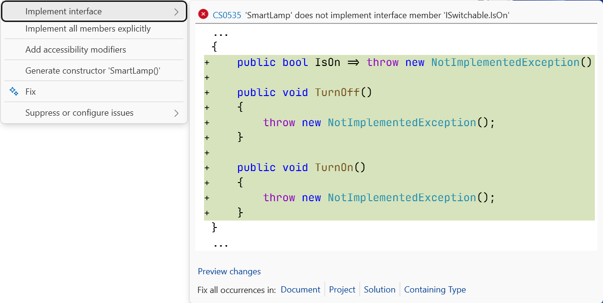
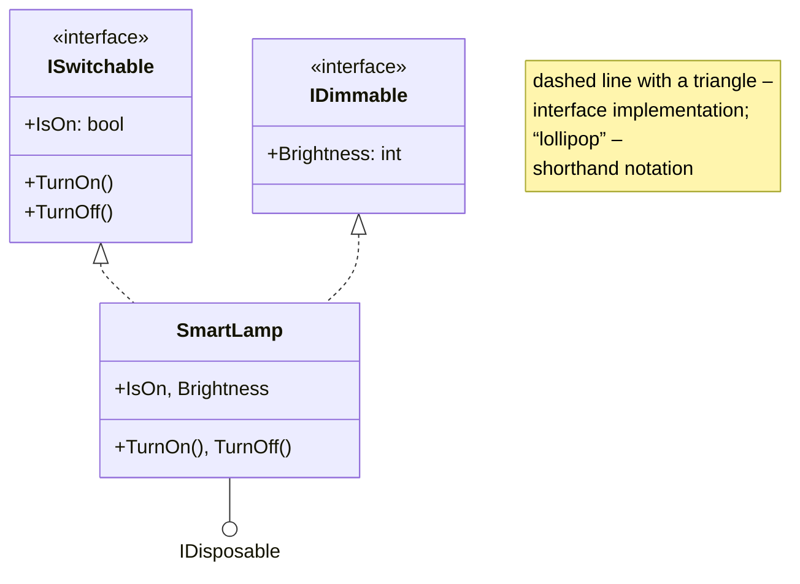
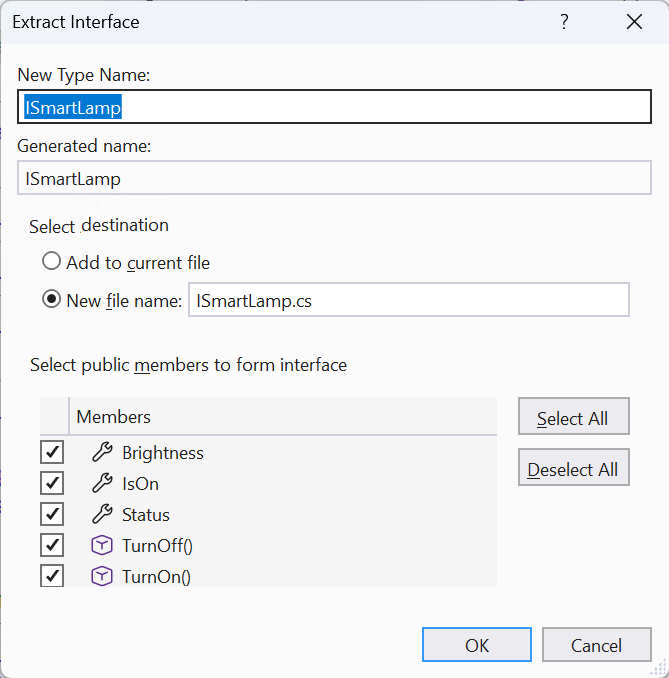

# Interfaces

## Interfaces

An **interface** is a **contract**: a set of members that a type implementing it undertakes to provide (<https://learn.microsoft.com/dotnet/csharp/fundamentals/types/interfaces>). By convention, interface names start with the letter `I`: `ISwitchable`, `IComparable<T>`. An interface declares methods, properties, indexers, and events, but (except for default members) contains no implementations, instance fields, or constructors:

```cs
interface ISwitchable
{
    bool IsOn { get; }
    void TurnOn();
    void TurnOff();
}

class Kettle : ISwitchable
{
    public bool IsOn { get; private set; }
    public void TurnOn() => IsOn = true;
    public void TurnOff() => IsOn = false;
}
```

Interface members are public by default, so their implementations in a class must also be `public` (error CS0737). If a class does not implement a member, the compiler reports error CS0535. Visual Studio offers stubs: **Ctrl+.** → *Implement interface* (Fig. 10.4).



Figure 10.4. Automatically implementing an interface {.caption}

### Multiple interfaces

A class can have only one base class but can implement **any number** of interfaces: `class SmartLamp : Device, ISwitchable, IDimmable, IDisposable` (the base class is written first). A variable of an interface type can refer to any object that implements the interface, and the `is` operator with a pattern checks whether an object supports another interface: `if (device is IDimmable d)`. This connects classes that have no common base class: a kettle and a lamp are not “the same kind” of device, but both can be switched on (Fig. 10.5).



Figure 10.5. A class that implements several interfaces {.caption}

In a UML diagram, interface implementation is shown as a dashed line with a hollow triangle or with the shorthand “lollipop.” Visual Studio can build such diagrams from code with the optional *Class Designer* component, which is installed through the Visual Studio Installer.

You can extract an interface from an existing class: place the cursor on the class name → **Ctrl+.** → *Extract interface…* (Fig. 10.6).



Figure 10.6. Extracting an interface from a class {.caption}

### Explicit interface implementation

If two interfaces have members with the same signature but different meanings, or a member should not be part of the class’s public interface, use an **explicit implementation**: specify the interface in the member name and omit the access modifier (<https://learn.microsoft.com/dotnet/csharp/programming-guide/interfaces/explicit-interface-implementation>):

```cs
void IPrintable.Print() { /* print on a printer */ }
void ILoggable.Print() { /* write to the log */ }
```

An explicitly implemented member is accessible only through a variable of the interface type: `((IPrintable)report).Print()`. An example is given in the lab assignment.

### Default members and static abstract members

Starting with C# 8, an interface can contain a **default implementation**: a class that implements the interface receives it automatically but can provide its own. This lets you add a new member to a widely used interface without breaking existing classes:

```cs
interface ISwitchable
{
    bool IsOn { get; }
    string Status => IsOn ? "on" : "off";   // default
}
```

A default member is called only through an interface variable. Interfaces can also declare **static abstract members** (C# 11): a type undertakes to provide a static method, property, or operator. .NET generic math is built on this: the `INumber<T>` interface requires numeric types to provide the `+` and `*` operators and the `Zero` and `One` properties, so you can write a single sum method for `int`, `double`, and `decimal`. Generics are covered in Topic 13.
