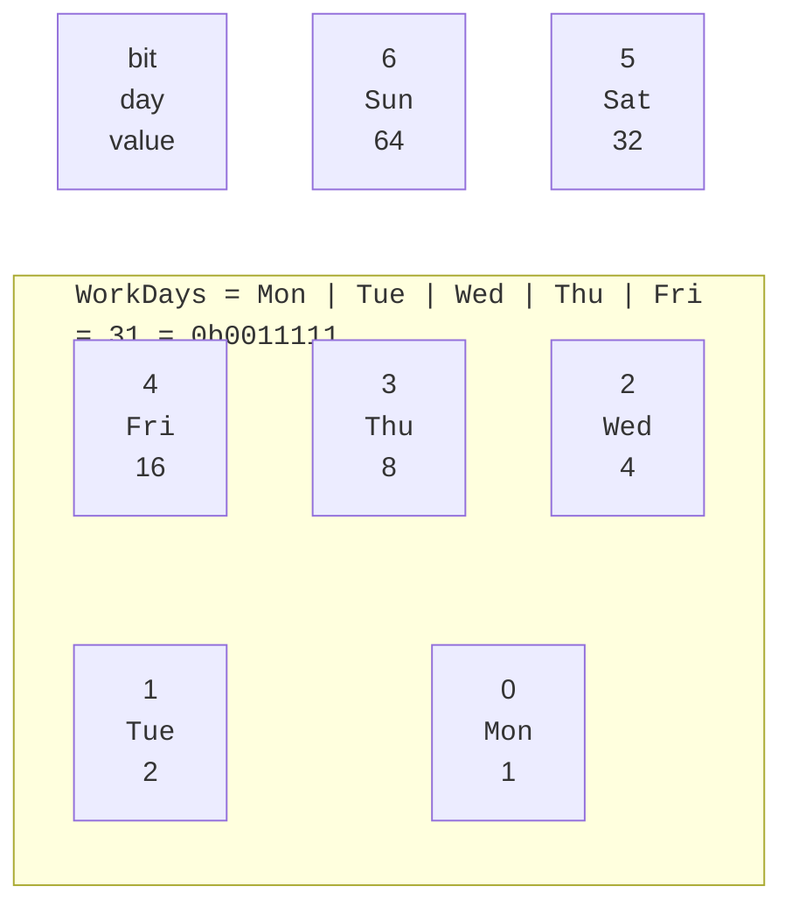
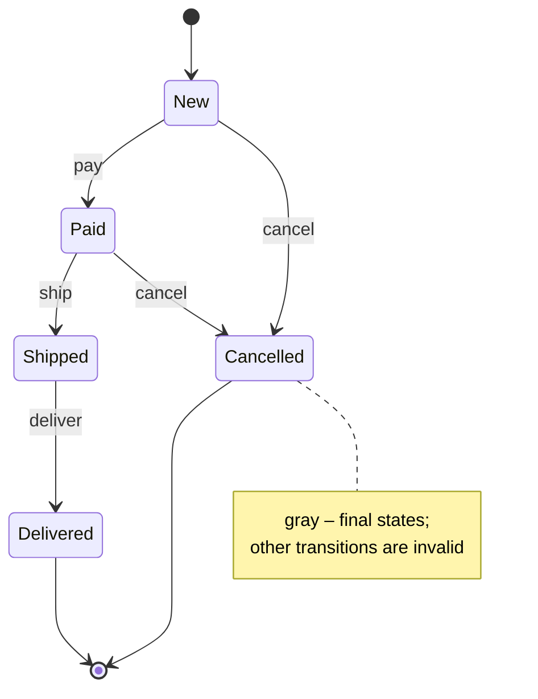
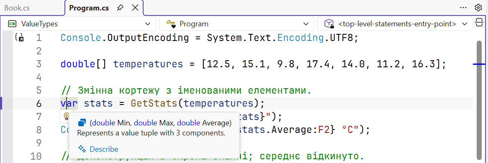

# Enumerations and tuples

## Enumerations

An **enumeration** (`enum`) is a value type with a set of named integer constants. Instead of “magic numbers” (0 means new, 1 means paid), code uses meaningful names, and the compiler checks the type:

```cs
enum Season { Winter, Spring, Summer, Autumn }     // 0, 1, 2, 3

enum HttpStatus : short
{
    Ok = 200,
    NotFound = 404,
    ServerError = 500,
}
```

By default, the underlying type is `int`, and values start at 0 and increase by 1. The underlying type can be changed to any integer type (`byte`, `short`, `long`…), and values can be set explicitly. An enumeration is explicitly cast to a number and back: `(int)Season.Summer` equals 2, and `(Season)3` is `Autumn`.

Basic operations with enumerations:

- `season.ToString()` returns the constant name (`"Summer"`); for a value without a name, the number;
- `Enum.Parse<Season>("summer", ignoreCase: true)` parses a string and throws an exception on error;
- `Enum.TryParse<Season>(text, true, out var s)` parses without an exception;
- `Enum.GetValues<Season>()` and `Enum.GetNames<Season>()` return all values and names;
- `Enum.IsDefined(season)` checks whether a value has a name.

A cast does not check the range: `(Season)42` is a valid value without a name. The `TryParse` method also successfully parses the string `"42"`, so a value entered by the user is additionally checked with `Enum.IsDefined`.

### Flag enumerations

If a variable can hold **several** values at once, the enumeration is declared with the `[Flags]` attribute, and the constants are assigned powers of two: each occupies a separate bit (Fig. 11.5).

```cs
[Flags]
enum Days
{
    None = 0,
    Mon = 1, Tue = 2, Wed = 4, Thu = 8, Fri = 16, Sat = 32, Sun = 64,
    WorkDays = Mon | Tue | Wed | Thu | Fri,
}
```



Figure 11.5. A flag enumeration as a set of bits {.caption}

Sets of values are processed with bitwise operators (Topic 2): `|` is union, `&` is intersection, `& ~` is removal, and `^` is toggling. The `HasFlag` method checks whether a flag is present: `days.HasFlag(Days.Sat)` is equivalent to `(days & Days.Sat) == Days.Sat`. The `[Flags]` attribute changes `ToString`: the value 37 is printed as `Mon, Wed, Sat` rather than as a number.

### Enumerations in `switch` expressions and finite state machines

Enumerations are naturally processed with a `switch` expression (Topic 3). If not all constants are listed, the compiler issues warning CS8509 and offers the *Add missing cases* action (Fig. 11.6). Even when all constants are listed, warning CS8524 remains for unnamed values such as `(Season)4`, so a `_` arm that throws an exception is added.


Figure 11.6. Generating `switch` arms for an enumeration {.caption}

An enumeration of states and a `switch` expression on a `(state, action)` tuple form a **finite state machine**: an object is in one of the states, and a table defines the allowed transitions (Fig. 11.7). Invalid transitions are handled by the `_` arm.



Figure 11.7. A finite state machine for order states {.caption}

## Tuples

A **tuple** is a lightweight `System.ValueTuple` structure that groups several values without declaring a separate type. Elements can be given names; without names, they are accessible as `Item1`, `Item2`…

```cs
(string Name, int Age) person = ("Olena", 21);
Console.WriteLine($"{person.Name}, {person.Age}");

var point = (X: 3, Y: 4);                  // names from the literal
Console.WriteLine(point == (3, 4));         // True
```

Tuples are value types with mutable fields. The `==` and `!=` operators compare elements pairwise; element names do not affect the comparison. Most often, a tuple is used to return several values from a method instead of `out` parameters (Topic 5). A Visual Studio tooltip shows the tuple type with its names (Fig. 11.8).

```cs
static (int Min, int Max) Order(int a, int b) =>
    a <= b ? (a, b) : (b, a);
```



Figure 11.8. A named tuple in a Visual Studio tooltip {.caption}

Tuples are not suitable for long-lived data with its own behavior: it is better to declare a record. A tuple is appropriate inside a method or class when the values are closely related and used close together.

### Deconstruction

**Deconstruction** breaks a tuple or object into separate variables:

```cs
var (min, max) = Order(9, 4);   // new variables: 4 and 9
(min, max) = (max, min);        // swapping values
var (_, top) = Order(9, 4);     // discard: only 9
```

For your own class or structure, deconstruction is provided by a `Deconstruct` method with `out` parameters; records get it automatically:

```cs
var (name, course) = new Student("Iryna", 2);
Console.WriteLine($"{name}, year {course}");

class Student(string name, int course)
{
    public string Name { get; } = name;
    public int Course { get; } = course;

    public void Deconstruct(out string name, out int course)
    {
        name = Name;
        course = Course;
    }
}
```

### Positional patterns and property patterns

Patterns (Topic 3) also work with the new types. A **positional pattern** uses deconstruction, and a **property pattern** checks property values:

```cs
// Point and Book are records from the previous examples.
static string Quadrant(Point p) => p switch
{
    (0, 0) => "origin",
    (> 0, > 0) => "quadrant I",
    (< 0, > 0) => "quadrant II",
    { X: 0 } or { Y: 0 } => "on an axis",
    _ => "quadrant III or IV",
};

static string Era(Book book) => book switch
{
    { Year: < 1900 } => "classic",
    { Author: "Ivan Bahrianyi" } => "Bahrianyi",
    _ => "modern",
};
```

A tuple in a `switch` expression lets you analyze several values at once, as in the transition table of a state machine: `(state, action) switch { (New, Pay) => Paid, … }`.
