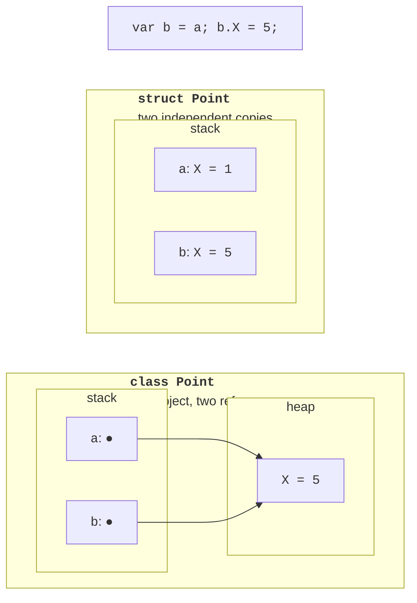
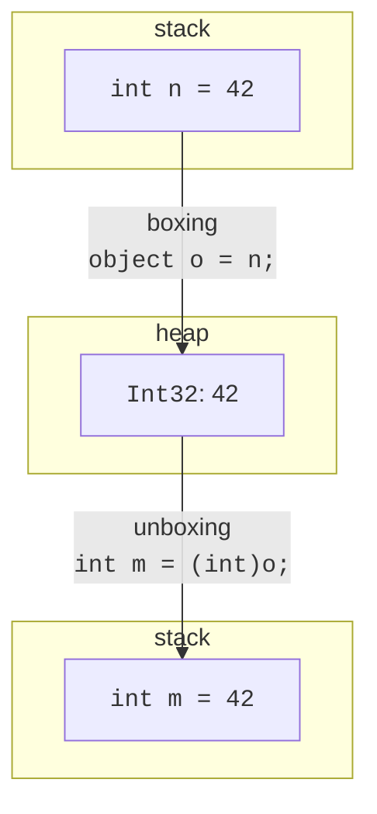

# Structures

## Structures

A **structure** is declared with the `struct` keyword and, like a class, can contain fields, properties, methods, and constructors. The main difference is that a structure is a **value type** (Topic 2). A structure variable stores the value itself rather than a reference, so assignment, passing to a method, and returning from a method **copy** all the fields (Fig. 11.1).

```cs
struct Point
{
    public int X;
    public int Y;

    public Point(int x, int y) { X = x; Y = y; }

    public override string ToString() => $"({X}; {Y})";
}
```



Figure 11.1. Copying a structure and a class {.caption}

If `Point` is declared as a `struct`, after `var b = a; b.X = 5;` the variable `a` does not change: `b` is a separate copy. If `Point` is a class, both variables refer to the same object on the heap, and a change through `b` is visible through `a`.

Features of structures:

- a structure cannot inherit from another class or structure (it implicitly inherits from `System.ValueType`), and nothing can inherit from it, but it can implement interfaces;
- the default value `default(Point)` and the elements of a new array `new Point[10]` have all fields set to zero; constructors are **not called** in this case;
- since C# 10, a structure can have its own parameterless constructor and field initializers, but `default` still ignores them;
- a structure variable cannot be `null`; for a missing value, use `Point?` (`Nullable<Point>`, Topic 2).

### When to choose a structure

The .NET library contains many structures: `int`, `double`, `decimal`, `bool`, `char`, `DateTime`, `TimeSpan`, and `Guid`. The .NET design guidelines recommend a structure if the type logically represents a single value (like a number or a date), is small (roughly up to 16 bytes), is immutable, and does not need to be boxed frequently. Otherwise, choose a class. Large structures hurt performance because they are copied in full on every assignment.

### `readonly struct` and the copy mutation trap

For a structure with the `readonly` modifier, the compiler checks immutability: all fields must be `readonly`, and properties must have no `set` (or use `init`). An individual method or property of a regular structure can also be marked `readonly` if it does not change the state.

Mutable structures are dangerous because of copying. A property or method that returns a structure returns a **copy**, so changing it would be meaningless, and the compiler prohibits it:

```cs
Label label = new();
label.Position.X = 5;               // CS1612
label.Position = new Point(5, 0);   // correct: a new value

Point[] points = new Point[3];
points[0].X = 5;                    // array: the element itself changes

class Label
{
    public Point Position { get; set; }
}
```

Error CS1612 reports that the return value of `Label.Position` cannot be modified because it is not a variable. Immutable structures (`readonly struct`) do not have such problems: to change a value, you create a new one.

### Boxing structures

Assigning a structure to a variable of type `object` or an interface performs **boxing** (Fig. 11.2): a copy of the value is created on the heap. Methods called through the interface change the **boxed copy**, not the original variable:

```cs
Counter c = new();
IIncrementable boxed = c;   // boxing: a copy on the heap
boxed.Increment();
Console.WriteLine(c.Value); // 0 – only the copy changed

interface IIncrementable { void Increment(); }

struct Counter : IIncrementable
{
    public int Value;
    public void Increment() => Value++;
}
```



Figure 11.2. Boxing and unboxing a value {.caption}
