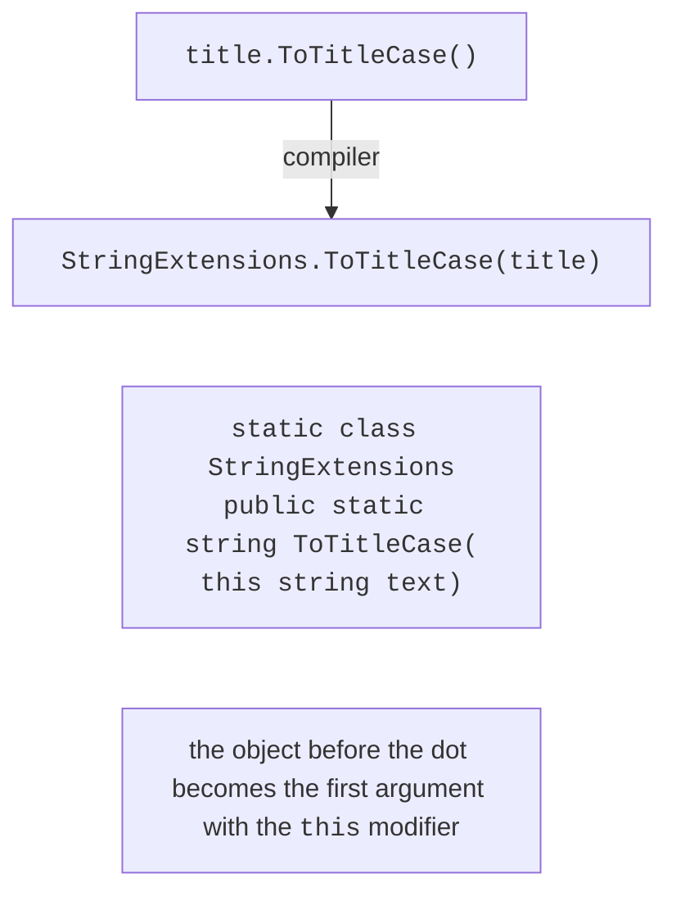
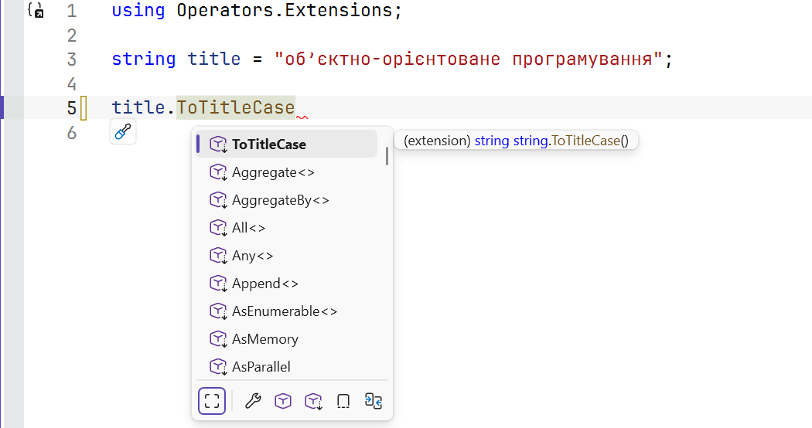

# Extension methods

## Extension methods

An **extension method** adds a method to an existing type without changing its code or creating a derived class. This way, you can extend even types whose code is not available to you: `string`, `int`, `DateTime`, and interfaces. A classic extension method is a static method of a static non-generic class whose first parameter has the `this` modifier:

```cs
int count = "object-oriented programming".WordCount(); // 2

static class StringExtensions
{
    public static int WordCount(this string text) =>
        text.Split(' ', StringSplitOptions.RemoveEmptyEntries).Length;
}
```

An extension method is called like an instance method, but the compiler converts the call into a regular static method call (Fig. 12.6). That is why an extension method has no access to the type’s private members and can be called even on `null`.



Figure 12.6. Calling an extension method {.caption}

Extension methods are available only when the namespace of their static class is imported with a `using` directive (or the class is in the same namespace). IntelliSense marks them with a separate icon and the word *extension* (Fig. 12.7). The LINQ extension methods (Topic 15) become available after `using System.Linq`, which is imported implicitly in console projects.



Figure 12.7. An extension method in the IntelliSense list {.caption}

### Resolution rules

- **An instance method takes precedence**: if a type has its own method with a matching signature, an extension method with the same name is not called (without a warning).
- An extension for an interface is available to all classes that implement it; this is how LINQ is built for `IEnumerable<T>`.
- If several imported namespaces contain identical extensions, the call is ambiguous (a compilation error); in that case, call the method explicitly: `StringExtensions.WordCount(text)`.

An extension method is appropriate for helper operations on other people’s types. For your own class, a regular class method is clearer: it is visible in the class code and has access to private members.

### `extension` blocks

C# 14 introduced **extension blocks** (*extension members*). An `extension(DateTime date)` block inside a static class declares the receiver parameter once for all members of the block and lets you declare, in addition to methods, **properties**, **static members**, and operators:

```cs
bool rest = DateTime.Today.IsWeekend;
DateTime first = DateTime.FirstOfMonth(2026, 9);

static class DateExtensions
{
    extension(DateTime date)           // instance members
    {
        public bool IsWeekend =>
            date.DayOfWeek is DayOfWeek.Saturday or DayOfWeek.Sunday;
    }

    extension(DateTime)                // static members
    {
        public static DateTime FirstOfMonth(int year, int month) =>
            new(year, month, 1);
    }
}
```

Classic extension methods and `extension` blocks are compatible with each other: the compiler converts both forms into static methods. The new blocks are useful when you need properties or static members; existing code and documentation most often use classic methods with `this`.
