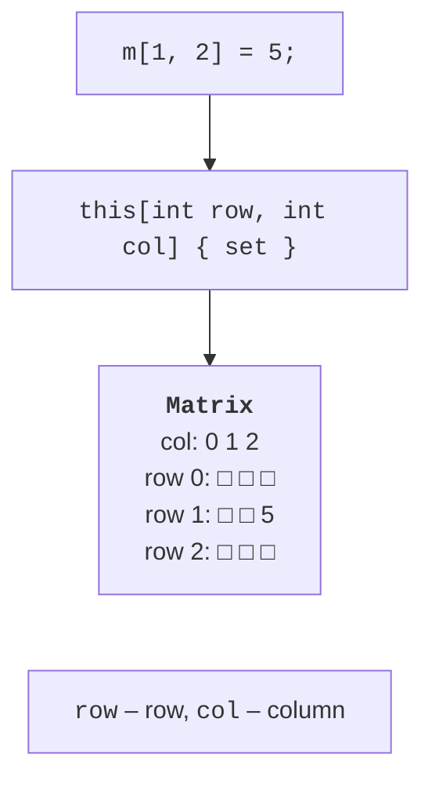
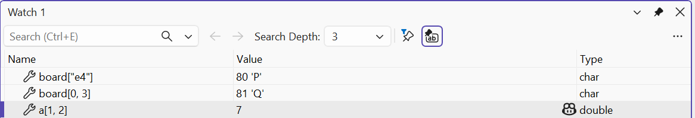

# Indexers

## Indexers

An **indexer** lets you access an object like an array: `list[3]`, `matrix[1, 2]`, `board["e4"]`. An indexer is declared as a property named `this` with parameters in square brackets:

```cs
public double this[int power]
{
    get => power < coefficients.Length ? coefficients[power] : 0;
    set => coefficients[power] = value;
}
```

Features of indexers:

- the `get` and `set` accessors work as in properties; a read-only indexer has only `get`;
- there can be several parameters (`this[int row, int col]`) of any type, including strings (`this[string square]`);
- indexers can be overloaded by the number and types of parameters;
- an indexer should check bounds and throw `ArgumentOutOfRangeException` or `IndexOutOfRangeException` for invalid indexes.

The access `m[1, 2] = 5` calls the `set` accessor with the parameters `row = 1`, `col = 2`, and `value = 5` (Fig. 12.4). In the debugger, you can evaluate indexer values in the *Watch* window (Fig. 12.5).



Figure 12.4. An indexer for a two-dimensional matrix {.caption}



Figure 12.5. Evaluating indexers in the Watch window {.caption}

### Indexes from the end and ranges

Indexes from the end `^1` and ranges `1..3` (Topic 4) also work with your own types. If a type has a `Length` or `Count` property and an indexer with an `int` parameter, the compiler converts the expression `seq[^1]` into `seq[seq.Length - 1]`. Ranges also require a `Slice(int start, int length)` method:

```cs
Readings r = new();
Console.WriteLine(r[^1]);                     // 14,2
Console.WriteLine(string.Join("; ", r[1..3])); // 13,1; 12,9

class Readings
{
    private readonly double[] values = [12.5, 13.1, 12.9, 14.2];

    public int Length => values.Length;
    public double this[int index] => values[index];
    public double[] Slice(int start, int length) =>
        values[start..(start + length)];
}
```
