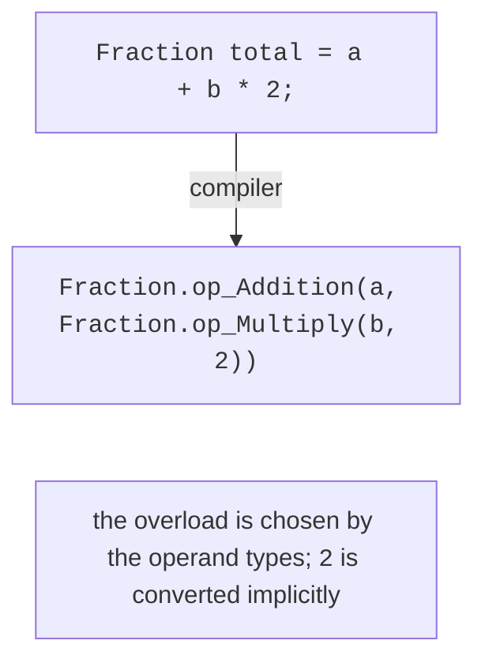
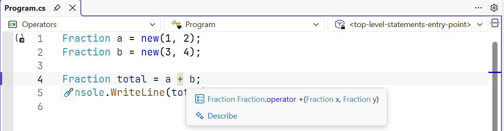
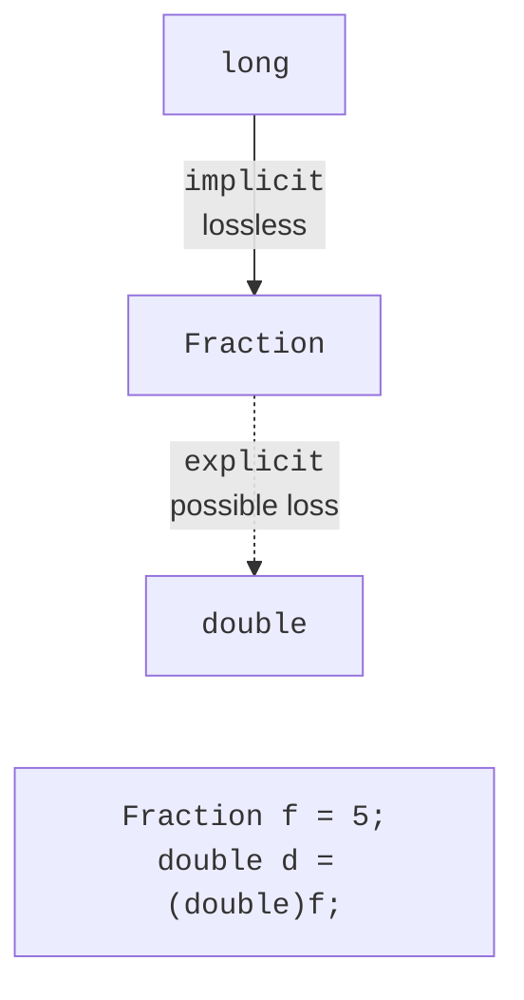

# Operator overloading

## Operator overloading

For built-in types, the expression `a + b * 2` is natural and clear. If a program has its own mathematical types (fractions, vectors, matrices, amounts of money), calls like `a.Add(b.Multiply(2))` are much harder to read. **Operator overloading** lets you define what `+`, `*`, `==`, and other operators mean for your own class or structure.

Overload operators only when their meaning is obvious: `+` for fractions adds fractions. A `+` operator that adds a product to a shopping cart or saves a file only confuses the code; for such actions, a regular method with a meaningful name is better.

### Syntax

An operator is declared as a **public static method** with the `operator` keyword. At least one parameter must be of the type in which the operator is declared:

```cs
public static Fraction operator +(Fraction x, Fraction y) =>
    new(x.Numerator * y.Denominator + y.Numerator * x.Denominator,
        x.Denominator * y.Denominator);

public static Fraction operator -(Fraction x) =>   // unary minus
    new(-x.Numerator, x.Denominator);
```

Unary operators (`+`, `-`, `!`, `~`, `++`, `--`) have one parameter, and binary operators have two. The operand types can differ: to multiply a vector by a number, you declare two operators, `Vector2 * double` and `double * Vector2`, because the compiler does not swap the operands by itself.

The compiler converts an expression with operators into calls to static methods with special names such as `op_Addition` and `op_Multiply` (Fig. 12.1). The overload is chosen by the operand types, just as for regular methods (Topic 5). A Visual Studio tooltip shows which operator will be called (Fig. 12.2).



Figure 12.1. Converting an expression with operators into method calls {.caption}



Figure 12.2. An overloaded operator in a Visual Studio tooltip {.caption}

### Comparison operators

Comparison operators are overloaded **in pairs**: `==` and `!=`, `<` and `>`, `<=` and `>=`. If you declare only one operator of a pair, the compiler reports error CS0216. The `==` operator must be consistent with the `Equals` method: otherwise, `a == b` and `a.Equals(b)` give different results, and collections (Topic 13) that use `Equals` and `GetHashCode` work incorrectly. That is why the compiler issues warnings CS0660 and CS0661 if `==` is declared without overriding `Equals` and `GetHashCode`.

A typical pattern is to implement `IEquatable<T>` (Topic 10) and express the operators through `Equals`:

```cs
public bool Equals(Fraction other) =>
    Numerator == other.Numerator
    && Denominator == other.Denominator;
public override bool Equals(object? obj) =>
    obj is Fraction other && Equals(other);
public override int GetHashCode() =>
    HashCode.Combine(Numerator, Denominator);

public static bool operator ==(Fraction x, Fraction y) =>
    x.Equals(y);
public static bool operator !=(Fraction x, Fraction y) =>
    !x.Equals(y);
```

It makes sense to keep the `<` and `>` operators consistent with `IComparable<T>`: if `CompareTo` returns a negative number, `<` should return `true`. Records (Topic 11) generate `==` and `!=` automatically.

### Other operators

The `++` and `--` operators are declared as static methods that return a new value; the compiler implements the prefix and postfix forms itself. The `true` and `false` operators (also paired) let you use an object in an `if` condition and, together with `&` and `|`, in the `&&` and `||` operators:

```cs
public static bool operator true(Duration d) => d.Minutes > 0;
public static bool operator false(Duration d) => d.Minutes == 0;

if (duration) { /* the duration is nonzero */ }
```

You cannot overload assignment `=`, member access `.`, the conditional operator `?:`, or the operators `??`, `&&`, `||`, `new`, `is`, `as`, `typeof`, and `nameof`. Instead of the `[]` operator and type casting, you declare indexers and conversion operators, respectively. An attempt to declare, for example, `operator &&` causes error CS1020.

### Compound assignment and `checked` operators

By default, compound assignment `a += b` is executed as `a = a + b`: you do not need to declare it separately. For large objects (matrices, buffers), this means creating a new object on every `+=`. Starting with C# 14, a class can declare **its own** compound operator as an instance method that modifies the object itself:

```cs
class Mileage(long km)
{
    public long Km { get; private set; } = km;

    public static Mileage operator +(Mileage a, Mileage b) =>
        new(a.Km + b.Km);

    // Checked version for a checked context (C# 11).
    public static Mileage operator checked +(Mileage a, Mileage b) =>
        new(checked(a.Km + b.Km));

    // Custom compound assignment (C# 14): no new object.
    public void operator +=(Mileage other) => Km += other.Km;
}
```

An operator with the `checked` modifier is called in a `checked` context (Topic 2) and should throw `OverflowException` on overflow, while the regular version works without checking. This way, your own numeric types behave like the built-in `int` and `long`.

## Conversion operators

**Conversion operators** define casts between your own type and other types. An `implicit` conversion happens automatically, and an `explicit` one only with an explicit cast `(double)f` (Fig. 12.3):

```cs
public static implicit operator Fraction(long n) => new(n, 1);

public static explicit operator double(Fraction f) =>
    (double)f.Numerator / f.Denominator;
```



Figure 12.3. Implicit and explicit conversion {.caption}

A conversion should be implicit only when it **always** succeeds and loses no information, like `int` → `long` for built-in types. If a loss of precision (the fraction 1/3 as a `double`) or an exception is possible, the conversion is declared explicit. An implicit conversion from `long` lets you write `a + 2`: the compiler converts 2 into a fraction and calls `operator +(Fraction, Fraction)`.
