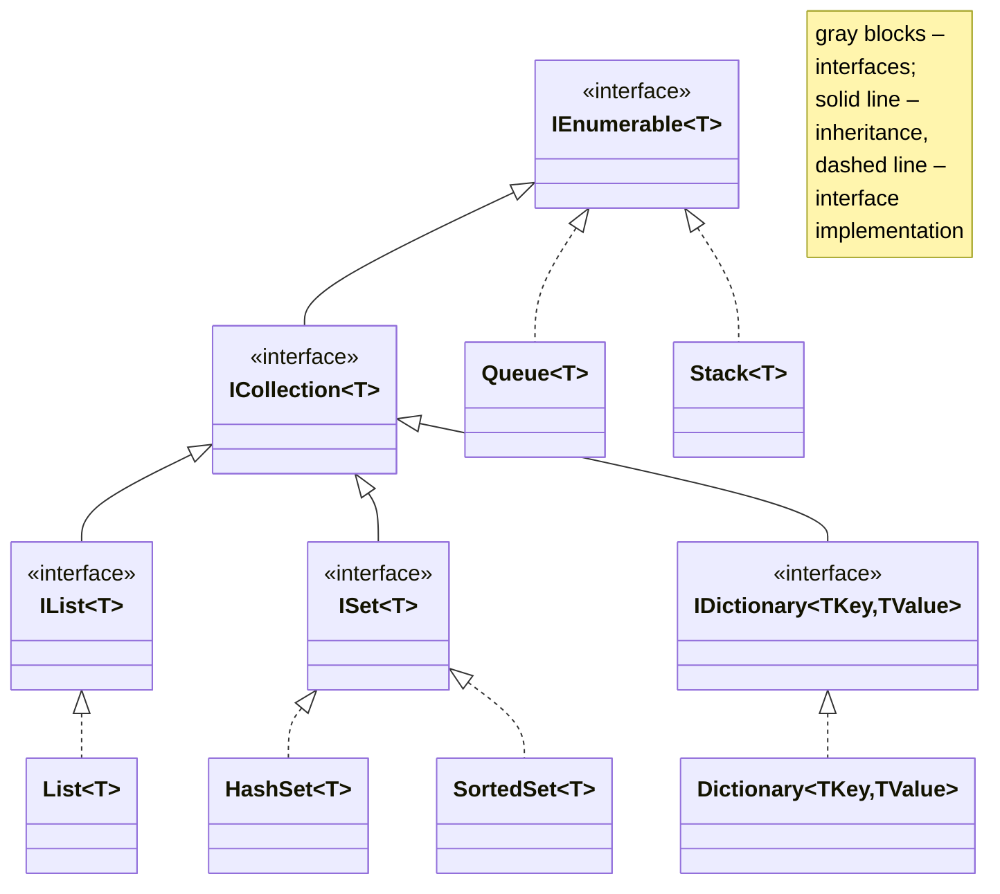
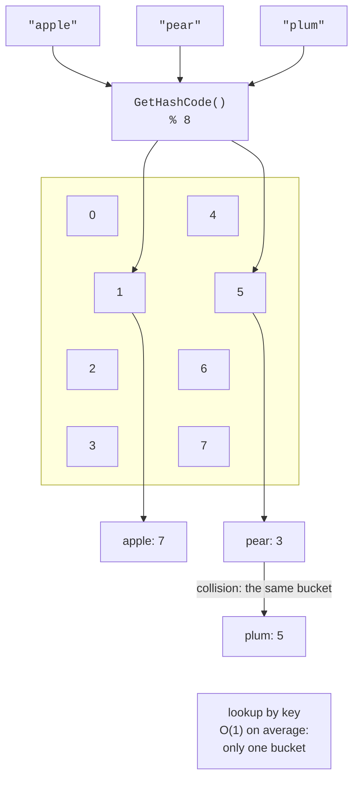
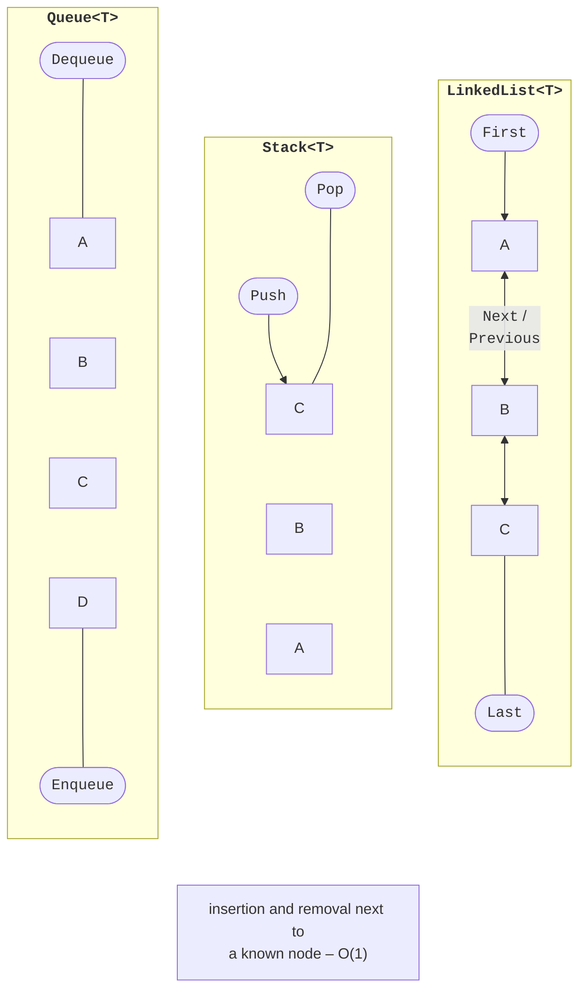
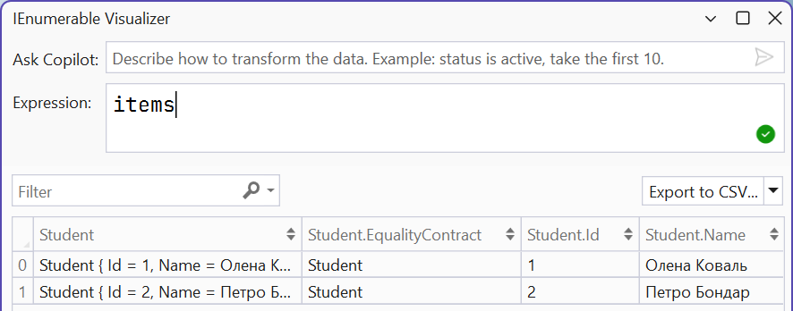

# .NET collections

## .NET collections

A **collection** is an object that stores a group of elements and, unlike an array, resizes automatically. Generic collections implement common interfaces (Fig. 13.3), so code that works with `IEnumerable<T>` accepts any of them. The diagram is simplified: for example, `IDictionary` inherits `ICollection<KeyValuePair<TKey, TValue>>`, and `Queue<T>` and `Stack<T>` implement `IEnumerable<T>` through `IReadOnlyCollection<T>`.



Figure 13.3. Collection interfaces and classes (simplified) {.caption}

A collection is chosen based on the operations performed most often and their **complexity**, that is, how the running time depends on the number of elements *n*: O(1) is constant time, O(log *n*) is logarithmic, and O(*n*) is linear (Table 13.2).

Table 13.2. Choosing a collection (<sup>\*</sup> – on average) {.caption}

| **Collection** | **Purpose** | **Complexity** |
| --- | --- | --- |
| `List<T>` | a list with index access | index O(1), `Add` O(1)<sup>\*</sup>, search O(*n*) |
| `Dictionary` | “key – value” pairs | lookup by key O(1)<sup>\*</sup> |
| `HashSet<T>` | a set of unique elements | `Contains` O(1)<sup>\*</sup> |
| `SortedDictionary`, `SortedSet<T>` | sorted keys or elements | search, insertion O(log *n*) |
| `Queue<T>`, `Stack<T>` | a FIFO queue, a LIFO stack | adding, removing O(1) |
| `PriorityQueue` | a priority queue | adding, removing O(log *n*) |
| `LinkedList<T>` | a doubly linked list | insertion next to a node O(1), search O(*n*) |

### `List<T>`

`List<T>` is the most commonly used collection: a dynamic array that doubles its internal array when it runs out of space. The `Capacity` property returns the current size of the internal array, and `Count` returns the number of elements.

```cs
List<string> cities = ["London", "Madrid"]; // collection expression
cities.Add("Paris");
cities.Insert(0, "Vienna");                 // shifts the rest: O(n)
cities.Remove("Madrid");                    // the first match
bool hasLondon = cities.Contains("London"); // linear search
int index = cities.IndexOf("Paris");        // 2 or -1
cities.Sort();                              // IComparable<string>
cities.Sort(new ByLength());                // a custom IComparer<T>
List<string> copy = [.. cities];            // a copy
```

The `Sort` method without arguments uses the elements’ `IComparable<T>`, and with an argument, it uses an `IComparer<T>` comparer (Topic 10). A short notation for a comparer with a lambda expression is covered in Topic 14.

### `Dictionary<TKey, TValue>`

A **dictionary** stores “key – value” pairs with unique keys and finds a value by its key in constant time on average. To do this, the dictionary calculates the key’s `GetHashCode()` and uses it to determine a **bucket**, in which it searches for the key with the `Equals` method (Fig. 13.4).



Figure 13.4. Placement of elements in a dictionary’s hash table {.caption}

```cs
Dictionary<string, int> stock = new()
{
    ["apple"] = 7,
    ["pear"] = 3,
};
stock["plum"] = 5;                   // add or replace
stock.Add("pear", 1);                // ArgumentException: the key exists
int pears = stock["pear"];      // KeyNotFoundException if missing

if (stock.TryGetValue("cherry", out int cherries))  // no exception
{
    Console.WriteLine(cherries);
}
bool added = stock.TryAdd("pear", 1);              // false
foreach (KeyValuePair<string, int> pair in stock)
{
    Console.WriteLine($"{pair.Key}: {pair.Value}");
}
```

Requirements for a key: `Equals` and `GetHashCode` must be consistent (Topic 9), and the key must not change while it is in the dictionary. Strings, numbers, records, and enumerations are suitable as keys. The way strings are compared is set by a constructor argument: a dictionary created with the `StringComparer.OrdinalIgnoreCase` argument is case-insensitive. The contents of a dictionary are convenient to inspect in the debugger (Fig. 13.5).


Figure 13.5. A dictionary in the debugger {.caption}

### Sets and sorted collections

`HashSet<T>` stores **unique** elements and quickly checks membership. Set operations modify the current set:

```cs
HashSet<string> monday = ["Olena", "Petro", "Iryna"];
HashSet<string> tuesday = ["Petro", "Andrii"];

bool added = monday.Add("Olena");     // false: already present
monday.IntersectWith(tuesday);        // intersection: { Petro }
tuesday.UnionWith(["Iryna"]);         // union
tuesday.ExceptWith(["Andrii"]);       // difference
bool subset = monday.IsSubsetOf(tuesday);
```

`SortedSet<T>` and `SortedDictionary<TKey, TValue>` keep their elements sorted (a search tree), and `SortedList<TKey, TValue>` stores sorted arrays of keys and values and provides access by position. They are useful when you need to iterate in key order or get the smallest or largest element.

### Queues, stacks, and linked lists

`Queue<T>` is a **queue** (FIFO, “first in, first out”): `Enqueue` adds to the end, and `Dequeue` removes from the beginning. `Stack<T>` is a **stack** (LIFO, “last in, first out”): `Push` puts an element on top, and `Pop` takes it off the top. `Peek` returns an element without removing it, and the `TryDequeue`, `TryPop`, and `TryPeek` methods do not throw an exception for an empty collection (Fig. 13.6).



Figure 13.6. A queue, a stack, and a doubly linked list {.caption}

`PriorityQueue<TElement, TPriority>` removes the element with the **lowest** priority first. The order of elements with the same priority is not guaranteed: in a test, a queue with the priorities `a` 1, `b` 1, `c` 1 returned them in the order `a`, `c`, `b`. If the order of arrival matters, an arrival number is added to the priority, for example, as a tuple `(priority, number)`.

`LinkedList<T>` is a doubly linked list of `LinkedListNode<T>` nodes with `Next` and `Previous` references. Insertion and removal next to a known node (`AddAfter`, `AddBefore`, `Remove(node)`) do not shift other elements, but there is no index access. In practice, `List<T>` is usually faster, so `LinkedList<T>` is chosen for frequent insertions in the middle, for example, in an LRU cache.

### Collection interfaces

A method that only iterates over elements accepts the most general interface, `IEnumerable<T>`; then you can pass it an array, a list, a set, or the result of an iterator. A method that returns an internal collection returns it as `IReadOnlyList<T>` or `IReadOnlyDictionary<TKey, TValue>` so that outside code cannot modify it:

```cs
class Course
{
    private readonly List<string> students = [];

    public IReadOnlyList<string> Students => students; // read-only

    public void Enroll(string name) => students.Add(name);
}
```

`IEnumerable<T>` allows only iteration; `ICollection<T>` adds `Count`, `Add`, `Remove`, and `Contains`; `IList<T>` adds index access. For collections that do not change after creation, the `System.Collections.Immutable` namespace contains immutable collections, and `System.Collections.Frozen` contains `FrozenDictionary` and `FrozenSet`, optimized for fast reads (the `ToFrozenDictionary()` method). A list of objects is convenient to inspect with the debugger visualizer (Fig. 13.7).



Figure 13.7. The IEnumerable collection visualizer {.caption}
