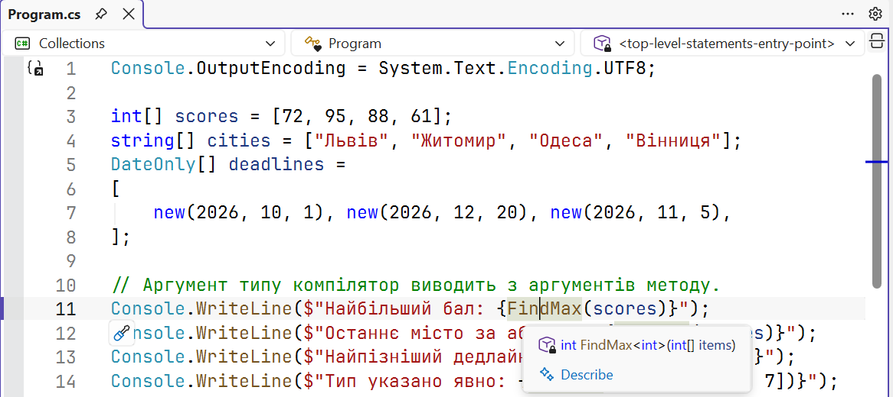
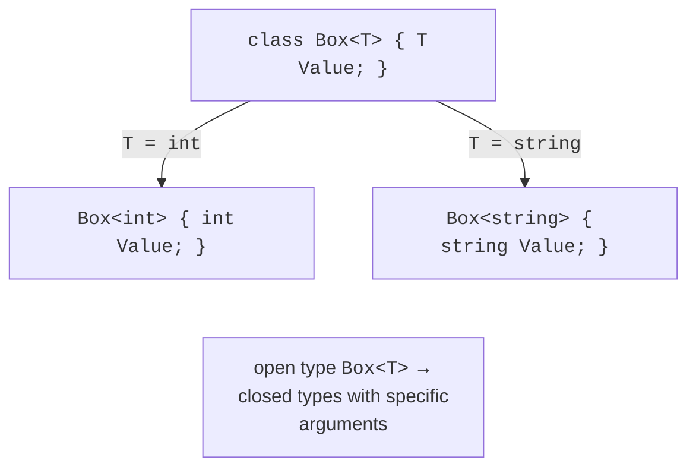

# Generic methods and classes

## Why generics are needed

A method that finds the maximum in an `int` array differs from the method for `double` or `string` only in the type. Writing several copies of the same code is inconvenient, and a shared version using the `object` type loses type safety. This is exactly how the collections in the first versions of .NET worked, for example, `ArrayList`:

```cs
using System.Collections;

ArrayList values = new() { 10, 20, "thirty" };   // anything
int sum = 0;
foreach (object item in values)
{
    sum += (int)item;       // InvalidCastException on the third one
}
```

This code has three drawbacks: a type error is detected not by the compiler but by the program at run time; every `int` is boxed (Topic 11); and explicit casts are needed. **Generics** eliminate these drawbacks: the data type becomes a **type parameter**, and the compiler checks every use. Modern code uses only the generic collections of the `System.Collections.Generic` namespace.

## Generic methods

A **generic method** declares one or more type parameters in angle brackets after its name. When calling it, you usually do not specify the type: the compiler **infers** it from the arguments:

```cs
static void Swap<T>(ref T a, ref T b) => (a, b) = (b, a);

int x = 1, y = 2;
Swap(ref x, ref y);                 // T = int
string s1 = "a", s2 = "b";
Swap<string>(ref s1, ref s2);       // the type is specified explicitly
```

A type parameter is named with the letter `T` or with a name prefixed with `T`: `TKey`, `TValue`, `TResult`. A Visual Studio tooltip shows the inferred type argument (Fig. 13.1).



Figure 13.1. The inferred type argument in a tooltip {.caption}

## Generic classes and interfaces

A class, structure, interface, or record can also have type parameters. The generic type `Box<T>` is **open**: it is a template from which a **closed** type such as `Box<int>` or `Box<string>` is formed for each type argument (Fig. 13.2). Closed types with different arguments are different types.

```cs
Pair<string, int> age = new("Olena", 21);
Pair<DateOnly, double> rate = new(new(2026, 9, 16), 41.25);

class Pair<TFirst, TSecond>(TFirst first, TSecond second)
{
    public TFirst First { get; } = first;
    public TSecond Second { get; } = second;

    public override string ToString() => $"({First}, {Second})";
}
```



Figure 13.2. Substituting a type argument into a generic class {.caption}

Inside generic code, the expression `default(T)`, or simply `default`, gives the “default” value for an unknown type: `0` for numbers, `false` for `bool`, and `null` for reference types. It is used, for example, in the `TryPop(out T item)` method of a custom stack when the stack is empty.

### Type parameter constraints

Without constraints, you can perform only the operations of the `object` class on an object of type `T`. To call, for example, `CompareTo`, the type parameter is **constrained** with the `where` keyword:

```cs
static T FindMax<T>(T[] items) where T : IComparable<T>
```

Now the compiler allows the call `item.CompareTo(max)` and does not allow calling the method for a type that does not implement `IComparable<T>`. Table 13.1 lists the main constraints.

Table 13.1. Type parameter constraints {.caption}

| **Constraint** | **Requirement for the type argument** |
| --- | --- |
| `where T : class` | a reference type |
| `where T : struct` | a value type (except `Nullable<T>`) |
| `where T : notnull` | a non-nullable type |
| `where T : new()` | has a public parameterless constructor |
| `where T : Shape` | the `Shape` class or a class derived from it |
| `where T : IEntity` | implements the `IEntity` interface |
| `where T : class, IEntity, new()` | several constraints at once |

**Generic math** (.NET 7) lets you write arithmetic for any numeric type through static abstract interface members (Topic 10). The `INumber<T>` constraint provides the `+` and `*` operators, `T.Zero`, and so on:

```cs
using System.Numerics;

static T Sum<T>(T[] items) where T : INumber<T>
{
    T total = T.Zero;
    foreach (T item in items)
    {
        total += item;
    }
    return total;
}
// Sum([1, 2, 3]) == 6;  Sum([1.5m, 2.25m]) == 3.75m
```
