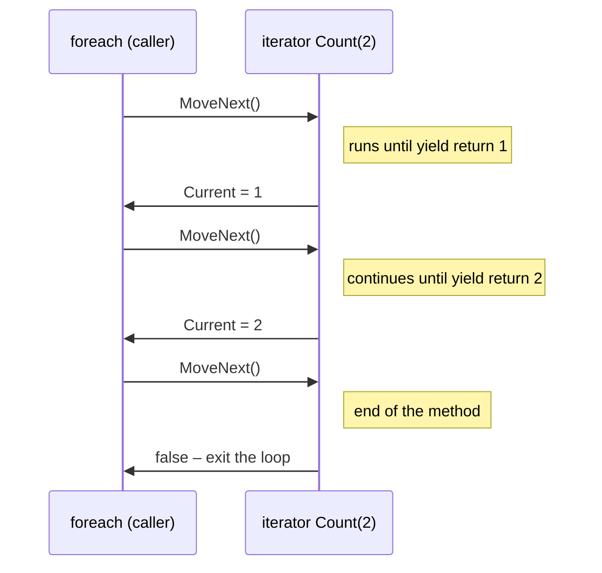

# Iterators

## Iterators

The `foreach` loop works with any object that has a `GetEnumerator()` method. The compiler converts the loop into calls to `MoveNext()` and reads of `Current` on the enumerator object. The easiest way to create your own sequence is an **iterator**: a method that returns `IEnumerable<T>` and uses `yield return`:

```cs
foreach (int n in Count(2))
{
    Console.Write($"{n} ");      // [yield] 1 [yield] 2
}

static IEnumerable<int> Count(int limit)
{
    for (int i = 1; i <= limit; i++)
    {
        Console.Write("[yield] ");
        yield return i;          // return a value and pause
    }
}
```

An iterator runs **lazily**: the method body does not start when `Count(2)` is called, and each call to `MoveNext()` resumes execution until the next `yield return` (Fig. 13.8). The `yield break` statement ends the sequence.



Figure 13.8. Executing an iterator with `yield return` {.caption}

A collection cannot be modified during iteration: after `Add` or `Remove` in the body of `foreach`, the next `MoveNext()` throws `InvalidOperationException` with the message “Collection was modified; enumeration operation may not execute” (Fig. 13.9). To remove elements, iterate over a copy or use a `for` loop from the end.


Figure 13.9. Modifying a collection during iteration {.caption}
