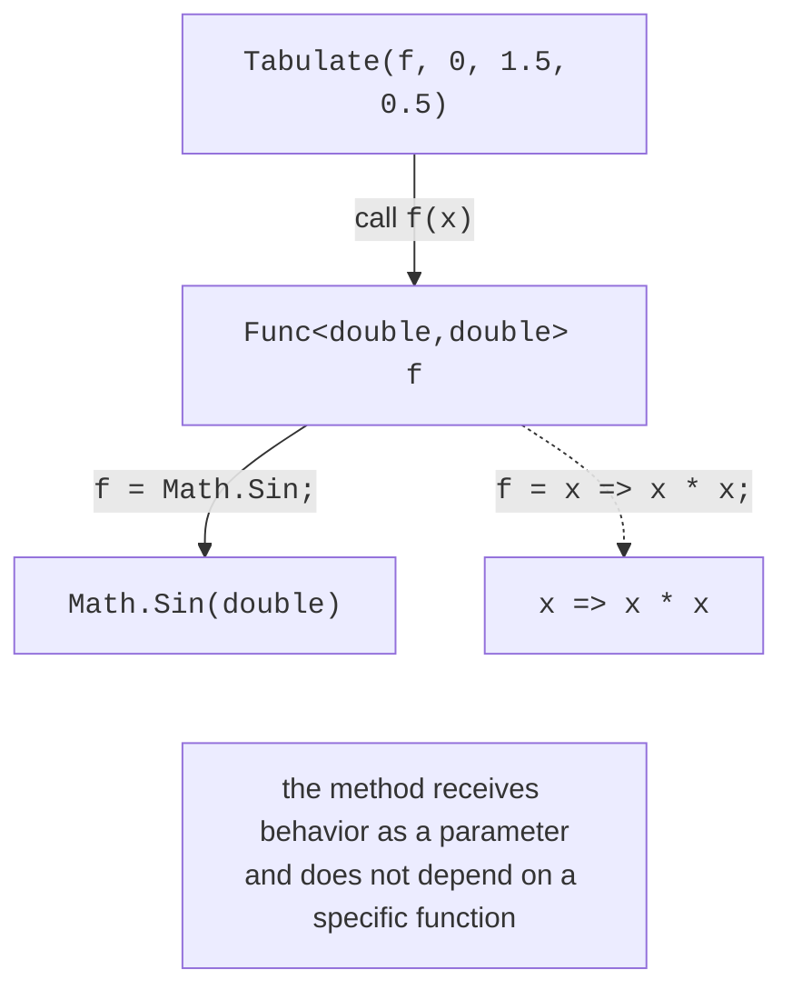
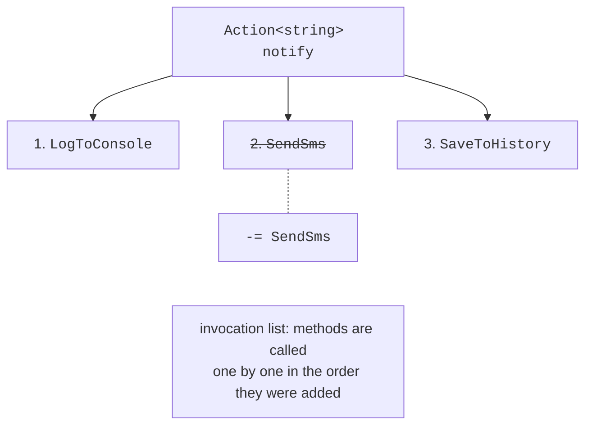

# Delegates

## A method as a value

So far, methods have received only data as parameters. However, you often need to pass **behavior** into a method: a filter condition, a sorting rule, a function to tabulate, or an action to perform after an operation completes (a *callback*). In Topic 10, interfaces (`IComparer<T>`) were used for this, but declaring a separate class for one short function is inconvenient. C# lets you store a reference to a method in a **delegate** variable.

## Delegates

A **delegate** is a type whose values are references to methods with a specific signature (Fig. 14.1). A delegate type is declared with the `delegate` keyword:

```cs
Operation op = Add;               // a reference to a method
Console.WriteLine(op(2, 3));      // 5 – a call through the delegate
op = Multiply;
Console.WriteLine(op.Invoke(2, 3)); // 6 – the same as op(2, 3)

static int Add(int a, int b) => a + b;
static int Multiply(int a, int b) => a * b;

delegate int Operation(int a, int b);
```



Figure 14.1. A delegate as a reference to a method {.caption}

A method is **compatible** with a delegate if the number and types of parameters (including the `ref`, `out`, and `in` modifiers) and the return type match; the method name does not matter. You can assign a static method, a method of a specific object (`account.Deposit`), or a lambda expression to a delegate. Delegates are reference types: a delegate variable can be `null`, and calling such a delegate throws `NullReferenceException`. That is why an optional delegate is called through `?.Invoke`:

```cs
Action? onFinished = null;
onFinished?.Invoke();            // nothing happens
```

### Multicast delegates

A delegate can refer to several methods at once. The `+=` operator adds a method to the **invocation list**, and `-=` removes it. Calling such a **multicast** delegate calls all the methods one by one in the order they were added (Fig. 14.2):

```cs
Action<string> notify = LogToConsole;
notify += SendSms;
notify += SaveToHistory;
notify("Order paid");            // three calls
notify -= SendSms;               // removal from the list
```



Figure 14.2. The invocation list of a multicast delegate {.caption}

Features of multicast delegates:

- if the delegate returns a value, the result of the call is the value of the **last** method in the list; the results of the other methods are lost;
- if one of the methods throws an exception, the rest of the methods in the list are not called;
- `GetInvocationList().Length` returns the number of methods.

That is why multicast delegates are used mostly with `void` methods, primarily in events.

## Built-in delegates

You do not need to declare your own delegate type for every signature: .NET contains generic delegates that cover almost all cases (Table 14.1).

Table 14.1. Built-in .NET delegates {.caption}

| **Delegate** | **Signature and example** |
| --- | --- |
| `Action`, `Action<T1, …, T16>` | no result: `Action<string> print` |
| `Func<TResult>`, `Func<T1, …, TResult>` | the last type parameter is the result: `Func<double, double> f` |
| `Predicate<T>` | a condition, `bool` for one argument: `List<T>.FindAll`, `RemoveAll`, `Array.FindAll` |
| `Comparison<T>` | comparison of two elements, `int`: `List<T>.Sort`, `Array.Sort` |
| `EventHandler`, `EventHandler<TEventArgs>` | an event handler: `(object? sender, TEventArgs e)` |

.NET library methods accept such delegates as parameters. For example, `list.Sort(comparison)` sorts according to the rule passed as a `Comparison<T>` delegate, without a separate `IComparer<T>` class (Topic 13), and `list.RemoveAll(predicate)` removes the elements that satisfy the condition.
