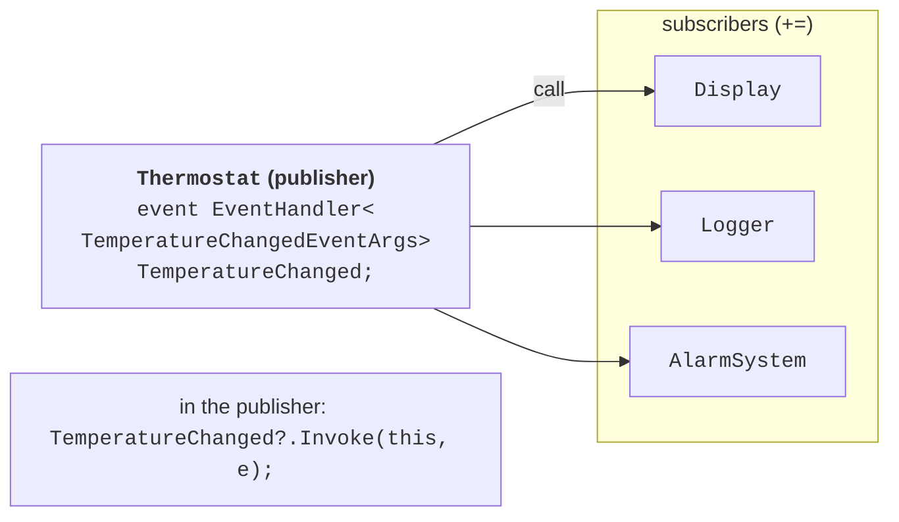
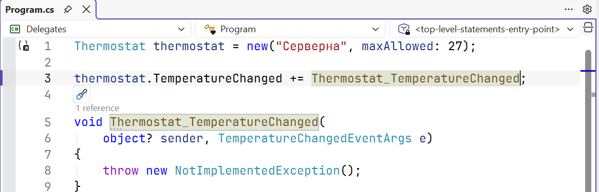

# Events

## Events

An **event** is a class member that lets a **publisher** object notify other **subscriber** objects that something has happened: the temperature changed, a button was clicked, a download finished. An event is declared with the `event` keyword and a delegate type:

```cs
Button button = new();
button.Clicked += (sender, e) => Console.WriteLine("Clicked");
button.Click();

class Button
{
    public event EventHandler? Clicked;

    public void Click() => Clicked?.Invoke(this, EventArgs.Empty);
}
```

An event is similar to a public delegate field, but the `event` keyword restricts access from outside the class: you can only subscribe (`+=`) or unsubscribe (`-=`). Only the class itself can raise the event, assign `null` to it, or replace the list of handlers. An attempt to call `button.Clicked(null, EventArgs.Empty)` or `button.Clicked = null` from outside causes error CS0070. A public delegate field has no such protection: any code could raise the “event” or erase all subscribers.

### The standard .NET event pattern

Events in .NET are declared according to a single pattern (Fig. 14.6):

- the event type is `EventHandler` (an event without data) or `EventHandler<TEventArgs>`;
- the handler has the parameters `object? sender` (who raised the event) and `TEventArgs e` (the event data);
- event data is passed in a class derived from `EventArgs` whose name ends with `EventArgs`: `TemperatureChangedEventArgs`;
- the event is raised by a protected virtual method `OnEventName`, which derived classes can override;
- the event name is a verb or participle: `Clicked`, `TemperatureChanged`, `Closing`.



Figure 14.6. An event publisher and subscribers {.caption}

```cs
public event EventHandler<TemperatureChangedEventArgs>?
    TemperatureChanged;

protected virtual void OnTemperatureChanged(
    TemperatureChangedEventArgs e) =>
    TemperatureChanged?.Invoke(this, e);
```

Visual Studio can create a handler with the required signature: after `+=`, type the name of a new handler and invoke *Ctrl+.* → *Generate method*. Fig. 14.7 shows the generated result; replace the stub body with your own event handling.



Figure 14.7. A generated event handler {.caption}

### Subscribing, unsubscribing, and the Observer pattern

The publisher keeps references to all subscribers through the delegate’s invocation list. While a subscription exists, the garbage collector will not free the subscriber object, even if it is no longer used anywhere else. That is why a long-lived publisher (for example, a static service) with unremoved subscriptions from short-lived objects causes a **memory leak**. A subscriber that finishes its work must unsubscribe.

You can unsubscribe a method (`-= LogChange`) or a delegate stored in a variable. Unsubscribing with a lambda written again (`-= (s, e) => …`) does not work: it is a new, different delegate object. If you will need to unsubscribe, store the lambda in a variable first.

Events implement the **Observer** design pattern (Topic 17): the publisher does not know the specific classes of its subscribers, and subscribers can appear and disappear while the program runs. An alternative is a subscriber interface with a method that the publisher calls; it is convenient when there are many logically related events. For event streams, .NET also has the `IObservable<T>` and `IObserver<T>` interfaces.
