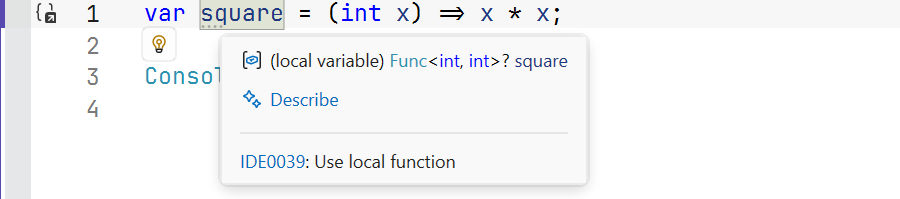
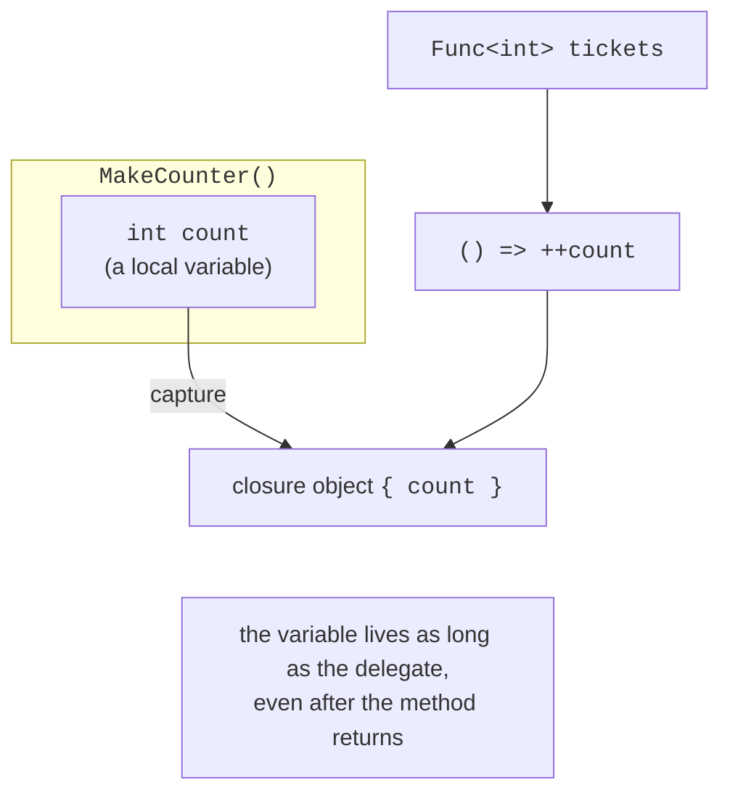

# Lambda expressions and closures

## Lambda expressions

A **lambda expression** is a short notation for an anonymous method right where it is used. The parameters are written to the left of `=>`, and an expression or a block of statements to the right:

```cs
Func<int, int> square = x => x * x;              // expression lambda
Func<int, int, int> add = (a, b) => a + b;       // several parameters
Action greet = () => Console.WriteLine("Hello");   // no parameters
Func<string, bool> isLong = (string s) =>        // explicit types
{
    string trimmed = s.Trim();                   // statement lambda
    return trimmed.Length > 10;
};
Func<int, int, int> first = (x, _) => x;         // discard
```

Parameter types are usually inferred from the delegate type. If the delegate type is not specified (`var`), the compiler determines the lambda’s **natural type**: `var square = (int x) => x * x;` has the type `Func<int, int>` (Fig. 14.3). For a lambda without explicit parameter types (`var f = x => x;`), the type cannot be inferred, which causes error CS8917.



Figure 14.3. The natural type of a lambda expression in a tooltip {.caption}

The `static` modifier before a lambda (`static x => x * 2`) prohibits it from using local variables and instance members of the enclosing code (error CS8820). This guarantees that the lambda does not create a closure. Anonymous methods with the older syntax `delegate (int x) { return x * x; }` appear in existing code, but new code uses lambda expressions.

## Closures

A lambda can use the local variables and parameters of the method in which it is declared. Such a lambda forms a **closure**: it **captures** the variable itself, not a copy of its value. The compiler moves the captured variable into a hidden object on the heap, so the variable continues to exist as long as the delegate exists, even after the method returns (Fig. 14.4):

```cs
Func<int> next = MakeCounter();
Console.WriteLine(next());   // 1
Console.WriteLine(next());   // 2 – the count variable was preserved

static Func<int> MakeCounter()
{
    int count = 0;
    return () => ++count;
}
```



Figure 14.4. A variable captured by a closure {.caption}

During debugging, the values of captured variables are visible in the *Locals* window when a breakpoint is set inside the lambda (Fig. 14.5).


Figure 14.5. A captured variable in the Locals window {.caption}

Because the variable itself is captured, all lambdas created in a `for` loop see **one** counter variable and, after the loop ends, get its last value. In a `foreach` loop, the iteration variable is created anew at each step, so there is no such problem. For a `for` loop, the value is copied into a local variable inside the loop body (the “Counters and the loop variable trap” example).

## Higher-order functions

A **higher-order function** is a method that takes delegates as parameters or returns a delegate. Such functions let you build new functions from existing ones:

```cs
// Composition: first f, then g.
static Func<T, TResult> Compose<T, TMiddle, TResult>(
    Func<T, TMiddle> f, Func<TMiddle, TResult> g) =>
    x => g(f(x));

// Memoization: remembering calculated results.
static Func<int, long> Memoize(Func<int, long> slow)
{
    Dictionary<int, long> cache = [];
    return n =>
    {
        if (!cache.TryGetValue(n, out long result))
        {
            result = slow(n);
            cache[n] = result;
        }
        return result;
    };
}

Func<double, double> root = Math.Sqrt;
Func<double, string> format = Compose(root, x => $"{x:F2}");
Console.WriteLine(format(2));   // 1,41
```

Typical higher-order functions include filtering and sorting with a condition, tabulating a function, retrying an operation (`Retry`), and measuring the running time of an action. In Topic 15, the LINQ library is built precisely on methods that accept delegates.
