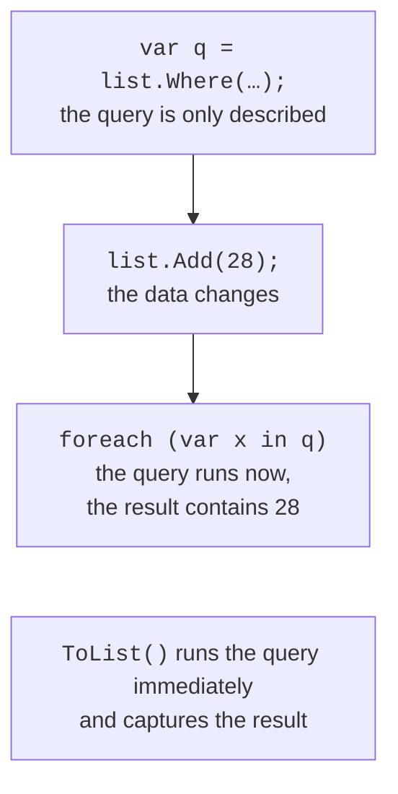

# Execution and aggregation

## Deferred and immediate execution

Most operators that return a sequence (`Where`, `Select`, `OrderBy`, `Take`) use **deferred execution**: the call only creates a description of the query, and the data is processed when the result is iterated (Fig. 15.4). Such operators are built on iterators (Topic 13). The consequences:

- a query sees changes to the source made after it was created;
- each iteration (`foreach`, `Count()`, `string.Join`) executes the query again.



Figure 15.4. Deferred execution of a query {.caption}

Operators that return a single value (`Count`, `Sum`, `First`, `Any`) and conversion operators (`ToList`, `ToArray`, `ToDictionary`, `ToHashSet`, `ToLookup`) execute **immediately**. To execute a query once and keep the result, call `ToList()` or `ToArray()`.

In the debugger, the *Locals* window shows a *Results View* node for a query variable, with a warning that expanding it iterates the sequence (Fig. 15.5).


Figure 15.5. A deferred query in the debugger {.caption}

## Elements, quantifiers, and aggregation

The operators that get a single element behave differently when there is no element or there are several (Table 15.1).

Table 15.1. Element operators {.caption}

| **Operator** | **No elements** | **Several elements** |
| --- | --- | --- |
| `First` | exception | the first |
| `FirstOrDefault` | `default` or a specified value | the first |
| `Single` | exception | exception |
| `SingleOrDefault` | `default` or a specified value | exception |
| `Last`, `LastOrDefault` | like `First`, `FirstOrDefault` | the last |
| `ElementAt(i)` | exception | the element at index `i` |

The exception in the table is `InvalidOperationException`; for `ElementAt`, it is `ArgumentOutOfRangeException`.

The exception messages are “Sequence contains no elements” for an empty sequence and “Sequence contains more than one matching element” for `Single` with a condition. Choose `First` when you need any first matching element, and `Single` when, by its meaning, there must be **exactly one** element (a search by a unique key) and a duplicate is a data error.

**Quantifiers** return `bool`: `Any()` checks whether there is at least one element (or an element with a condition), `All(predicate)` checks whether all elements satisfy the condition, and `Contains(value)` checks whether a value is present.

**Aggregate operators** calculate a single value: `Count`, `Sum`, `Average`, `Min`, and `Max`. `MinBy(key)` and `MaxBy(key)` (.NET 6) return the **element** with the smallest or largest key, not the key value. `Aggregate` performs arbitrary accumulation:

```cs
int[] numbers = [4, 8, 15, 16, 23, 42];

int count = numbers.Count(n => n % 2 == 0);        // 4
double average = numbers.Average();                // 18
int product = numbers.Take(3).Aggregate((a, b) => a * b);   // 480
Student best = students.MaxBy(s => s.Average)!;   // an element
bool hasFailed = students.Any(s => s.Average < 3); // whether any
```

`Sum`, `Average`, `Min`, and `Max` behave differently for an empty sequence: `Sum` returns 0, while `Average`, `Min`, and `Max` throw `InvalidOperationException` for value types.
