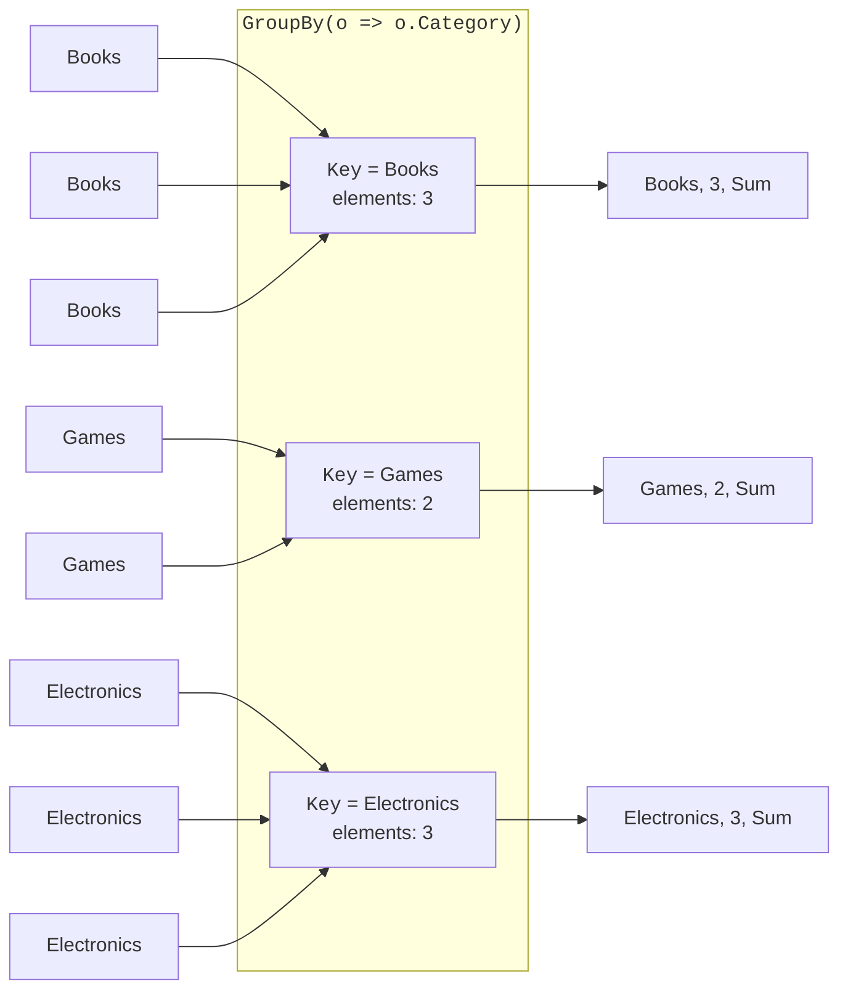
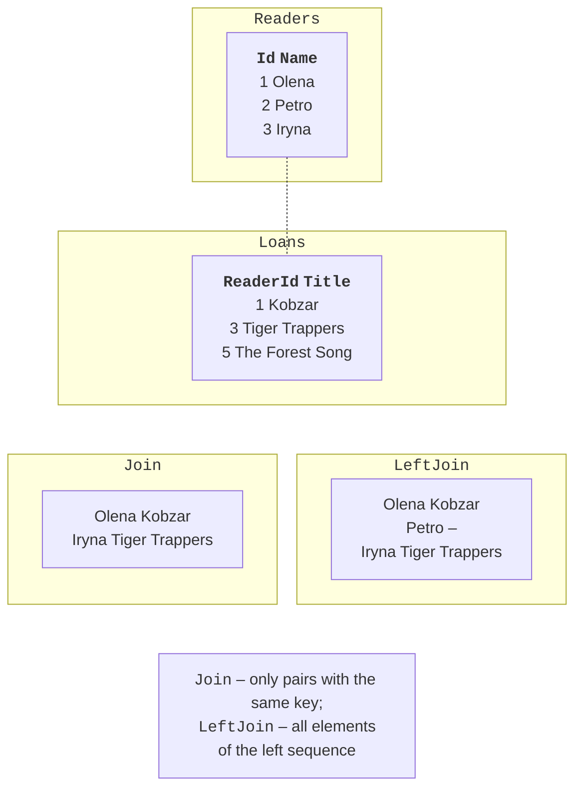

# Grouping, joins, and how LINQ works

## Grouping

`GroupBy(key)` splits a sequence into groups of elements with the same key (Fig. 15.6). Each group implements `IGrouping<TKey, TElement>`: it has a `Key` property and is a sequence of its elements, so aggregate operators can be applied to it:

```cs
var summary = orders
    .GroupBy(o => o.Category)
    .Select(g => new { Category = g.Key, Count = g.Count(),
                       Total = g.Sum(o => o.Price) });

// Query syntax: into continues the query after grouping.
var summary2 =
    from o in orders
    group o by o.Category into g
    select new { Category = g.Key, Count = g.Count() };
```



Figure 15.6. Grouping elements with `GroupBy` {.caption}

For counting and accumulating by key, .NET 9 added shorter operators without intermediate groups: `CountBy(key)` returns “key – count” pairs, and `AggregateBy(key, seed, func)` returns “key – accumulated value” pairs. `ToLookup(key)` performs grouping immediately and lets you access a group by key: `lookup["Books"]`. The result of grouping is convenient to inspect in the debugger visualizer (Fig. 15.7). In the screenshot, the projection is a named record `Summary` with the same four fields, so that the column headers are short.


Figure 15.7. The result of grouping in the visualizer {.caption}

## Joins

`Join` matches the elements of two sequences by equal keys and returns only the pairs that match (an **inner join**). `GroupJoin`, for each element of the first sequence, returns a group of matching elements of the second, possibly empty. .NET 10 added `LeftJoin` and `RightJoin`: a **left join** returns all elements of the first sequence, substituting `default` (`null` for classes) when there is no match (Fig. 15.8).

```cs
var pairs = readers.Join(loans,
    r => r.Id,                 // the key of the first sequence
    l => l.ReaderId,           // the key of the second
    (r, l) => new { r.Name, l.Title });

// The same in query syntax.
var pairs2 =
    from r in readers
    join l in loans on r.Id equals l.ReaderId
    select new { r.Name, l.Title };
```



Figure 15.8. Inner and left joins {.caption}

Before .NET 10, a left join was written with `GroupJoin` and `SelectMany` with `DefaultIfEmpty()`; this pattern appears in existing code. The `Zip` operator joins two sequences **by position**: `names.Zip(scores)` returns tuples (the first name, the first score), and so on.

## Partitioning, set operations, and generation

- `Skip(n)` and `Take(n)` skip or take *n* elements; `SkipWhile` and `TakeWhile` do so while a condition is true; `Take(^3..)` takes the last three. Together, `Skip` and `Take` implement pagination.
- `Chunk(size)` (.NET 6) splits a sequence into arrays of a given size.
- `Distinct()` and `DistinctBy(key)` return unique elements; `Union`, `Intersect`, `Except`, and their `…By` versions perform set operations on two sequences.
- `Index()` (.NET 9) returns `(Index, Item)` pairs for iterating with an index in `foreach`.
- `Enumerable.Range(start, count)`, `Enumerable.Repeat(value, count)`, and `Enumerable.Empty<T>()` generate sequences.

```cs
foreach (var (i, word) in new[] { "a", "b", "c" }.Index())
{
    Console.Write($"{i}:{word} ");             // 0:a 1:b 2:c
}
int[] squares = Enumerable.Range(1, 5).Select(x => x * x).ToArray();
string[][] pages = Enumerable.Range(1, 23)
    .Select(i => $"Product {i}").Chunk(5).ToArray();   // 5 pages
```

## How LINQ works inside

A deferred operator is an extension method for `IEnumerable<T>` implemented as a `yield return` iterator. A simplified implementation of `Where` looks like this:

```cs
static class MyLinq
{
    public static IEnumerable<T> MyWhere<T>(
        this IEnumerable<T> source, Func<T, bool> predicate)
    {
        foreach (T item in source)
        {
            if (predicate(item))
            {
                yield return item;
            }
        }
    }
}
```

That is why a `Where(…).Select(…)` chain does not create intermediate lists: during iteration, each element passes through all the operators of the pipeline in turn. You can create your own operators the same way (Example 3 of the lab assignment). The real .NET operators also validate their arguments and are optimized for arrays and lists.
