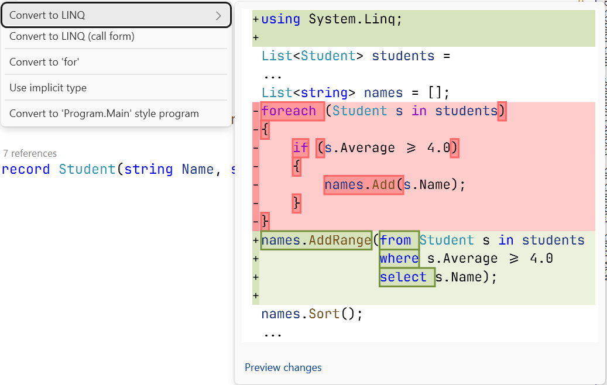
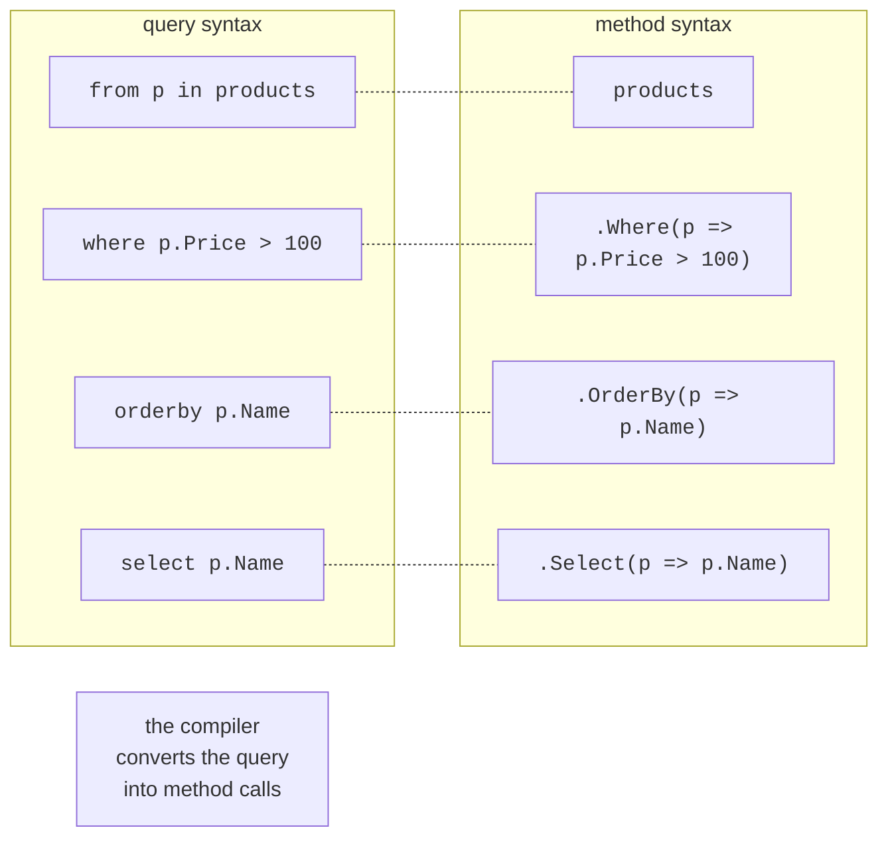
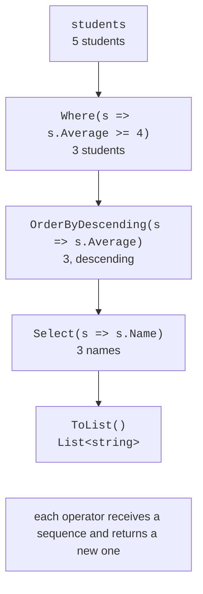

# LINQ fundamentals

## What LINQ is

**LINQ** (*Language-Integrated Query*) is a set of C# language features and .NET library facilities for querying data: filtering, sorting, grouping, and joining. Instead of loops with conditions and intermediate lists, a query describes **what** you want to get:

```cs
// Without LINQ.
List<string> names = [];
foreach (Student s in students)
{
    if (s.Average >= 4.0)
    {
        names.Add(s.Name);
    }
}
names.Sort();

// With LINQ.
List<string> names2 = students
    .Where(s => s.Average >= 4.0)
    .Select(s => s.Name)
    .Order()
    .ToList();
```

LINQ to Objects works with any `IEnumerable<T>` sequence: arrays, lists, dictionaries, and the results of iterators. LINQ operators are extension methods (Topic 12) of the static class `System.Linq.Enumerable` that accept delegates (Topic 14). The `System.Linq` namespace is imported implicitly in console projects. The same query syntax is used for other data sources as well: LINQ to XML (`XDocument`) and Entity Framework Core for databases, where a query through the `IQueryable<T>` interface is translated into SQL.

Visual Studio offers to convert a `foreach` loop into a LINQ query (Fig. 15.1).



Figure 15.1. Converting a loop into a LINQ query {.caption}

## Method syntax and query syntax

A query can be written in two ways. **Method syntax** is a chain of operator calls with lambda expressions. **Query syntax** resembles SQL and starts with `from`:

```cs
var expensive =
    from p in products
    where p.Price > 100
    orderby p.Name
    select p.Name;
```

The compiler converts query syntax into calls to the same methods (Fig. 15.2), so both forms are equivalent in result and performance. Query syntax has keywords for only some of the operators (`where`, `select`, `orderby`, `group … by`, `join`, `let`); the operators `Count`, `Take`, `Distinct`, and `ToList` are called as methods. Modern code more often uses method syntax, and query syntax is used for complex joins and groupings.



Figure 15.2. Query syntax and method syntax {.caption}

## Filtering, projection, and sorting

Operators are connected into a **pipeline**: each receives a sequence and returns a new one (Fig. 15.3).



Figure 15.3. A pipeline of LINQ operators {.caption}

- `Where(predicate)` performs **filtering**: the elements for which the condition is true.
- `Select(selector)` performs **projection**: the transformation of each element. The `Select((x, i) => …)` overload also receives the element’s index.
- `SelectMany(selector)` projects each element into a sequence and flattens the results, for example, all tags of all articles.
- `OfType<T>()` returns the elements of the required type from a sequence of objects of different types.
- `OrderBy(key)` and `OrderByDescending(key)` sort by a key; `ThenBy` and `ThenByDescending` sort by additional keys; `Order()` and `OrderDescending()` (.NET 7) sort by the elements themselves. LINQ sorting is **stable**: elements with the same key keep their original order.

A projection often creates an **anonymous type**, a type without a name declared with a `new { … }` expression:

```cs
var cards = students.Select(s => new
{
    s.Name,                            // the property name is Name
    Grade = Math.Round(s.Average),
});
foreach (var card in cards)
{
    Console.WriteLine($"{card.Name}: {card.Grade}");
}
```

The properties of an anonymous type are read-only, and `Equals` and `ToString` compare and print the values. A variable of an anonymous type can be declared only with `var`, so such types are used inside a method; to return data from a method, declare a record (Topic 11).
