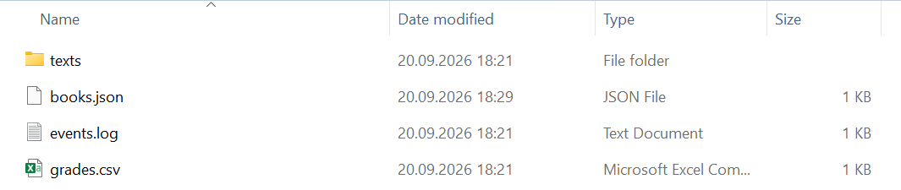

# Examples and common mistakes

## Example programs

### Text file statistics

The program creates a text file, counts the lines, words, and characters in it, and writes a report to another file.

```cs
Console.OutputEncoding = System.Text.Encoding.UTF8;

string folder = Path.Combine("data", "texts");
Directory.CreateDirectory(folder);        // create it if missing
string source = Path.Combine(folder, "lecture.txt");
string report = Path.Combine(folder, "lecture-report.txt");

// Preparing the input file (UTF-8 without a BOM).
File.WriteAllLines(source,
[
    "A file is a named sequence of bytes on a disk.",
    "",
    "A stream is an abstraction for reading and writing bytes sequentially.",
    "Serialization converts an object into a string or bytes.",
]);

int lines = 0, emptyLines = 0, words = 0, chars = 0;
string longest = "";
// ReadLines reads the file gradually, line by line.
foreach (string line in File.ReadLines(source))
{
    lines++;
    chars += line.Length;
    if (string.IsNullOrWhiteSpace(line))
    {
        emptyLines++;
        continue;
    }
    words += line.Split(' ',
        StringSplitOptions.RemoveEmptyEntries).Length;
    if (line.Length > longest.Length)
    {
        longest = line;
    }
}

File.WriteAllLines(report,
[
    $"File: {Path.GetFileName(source)}",
    $"Size: {new FileInfo(source).Length} bytes",
    $"Lines: {lines} (empty: {emptyLines})",
    $"Words: {words}, characters: {chars}",
    $"Longest line: {longest.Length} characters",
]);

Console.WriteLine($"Report {Path.GetFileName(report)}:");
Console.WriteLine(File.ReadAllText(report));
```

`Directory.CreateDirectory` does not throw an exception if the directory already exists. `File.ReadLines` reads the file gradually, so the program works the same way with files of any size. The file size (180 bytes) is larger than the number of characters (172) because each line ends with end-of-line characters (two bytes on Windows); characters outside ASCII, such as Cyrillic, would also take two bytes each in UTF-8. The files are created relative to the working directory. Output:

```
Report lecture-report.txt:
File: lecture.txt
Size: 180 bytes
Lines: 4 (empty: 1)
Words: 31, characters: 172
Longest line: 70 characters
```

### Event log

Two work sessions append events to a log through `StreamWriter`, after which the program prints the last three entries.

```cs
Console.OutputEncoding = System.Text.Encoding.UTF8;

string logPath = Path.Combine("data", "events.log");
Directory.CreateDirectory("data");
File.Delete(logPath);                 // start with an empty log

DateTime start = new(2026, 9, 16, 9, 0, 0);
string[] messages =
[
    "INFO  application started",
    "INFO  user olena logged in",
    "WARN  slow server response",
    "ERROR failed to save the report",
    "INFO  report saved on retry",
    "INFO  user olena logged out",
];

// Two writing sessions: the second appends to the end of the file.
for (int session = 0; session < 2; session++)
{
    using StreamWriter writer = new(logPath, append: true);
    for (int i = session * 3; i < (session + 1) * 3; i++)
    {
        DateTime time = start.AddMinutes(i * 7);
        writer.WriteLine($"{time:HH:mm} {messages[i]}");
    }
}   // writer is closed here: the data is written to disk

int count = File.ReadLines(logPath).Count();
Console.WriteLine($"Lines in the log: {count}");
Console.WriteLine("Last 3 entries:");
foreach (string line in ReadLast(logPath, 3))
{
    Console.WriteLine($"  {line}");
}

// Reading the last lines without loading the whole file into memory.
static IEnumerable<string> ReadLast(string path, int count)
{
    Queue<string> last = new(count);
    using StreamReader reader = new(path);
    while (reader.ReadLine() is string line)
    {
        if (last.Count == count)
        {
            last.Dequeue();
        }
        last.Enqueue(line);
    }
    return last;
}
```

The `using` declaration in the loop body closes the `StreamWriter` at the end of each iteration, so the second session opens the file again and appends to the end (`append: true`). The `ReadLast` method keeps only the last *N* lines in a queue without loading the whole file. The event times are set explicitly so that the result does not depend on when the program is run. Output:

```
Lines in the log: 6
Last 3 entries:
  09:21 ERROR failed to save the report
  09:28 INFO  report saved on retry
  09:35 INFO  user olena logged out
```

### Importing grades from CSV

The program imports grades from a CSV file, skipping lines with an empty score, a score out of range, or a date in the wrong format, and calculates the average score by course.

```cs
using System.Globalization;

Console.OutputEncoding = System.Text.Encoding.UTF8;

string csvPath = Path.Combine("data", "grades.csv");
Directory.CreateDirectory("data");
File.WriteAllText(csvPath, """
    Student,Course,Score,Date
    Koval Olena,OOP,92.5,2026-06-10
    Bondar Petro,OOP,74,2026-06-10
    Melnyk Iryna,Databases,88.0,2026-06-12
    Tkach Andrii,OOP,,2026-06-10
    Shevchuk Mariia,Databases,105,2026-06-12
    Oliinyk Dmytro,OOP,81.5,12.06.2026
    """);

List<Grade> grades = [];
int lineNumber = 0;
foreach (string line in File.ReadLines(csvPath).Skip(1)) // header
{
    lineNumber++;
    string[] f = line.Split(',');
    if (f.Length != 4)
    {
        Console.WriteLine($"Line {lineNumber}: 4 fields expected");
    }
    // Numbers and dates in the file are written independently of culture.
    else if (!double.TryParse(f[2], NumberStyles.Float,
        CultureInfo.InvariantCulture, out double score)
        || score is < 0 or > 100)
    {
        Console.WriteLine($"Line {lineNumber}: invalid score “{f[2]}”");
    }
    else if (!DateOnly.TryParseExact(f[3], "yyyy-MM-dd",
        out DateOnly date))
    {
        Console.WriteLine($"Line {lineNumber}: invalid date “{f[3]}”");
    }
    else
    {
        grades.Add(new Grade(f[0], f[1], score, date));
    }
}

Console.WriteLine($"Imported: {grades.Count}");
foreach (var course in grades.GroupBy(g => g.Course))
{
    // Output uses the user's culture (uk-UA): a comma in numbers.
    double average = course.Average(g => g.Score);
    Console.WriteLine($"  {course.Key}: average score {average:F1}");
}

record Grade(
    string Student, string Course, double Score, DateOnly Date);
```

Numbers are parsed with `CultureInfo.InvariantCulture`, so `92.5` is read correctly in any culture. `TryParseExact` requires the `yyyy-MM-dd` format and rejects `12.06.2026`. An invalid line does not stop the import, and the line number helps fix the file. The result is printed using the user’s culture, so the fractional part is separated by a comma. Output:

```
Line 4: invalid score “”
Line 5: invalid score “105”
Line 6: invalid date “12.06.2026”
Imported: 3
  OOP: average score 83,2
  Databases: average score 88,0
```

### A book library in JSON

The program loads a list of books from a JSON file (or creates an empty one if the file does not exist), adds books, and saves the list with serialization options.

```cs
using System.Text.Encodings.Web;
using System.Text.Json;
using System.Text.Json.Serialization;

Console.OutputEncoding = System.Text.Encoding.UTF8;

JsonSerializerOptions options = new(JsonSerializerDefaults.Web)
{
    WriteIndented = true,
    Converters = { new JsonStringEnumConverter() },
    // Cyrillic without \uXXXX escaping.
    Encoder = JavaScriptEncoder.UnsafeRelaxedJsonEscaping,
};
string path = Path.Combine("data", "books.json");
Directory.CreateDirectory("data");
File.Delete(path);

List<Book> books = Load(path, options);
Console.WriteLine($"Books loaded: {books.Count}");

books.Add(new("Tiger Trappers", 1944, ["Ivan Bahrianyi"], Genre.Novel));
books.Add(new("The Forest Song", 1911, ["Lesia Ukrainka"], Genre.Drama));
Save(path, books, options);

Console.WriteLine(File.ReadAllText(path));
List<Book> loaded = Load(path, options);
Console.WriteLine($"Books loaded: {loaded.Count}, " +
    $"identical: {loaded.SequenceEqual(books, new BookComparer())}");

static List<Book> Load(string path, JsonSerializerOptions options)
{
    if (!File.Exists(path))
    {
        return [];            // first run
    }
    string json = File.ReadAllText(path);
    return JsonSerializer.Deserialize<List<Book>>(json, options)
        ?? [];
}

static void Save(
    string path, List<Book> books, JsonSerializerOptions options)
{
    // Write to a temporary file and replace: old data will not be corrupted.
    string temp = path + ".tmp";
    File.WriteAllText(temp, JsonSerializer.Serialize(books, options));
    File.Move(temp, path, overwrite: true);
}

enum Genre { Novel, Poetry, Drama }

record Book(string Title, int Year, string[] Authors, Genre Genre);

// Arrays in records are compared by reference – a custom comparer.
class BookComparer : IEqualityComparer<Book>
{
    public bool Equals(Book? x, Book? y) =>
        x is not null && y is not null && x.Title == y.Title
        && x.Year == y.Year && x.Genre == y.Genre
        && x.Authors.SequenceEqual(y.Authors);

    public int GetHashCode(Book b) =>
        HashCode.Combine(b.Title, b.Year);
}
```

The `Save` method first writes a temporary file and only then replaces the main file with it: if writing is interrupted, the previous data will not be corrupted. Enumerations are written by name, property names are in *camelCase*, and non-ASCII characters such as Cyrillic are not escaped. Records with the `Authors` array are compared with a custom comparer because the generated `Equals` compares arrays by reference. Output:

```
Books loaded: 0
[
  {
    "title": "Tiger Trappers",
    "year": 1944,
    "authors": [
      "Ivan Bahrianyi"
    ],
    "genre": "Novel"
  },
  {
    "title": "The Forest Song",
    "year": 1911,
    "authors": [
      "Lesia Ukrainka"
    ],
    "genre": "Drama"
  }
]
Books loaded: 2, identical: True
```

The files created by the program are visible in the project’s output directory (Fig. 16.8).



Figure 16.8. Files created by the program {.caption}

## Common mistakes

Table 16.3. Common mistakes when working with files and JSON {.caption}

| **Problem** | **Cause and fix** |
| --- | --- |
| `FileNotFoundException` for a file from the project | a relative path from a different working directory; set *Copy to Output Directory* and use `AppContext.BaseDirectory` |
| “used by another process” | the stream was not closed; create streams in `using` |
| the file is empty or truncated | the `StreamWriter` was not closed and the buffer was not written; use `using` or `Flush` |
| data lost while saving | `WriteAllText` overwrites the file immediately; write to a temporary file and replace |
| Cyrillic appears as “�” or `\u041A…` | the file has a different encoding; specify the `Encoding` or a `JavaScriptEncoder` |
| `92.5` is read as 925 | parsing in the uk-UA culture; use `CultureInfo.InvariantCulture` |
| joining paths with `+` and `\` | the program does not work on other OSes; use `Path.Combine` |
| `JsonException` when reading | invalid JSON or mismatched types; handle the exception and inform the user |
