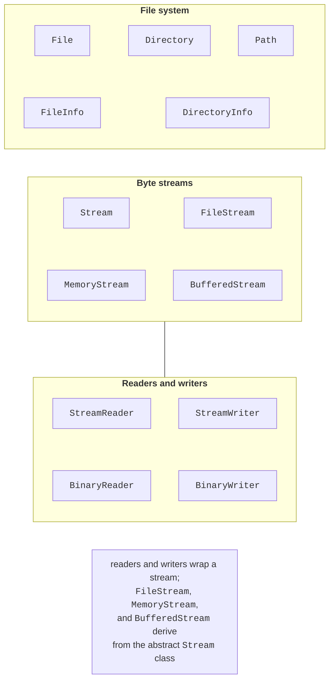

# The file system and encoding

## The file system in .NET

The classes for working with files are located in the `System.IO` namespace, which is imported implicitly in console projects. They can be divided into three groups (Fig. 16.1): file system classes, byte streams, and classes for reading and writing data on top of streams.



Figure 16.1. The main classes of the `System.IO` namespace {.caption}

### Paths

An **absolute path** starts at the root of a drive (`C:\Labs\data\books.json`), and a **relative** path (`data\books.json`) is resolved relative to the process’s **working directory**, `Environment.CurrentDirectory`. When run from Visual Studio, the working directory is the build output directory (`bin\Debug\net10.0`), and with `dotnet run`, it is the directory from which the command was executed. That is why data files that ship with a program are located relative to the application directory, `AppContext.BaseDirectory`.

Do not glue paths together by hand: the separator is `\` on Windows and `/` on Linux and macOS. The `Path` class builds and parses paths for the current operating system:

```cs
string path = Path.Combine("data", "reports", "2026-09.txt");
Console.WriteLine(Path.GetFileName(path));           // 2026-09.txt
Console.WriteLine(Path.GetFileNameWithoutExtension(path)); // 2026-09
Console.WriteLine(Path.GetExtension(path));          // .txt
Console.WriteLine(Path.GetDirectoryName(path));      // data\reports
Console.WriteLine(Path.GetFullPath(path));           // absolute
string temp = Path.Combine(Path.GetTempPath(), "import.tmp");
```

To have a data file from the project copied into the output directory, set *Copy to Output Directory* = *Copy if newer* in the file’s properties (Fig. 16.2).


Figure 16.2. Copying a data file to the output directory {.caption}

### The `File` and `Directory` classes

The static classes `File` and `Directory` perform common operations in a single call (Table 16.1).

Table 16.1. The main methods of the `File` and `Directory` classes {.caption}

| **Method** | **Purpose** |
| --- | --- |
| `File.Exists`, `Directory.Exists` | check whether it exists |
| `File.ReadAllText`, `ReadAllLines` | read the whole file into a string or an array of lines |
| `File.ReadLines` | read lines gradually (lazily) |
| `File.WriteAllText`, `WriteAllLines` | create or **overwrite** a file |
| `File.AppendAllText` | append to the end of a file |
| `File.Copy`, `Move`, `Delete` | copy, move, delete |
| `Directory.CreateDirectory` | create a directory together with missing parent directories |
| `Directory.EnumerateFiles` | list files by a mask, including recursively |

`ReadAllText` and `ReadAllLines` load the whole file into memory, which is convenient for small files. `File.ReadLines` returns an `IEnumerable<string>` and reads the next line only during iteration, so it is suitable for files of any size and for LINQ queries (Topic 15). `Delete` does not throw an exception if the file does not exist.

### `FileInfo` and `DirectoryInfo`

The `FileInfo` and `DirectoryInfo` classes describe a specific file or directory: the size `Length`, the dates `CreationTime` and `LastWriteTime`, the `Extension`, and the parent directory. They are convenient when you need several properties of one file or a recursive traversal:

```cs
DirectoryInfo dir = new("data");
foreach (FileInfo file in
    dir.EnumerateFiles("*.json", SearchOption.AllDirectories))
{
    Console.WriteLine($"{file.Name,-20} {file.Length,8} B " +
        $"{file.LastWriteTime:dd.MM.yyyy HH:mm}");
}
```

## Text encoding

A text file stores **bytes**, while a program works with **characters**. The correspondence between them is defined by an **encoding**. The `File` and `StreamWriter` methods write UTF-8 **without a BOM** (*byte order mark*, three service bytes at the beginning of a file) by default and detect a BOM automatically when reading. A Cyrillic character takes 2 bytes in UTF-8: the six-letter Ukrainian word for “hello” is written in 12 bytes.

Old Windows files often use the Windows-1251 encoding. In .NET, it must be registered first; otherwise, Cyrillic text is read as “�” replacement characters:

```cs
using System.Text;

Encoding.RegisterProvider(CodePagesEncodingProvider.Instance);
Encoding win1251 = Encoding.GetEncoding(1251);
string text = File.ReadAllText("old-report.txt", win1251);
File.WriteAllText("report-utf8.txt", text);      // re-encoding
```
