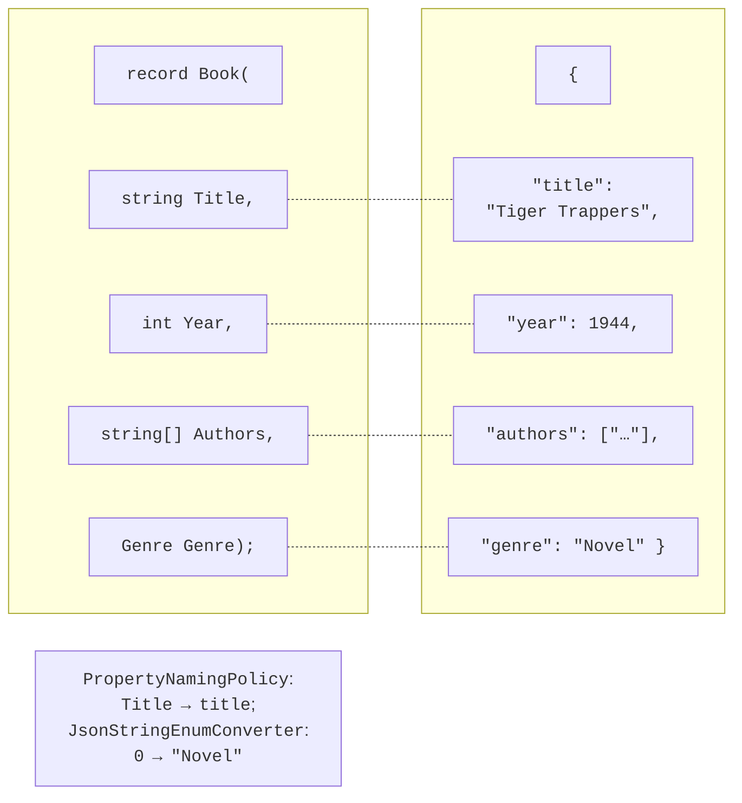
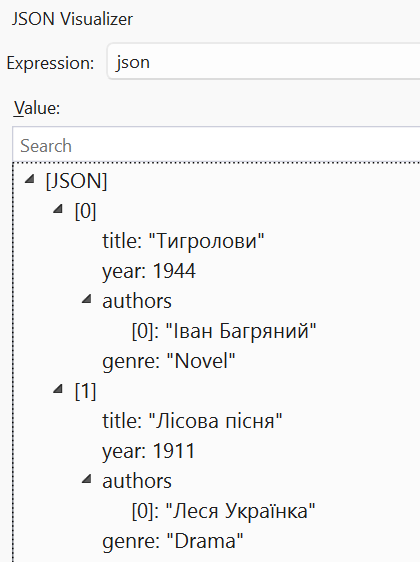

# JSON and asynchronous operations

## JSON and `System.Text.Json`

**JSON** (*JavaScript Object Notation*) is a text data interchange format with objects `{ }`, arrays `[ ]`, strings, numbers, `true`, `false`, and `null`. **Serialization** is the conversion of an object into JSON, and **deserialization** is the restoration of an object from JSON. In .NET, the `JsonSerializer` class of the `System.Text.Json` namespace is used for this:

```cs
using System.Text.Json;

Book book = new("Tiger Trappers", 1944, ["Ivan Bahrianyi"], Genre.Novel);
string json = JsonSerializer.Serialize(book);
Book? copy = JsonSerializer.Deserialize<Book>(json);

record Book(string Title, int Year, string[] Authors, Genre Genre);
enum Genre { Novel, Poetry, Drama }
```

Public properties are serialized. Records, classes with `init` properties, collections, dictionaries, `DateTime`, and `DateOnly` (ISO 8601 format, `"2026-09-16"`) are supported without additional code. `Deserialize` returns `null` for a JSON `null` and throws `JsonException` if the text is not valid JSON or a value does not match the property type.

::: tip Tip
For file-based apps (`dotnet run app.cs`, Topic 1), Native AOT compilation is enabled by default, in which reflection-based serialization is disabled: a call to `JsonSerializer.Serialize` throws `InvalidOperationException`. For learning examples, add the directive `#:property PublishAot=false` as the first line of the file. Regular Visual Studio projects do not need this.
:::

### Serialization options

A `JsonSerializerOptions` object changes the behavior of the serializer (Fig. 16.6). Create it once and reuse it:

```cs
using System.Text.Encodings.Web;
using System.Text.Json.Serialization;

JsonSerializerOptions options = new(JsonSerializerDefaults.Web)
{
    WriteIndented = true,                        // indentation
    Converters = { new JsonStringEnumConverter() },
    Encoder = JavaScriptEncoder.UnsafeRelaxedJsonEscaping,
};
```

- `JsonSerializerDefaults.Web` sets the web style: property names in *camelCase* (`title`), case-insensitive name matching during deserialization, and numbers can be read from strings.
- `WriteIndented = true` formats JSON with indentation for human reading.
- `JsonStringEnumConverter` writes an enumeration by name (`"Novel"`) rather than as a number (1).
- By default, the serializer escapes all non-ASCII characters: the word Kobzar written in Cyrillic is stored as `\u041A\u043E\u0431\u0437\u0430\u0440`. The `UnsafeRelaxedJsonEscaping` encoder keeps Cyrillic readable; it is used for files, not for JSON embedded in web pages.



Figure 16.6. Correspondence between a C# object and a JSON document {.caption}

A JSON string is convenient to inspect in the debugger with the *JSON Visualizer* (Fig. 16.7).



Figure 16.7. Viewing JSON in the visualizer {.caption}

### Serialization attributes

Property attributes control how individual properties correspond to JSON:

```cs
class AppSettings
{
    [JsonPropertyName("font_size")]      // the name in JSON
    public int FontSize { get; set; } = 14;   // default value

    [JsonRequired]                       // required in JSON
    public string Theme { get; set; } = "light";

    [JsonIgnore]                         // not serialized
    public bool IsDark => Theme == "dark";
}
```

If a property is missing from the JSON, it keeps the value from its initializer, so initializers set default values. For a missing property with `[JsonRequired]`, a `JsonException` is thrown: “JSON deserialization for type 'AppSettings' was missing required properties including: 'Theme'”. Unknown JSON properties are ignored by default.

### Polymorphic serialization

If a collection contains objects of derived types, by default the serializer writes only the properties of the declared base type and, when reading, does not know which type to create. `[JsonDerivedType]` attributes on the base type add a **type discriminator** `$type` to the JSON:

```cs
Item[] items = [new BookItem("Atlas", 350), new DiscItem("Jazz", 60)];
string json = JsonSerializer.Serialize(items);
// [{"$type":"book","Pages":350,"Title":"Atlas"},
//  {"$type":"disc","Minutes":60,"Title":"Jazz"}]
Item[] back = JsonSerializer.Deserialize<Item[]>(json)!;

[JsonDerivedType(typeof(BookItem), "book")]
[JsonDerivedType(typeof(DiscItem), "disc")]
abstract record Item(string Title);
record BookItem(string Title, int Pages) : Item(Title);
record DiscItem(string Title, int Minutes) : Item(Title);
```

After deserialization, the array contains `BookItem` and `DiscItem` objects. For JSON of arbitrary structure without a matching class, use `JsonNode.Parse(json)` with access such as `node["title"]`, or `JsonDocument` for fast reading.

## Asynchronous file operations

Reading a large file or a file from a network drive can take a long time. So that a GUI program or a web server does not “hang” while waiting, .NET has asynchronous versions of the methods: `File.ReadAllTextAsync`, `WriteAllTextAsync`, `ReadLinesAsync`, `JsonSerializer.SerializeAsync`, and so on. They are called with the `await` operator, which frees the thread of execution while waiting:

```cs
string json = await File.ReadAllTextAsync("data/books.json");
Console.WriteLine($"Characters read: {json.Length}");
```

In top-level statements, `await` can be used directly; in your own methods, the `async` modifier and the `Task` result type are required. Asynchronous programming is not covered in detail in this course; synchronous methods are sufficient for the console lab assignments.
