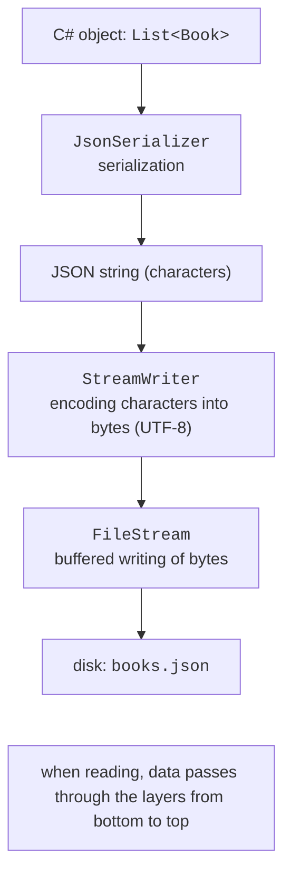
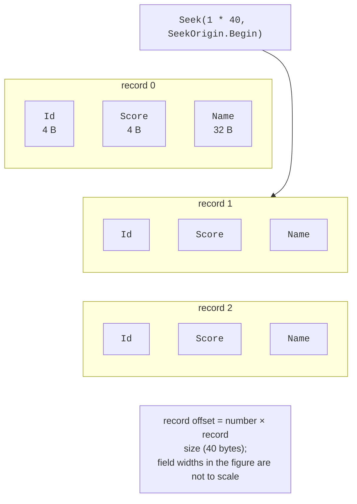

# Streams and CSV format

## Streams

A **stream** is an abstraction of a sequence of bytes that can be read or written. The abstract `Stream` class defines the methods `Read`, `Write`, and `Seek` and the properties `Position`, `Length`, `CanRead`, `CanWrite`, and `CanSeek`. Derived classes work with different sources: `FileStream` with a file, `MemoryStream` with an array in memory, and `NetworkStream` with the network. Code that works with `Stream` processes any source the same way.

When an object is written to a file, the data passes through several layers (Fig. 16.3): the serializer converts the object into text, `StreamWriter` encodes characters into bytes, and `FileStream` accumulates bytes in a buffer and writes them to disk.



Figure 16.3. Data processing layers when writing to a file {.caption}

The `FileStream` constructor takes an open mode `FileMode` and an access type `FileAccess`:

```cs
using FileStream stream = new("data.bin",
    FileMode.OpenOrCreate,     // Create, Open, Append, Truncate…
    FileAccess.ReadWrite);     // Read, Write, ReadWrite
stream.Seek(0, SeekOrigin.End);  // move to the end
Console.WriteLine($"{stream.Position} / {stream.Length}");
```

### `StreamReader` and `StreamWriter`

`StreamReader` and `StreamWriter` read and write **text** on top of a stream, performing the encoding. They can be created directly from a file path:

```cs
using (StreamWriter writer = new("log.txt", append: true))
{
    writer.WriteLine($"{DateTime.Now:HH:mm} started");
}

using StreamReader reader = new("log.txt");
while (reader.ReadLine() is string line)   // null – end of file
{
    Console.WriteLine(line);
}
```

Streams, readers, and writers implement `IDisposable` (Topic 10). The `Dispose` method writes the rest of the buffer to disk and closes the file. If the object is not closed, some of the data may not reach the file, and the file itself remains open and **locked**: an attempt to open it again throws `IOException` (Fig. 16.4). That is why streams are always created in a `using` statement or a `using` declaration.


Figure 16.4. An exception when accessing a locked file {.caption}

### Binary files

`BinaryWriter` and `BinaryReader` write and read values of simple types in binary form: an `int` takes 4 bytes and a `double` takes 8 bytes, regardless of the number of digits. Binary files are compact and cannot be viewed in a text editor. If all records have a **fixed length**, you can jump directly to record number *n* with `Seek(n · record size)` without reading the previous ones (Fig. 16.5). Strings in such records are stored with a fixed number of characters.



Figure 16.5. A binary file with fixed-length records {.caption}

### I/O exceptions

File operations depend on the external environment, so they are always checked for exceptions (Table 16.2). Checking `File.Exists` before opening does not guarantee success: the file may be deleted or locked between the check and the opening.

Table 16.2. The main I/O exceptions {.caption}

| **Exception** | **Cause** |
| --- | --- |
| `FileNotFoundException` | the file does not exist (“Could not find file …”) |
| `DirectoryNotFoundException` | part of the path does not exist (“Could not find a part of the path …”) |
| `UnauthorizedAccessException` | no access rights, or the file is read-only |
| `IOException` | the file is used by another process, the disk is full, and so on (the base class) |
| `PathTooLongException` | the path is too long |

`FileNotFoundException`, `DirectoryNotFoundException`, and `PathTooLongException` derive from `IOException`, so in a chain of `catch` blocks they are placed before `IOException` (Topic 6).

## CSV format

**CSV** (*comma-separated values*) is a text tabular format: each line is a record, fields are separated by commas, and the first line often contains headers. When processing CSV, take into account:

- **the culture of numbers and dates**: a file contains `92.5` and `2026-06-10` regardless of the system language, so parsing is done with `CultureInfo.InvariantCulture` and an explicit date format; in the Ukrainian culture, `double.Parse("92.5")` gives 925;
- **quotes**: a field with a comma is written in quotes (`"Shevchenko, Taras"`), and quotes inside a field are doubled; a simple `Split(',')` does not handle such fields, so libraries such as CsvHelper are used for complex files;
- **the separator**: Excel in the Ukrainian locale saves CSV with a semicolon `;`;
- **invalid lines**: an invalid line is skipped with a message rather than stopping the whole import.
