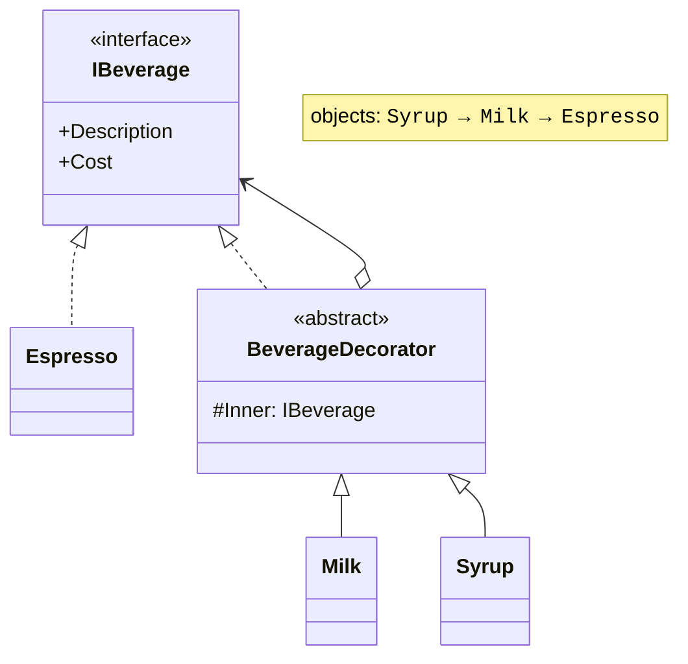
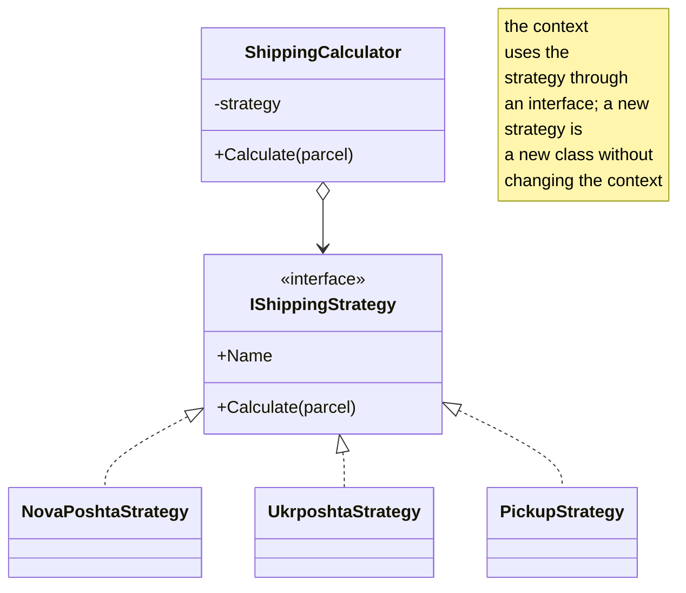
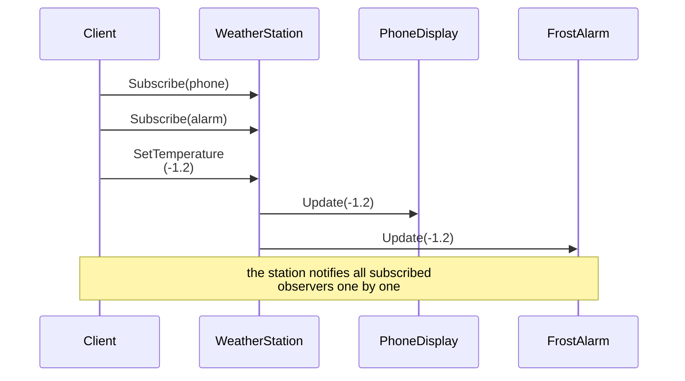
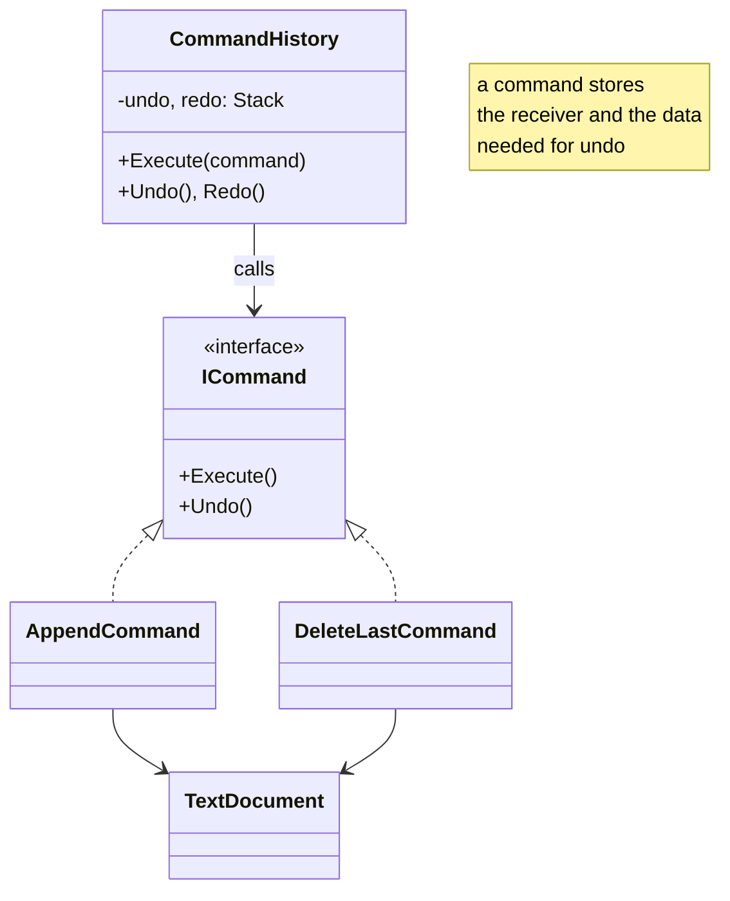

# Design patterns

## Design patterns

A **design pattern** is a typical, proven solution to a common design problem, described independently of the language. The classic catalog of 23 patterns was published in 1994 by E. Gamma, R. Helm, R. Johnson, and J. Vlissides (the “Gang of Four,” GoF). Patterns are divided into three groups (Table 17.2). A pattern description contains a name, the problem, the solution (a UML diagram), and the consequences of applying it.

Table 17.2. Classification of design patterns {.caption}

| **Group** | **Purpose** | **Patterns in this lecture** |
| --- | --- | --- |
| creational | creating objects | Factory Method, Builder, Singleton |
| structural | composing classes and objects | Adapter, Decorator, Facade, Composite |
| behavioral | interaction and distribution of responsibilities | Strategy, Observer, Command, State |

### Creational patterns

**Factory Method** separates the code that uses objects from the choice of their concrete classes. In its classic form, a base class declares an abstract creation method, and derived classes decide what exactly to create:

```cs
abstract class Logistics
{
    // Factory method: derived classes choose the transport.
    protected abstract ITransport CreateTransport();

    public string Deliver(string cargo) =>
        CreateTransport().Carry(cargo);
}

class RoadLogistics : Logistics
{
    protected override ITransport CreateTransport() => new Truck();
}
```

In practice, a simplified form is often used: a static method that returns the required implementation of an interface based on a parameter (Example 2). In both cases, the names of the concrete classes are concentrated in one place.

**Builder** creates a complex object with many optional parts step by step and checks its validity before creating it (Example 3). The builder’s methods return `this`, which lets you chain the calls. In .NET, `StringBuilder` works this way.

**Singleton** guarantees that a single instance of a class exists, with global access to it:

```cs
sealed class AppConfig
{
    private static readonly Lazy<AppConfig> instance =
        new(() => new());

    private AppConfig() { }                  // no new from outside

    public static AppConfig Instance => instance.Value;
}
```

`Lazy<T>` creates the object on first access and is thread-safe. However, a Singleton is effectively a global variable: it hides dependencies and makes testing harder. Instead, it is better to create one object in the composition root and pass it through the constructor (or register it with `AddSingleton` in a DI container).

### Structural patterns

**Adapter** lets you use a class with an incompatible interface: the adapter implements the expected interface and converts calls to the wrapped object (Example 2 of the lab assignment). Typical uses are third-party libraries and legacy code that cannot be changed.

**Decorator** dynamically adds behavior to an object by wrapping it in an object with the same interface (Fig. 17.5). Decorators can be combined in any order, whereas inheritance would require a class for each combination. In .NET, streams are built on this pattern: `BufferedStream` and `GZipStream` wrap another `Stream`.



Figure 17.5. The Decorator pattern {.caption}

**Facade** provides a simple interface to a complex subsystem. For example, a `TravelBookingFacade` class with a single `BookTrip` method calls the ticket, hotel, and payment services in sequence, hiding the order of calls and error handling from the client.

**Composite** lets you work with individual objects and groups of them in the same way: a file and a folder implement a common interface with a `Size` property, and the size of a folder equals the sum of the sizes of the nested elements, including other folders.

### Behavioral patterns

**Strategy** encapsulates a family of algorithms in classes with a common interface; a context object receives a strategy and delegates the work to it (Fig. 17.6). The strategy can be replaced while the program runs. For simple strategies, a `Func<…>` delegate is enough instead of an interface (Topic 14).



Figure 17.6. The Strategy pattern {.caption}

**Observer** defines a “one-to-many” dependency: when the state of the subject changes, all subscribed observers are notified (Fig. 17.7). In .NET, the pattern is built into the language as **events** (Topic 14), so separate observer interfaces are rarely needed (Example 4).



Figure 17.7. Interaction in the Observer pattern {.caption}

**Command** turns a request into an object with `Execute` and `Undo` methods (Fig. 17.8). Commands can be stored in a history, undone and redone, queued, and logged (Example 3 of the lab assignment).



Figure 17.8. The Command pattern {.caption}

**State** lets an object change its behavior depending on its state by moving each state into a separate class. A vending machine in the “waiting” state moves to the “money inserted” state on `InsertCoin`, while in the “dispensing” state it rejects the same action. Compared with a `switch` on an enumeration (Topic 11), the pattern is convenient when there are many states and actions. Structurally, State resembles Strategy, but a state usually changes by itself while the object works, whereas the client chooses a strategy.

### Patterns in .NET and anti-patterns

The .NET library uses patterns everywhere: iterator (`IEnumerable<T>`, `yield`), decorator (`Stream` wrappers), builder (`StringBuilder`, `UriBuilder`), observer (events), strategy (`IComparer<T>`), and factory method (`Encoding.GetEncoding`, `Enumerable.Range`).

**Anti-patterns** are common bad solutions: the “God Object” that does everything; unstructured “spaghetti code”; overusing patterns where a simple method would do; and premature abstraction (an interface with a single implementation “for the future,” which contradicts YAGNI). A pattern is chosen when the corresponding problem has arisen, not for the sake of the pattern.
