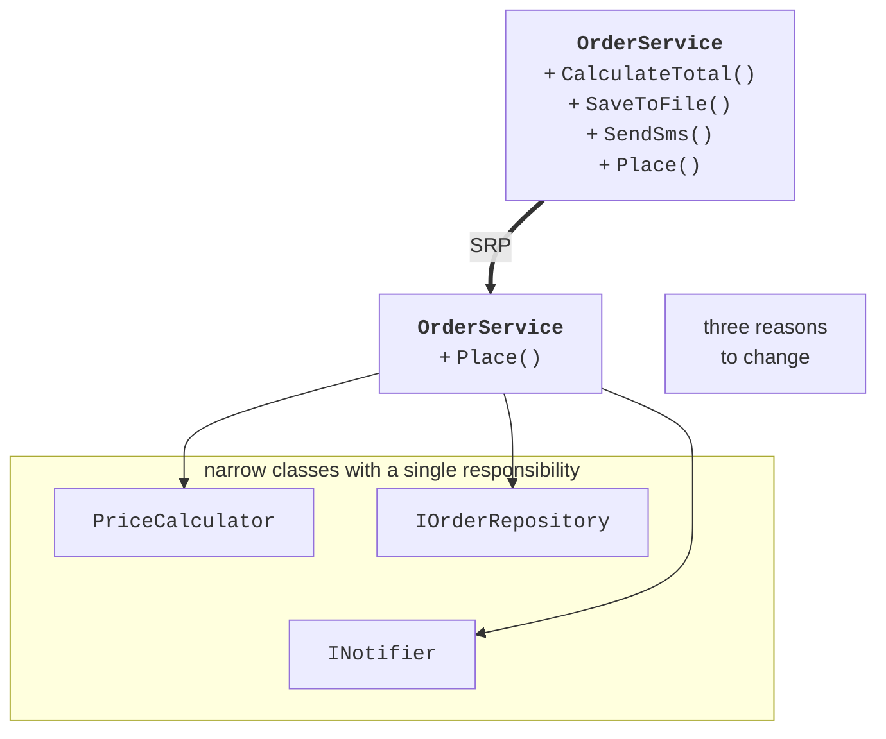
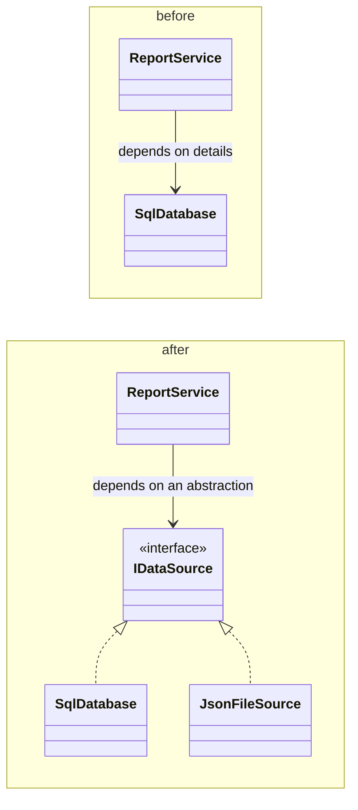
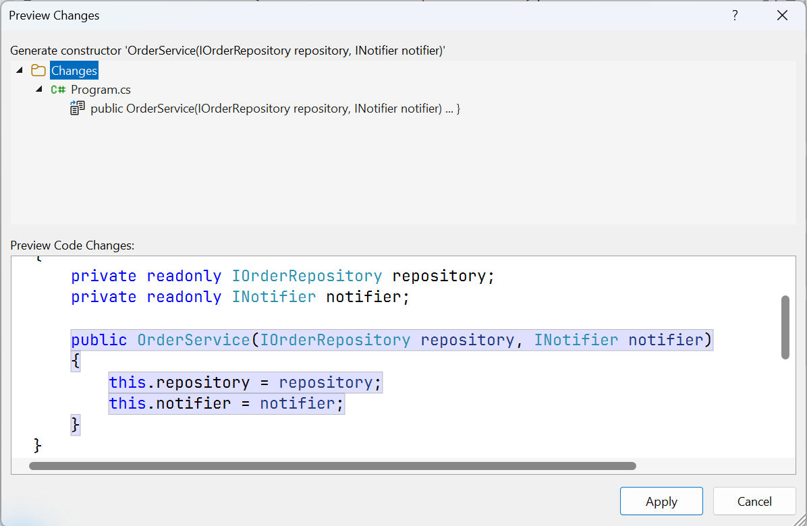

# SOLID and dependency injection

## Design quality

A program that works is not necessarily well designed. Good code is easy to read, change, and test. There are two main design characteristics:

- **cohesion** is how closely the members of a class are related by a common purpose; high cohesion means that a class does one thing;
- **coupling** is how much classes depend on each other; loose coupling lets you change one class without affecting others.

The goal of design is **high cohesion and loose coupling**. Signs of poor design (“code smells,” Topic 18) include a class of thousands of lines that “can do everything,” long `switch` statements on the type of an object, repeated code, and a change to one requirement that affects many classes.

General principles:

- **DRY** (*Don’t Repeat Yourself*): every piece of knowledge should have a single representation in the code;
- **KISS** (*Keep It Simple*): the simplest solution that works is the best;
- **YAGNI** (*You Aren’t Gonna Need It*): do not implement features “just in case.”

## The SOLID principles

**SOLID** is a set of five object-oriented design principles formulated by Robert Martin (Table 17.1).

Table 17.1. The SOLID principles {.caption}

|  | **Principle** | **Essence** |
| --- | --- | --- |
| **S** | *Single Responsibility* | a class has only one reason to change |
| **O** | *Open/Closed* | a class is open for extension but closed for modification |
| **L** | *Liskov Substitution* | an object of a derived class can be used in place of the base class without breaking anything |
| **I** | *Interface Segregation* | a client should not depend on methods it does not use |
| **D** | *Dependency Inversion* | modules depend on abstractions, not on concrete implementations |

### The single responsibility principle

An `OrderService` class that calculates the order total, saves the order to a file, and sends an SMS has three reasons to change: new discount rules, a different storage, and a different notification channel. Changing one part risks breaking the others, and the calculation cannot be tested without files and SMS. According to **SRP**, such a class is split into narrow classes (Fig. 17.1); `OrderService` only coordinates them (Example 1).



Figure 17.1. Splitting a class according to the single responsibility principle {.caption}

### The open/closed principle

Code that chooses behavior by type through a `switch` has to be changed for every new option:

```cs
decimal Cost(string method, Parcel p) => method switch
{
    "nova" => 70m + 12m * (decimal)p.WeightKg,
    "ukrposhta" => 45m + 8m * (decimal)Math.Ceiling(p.WeightKg),
    _ => throw new ArgumentException(method),   // a new service – a change
};
```

According to **OCP**, the behavior variants are moved into classes with a common interface (polymorphism, Topics 9–10). A new delivery method is a new class, and the existing code does not change (Example 2).

### The Liskov substitution principle

A derived class must not strengthen preconditions, weaken postconditions, or throw unexpected exceptions compared with the base class. A classic example of a violation: `Square` inherits from `Rectangle` and in the `Width` setter also changes `Height`. Code that sets the width to 5 and the height to 4 and expects an area of 20 gets 16 for a square. Another example is a `Penguin` class derived from `Bird` with a `Fly` method that throws `NotSupportedException` (Example 1 of the lab assignment). The fix is to reconsider the hierarchy: keep what is shared in the base class and move special abilities into separate interfaces.

### The interface segregation principle

A “fat” interface `IMultifunctionDevice` with the methods `Print`, `Scan`, and `Fax` forces a simple printer to implement `Scan` and `Fax` with exceptions. According to **ISP**, it is split into `IPrinter`, `IScanner`, and `IFax`; a multifunction device implements all three, and a simple printer only `IPrinter`.

### The dependency inversion principle

If `ReportService` creates `new SqlDatabase()` internally, it is tied to that database forever. According to **DIP**, both classes depend on the `IDataSource` abstraction (Fig. 17.2): the service works with any data source, including a test one.



Figure 17.2. Dependency inversion {.caption}

## Dependency injection

**Dependency injection** (DI) is a way to implement DIP: a class does not create its dependencies itself but receives them from outside, most often through the constructor:

```cs
class ReportService(IDataSource source, INotifier notifier)
{
    public void Send() => notifier.Notify(source.Load().ToString()!);
}
```

The concrete implementations are chosen in one place at the start of the program, the **composition root**. Visual Studio generates a constructor with parameters for the fields of a class with the *Generate constructor* action: select the fields you need, press **Ctrl+.**, and review the changes before applying them (Fig. 17.3).



Figure 17.3. Generating a constructor for dependencies {.caption}

In large applications, objects are created by a **DI container**. In .NET, this is the `Microsoft.Extensions.DependencyInjection` library (a NuGet package for console projects, built into ASP.NET Core). Registration defines which implementation to provide and with what lifetime:

```cs
using Microsoft.Extensions.DependencyInjection;

ServiceCollection services = new();
services.AddSingleton<INotifier, SmsNotifier>();   // one per program
services.AddTransient<OrderService>();             // new every time
using ServiceProvider provider = services.BuildServiceProvider();

// The container creates SmsNotifier itself and passes it to the constructor.
OrderService service = provider.GetRequiredService<OrderService>();
```

The package is added through *Manage NuGet Packages* (Fig. 17.4) or with the command `dotnet add package Microsoft.Extensions.DependencyInjection`. For the lab assignments, manual constructor injection is sufficient.


Figure 17.4. Installing the DI container package {.caption}
