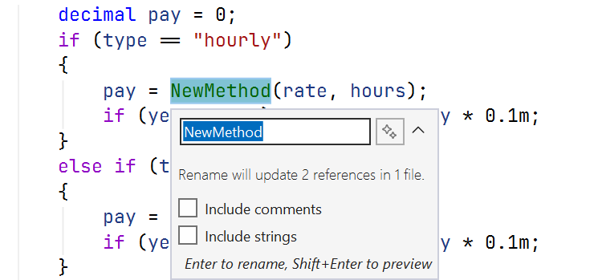

# Refactoring

## Refactoring

**Refactoring** is changing the internal structure of code **without changing its behavior** in order to improve readability and simplify future changes. Refactoring is done in small steps, running the tests after each one. If there are no tests, you first write **characterization tests** that capture the current behavior, even if it is strange (Example 4 and Example 3 of the lab assignment).

Signs of code that needs refactoring are called **“code smells”** (Table 18.3).

Table 18.3. “Code smells” and the corresponding refactorings {.caption}

| **“Smell”** | **Refactoring** |
| --- | --- |
| a long method | extract methods (*Extract Method*) |
| magic numbers and strings | named constants (*Introduce Constant*), enumerations |
| duplicated code | extract a common method or class |
| a large class | split it by responsibility (SRP) |
| a long parameter list | combine the parameters into a record or class |
| unclear names (`r`, `t`, `Calc`) | rename (*Rename*) |
| a `switch` on type in several places | polymorphism, Strategy (Topic 17) |
| commented-out and dead code | delete it (the history is in version control) |

### Visual Studio refactoring tools

Visual Studio performs refactorings automatically and safely across the whole solution:

- **Rename** (**Ctrl+R, Ctrl+R**) renames a symbol everywhere it is used (Fig. 18.11);
- **Extract Method** (**Ctrl+R, Ctrl+M** or **Ctrl+.** on a selected fragment) extracts a method, automatically determining the parameters and the result (Fig. 18.10);
- **Introduce constant / local** replaces an expression with a constant or variable;
- **Inline method / temporary variable** is the reverse operation;
- **Change signature** changes the order and set of parameters and updates the calls;
- **Move type to file** moves a class into a separate file with the matching name.

Figure 18.10. The Extract Method refactoring {.caption}

Figure 18.11. Renaming a symbol across the whole solution {.caption}

.NET code analyzers and the `.editorconfig` style settings file let you automatically detect some “smells” and style violations during the build.
